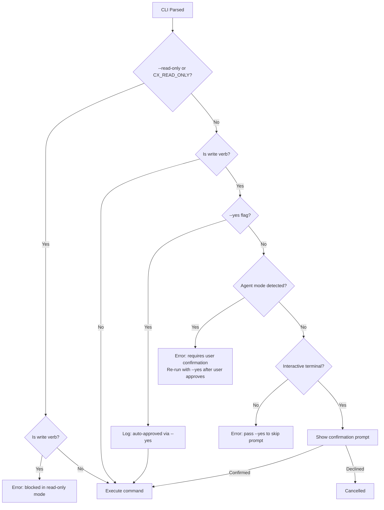

# Plan: CLI Safety Features - Write Detection, Read-Only Mode, Agent Mode, Auto-Approve Logging

| Field | Value |
|-------|-------|
| Status | in-progress |
| Created | 2026-04-29 |
| Ticket | N/A |
| Branch | liranhason/age-813-add-all-cx-apis-to-cli |

## Context

The cx CLI currently guards only IAM and archive write operations with confirmation prompts (27 of ~100+ write operations). We need four safety features: (1) centralized write command detection so new write commands are automatically caught, (2) a `--read-only` mode that blocks all writes at the CLI level, (3) agent mode awareness that fails fast with a user-confirmation error instead of hanging on stdin, and (4) auto-approve logging so `--yes` bypasses leave an audit trail. These features make cx safer for both humans and AI agents.

## Architecture Decisions

- **Centralized write detection via verb matching:** Rather than manually calling `confirm_destructive` per match arm, we'll classify subcommands by their leaf verb name (create, update, delete, set, enable, disable, deploy, undeploy, reorder, overwrite, remove, add, acknowledge, resolve, close, assign, unassign, bulk-delete, send, batch). This catches new commands automatically. The verb list lives in a single `is_write_verb()` function in `src/safety.rs`.
- **Leaf subcommand resolution via `clap::ArgMatches` recursion:** Instead of implementing a `leaf_verb()` method on the `Commands` enum (which would require 200+ match arms and manual maintenance), we use a `get_leaf_subcommand_name(matches: &clap::ArgMatches) -> Option<String>` function that recursively walks the ArgMatches tree. This is zero-maintenance - new commands are automatically detected. Inspired by [datadog-labs/pup](https://github.com/datadog-labs/pup).
- **New `src/safety.rs` module replaces `src/confirm.rs`:** Consolidates write detection, read-only enforcement, agent detection, and confirmation logic in one place. The old `confirm_destructive` function moves here and is enhanced.
- **Read-only mode via `--read-only` flag + `CX_READ_ONLY` env var:** Checked once after CLI parsing, before command dispatch. Blocks any command whose leaf subcommand matches a write verb.
- **Agent mode detection = fail-safe, not auto-approve:** Check well-known env vars (`CLAUDECODE`, `CURSOR_AGENT`, `CODEX`, `COPILOT_AGENT`, `AIDER`, `CX_AGENT_MODE`). When detected and `--yes` is NOT passed, fail fast with a clear error instead of hanging on stdin. The error message tells the agent to get user confirmation first, then re-run with `--yes`. This preserves the safety gate - `--yes` remains the only way to bypass confirmation.
- **`--yes` auto-approve logging:** When `--yes` bypasses confirmation, log `[auto-approved via --yes]` to stderr.
- **Read-only beats `--yes`:** If both `--read-only` and `--yes` are active, read-only wins and write commands are blocked.
- **Local-only commands exempt by top-level name:** `profiles` and `cleanup` are local-only and exempt from read-only mode and centralized write detection. Exemption is checked by top-level command name (not by verb), so `profiles set-default` is exempt while `notifications presets set-default` is correctly gated. Uses `get_top_level_subcommand_name()` before the verb check, same pattern as pup's `is_local_only`.
- **notification test commands are read-only:** `notifications test *` sends test notifications but doesn't modify persistent state - classify as read-only.

## Diagrams



## Milestones Overview

1. **Write command detection and safety module** - Central `is_write_verb()` function, new `src/safety.rs` module, all write commands auto-detected
2. **Read-only mode** - `--read-only` flag and `CX_READ_ONLY` env var block all write operations
3. **Agent mode awareness + auto-approve logging** - Fail-fast when agent env detected without `--yes`; `--yes` logs `[auto-approved]` to stderr
4. **Comprehensive testing and cleanup** - Full test suite, help text, skill updates

---

## Milestone 1: Write Command Detection and Safety Module

**Why this matters:** Currently, forgetting a `confirm_destructive` call on a new write command silently skips confirmation. Centralized verb-based detection catches all write commands automatically, making the system resilient as new commands are added. This also enables read-only mode (Milestone 2) which depends on knowing which commands are writes.

**Success criteria:** All write operations across the CLI are detected by `is_write_verb()`. The existing 27 IAM/archive confirmations still work. No behavioral change yet for unguarded write commands (that comes in M2).

### Deliverable Spec

| Function | Location | Purpose |
|----------|----------|---------|
| `is_write_verb(name: &str) -> bool` | `src/safety.rs` | Returns true if the subcommand name is a write verb |
| `get_leaf_subcommand_name(matches: &ArgMatches) -> Option<String>` | `src/safety.rs` | Recursively walks ArgMatches tree to find deepest subcommand name |
| `get_top_level_subcommand_name(matches: &ArgMatches) -> Option<String>` | `src/safety.rs` | Returns the first-level subcommand name (for local-only exemptions) |
| `confirm_destructive(action, yes) -> Result<()>` | `src/safety.rs` | Moved from `src/confirm.rs`, unchanged for now |

Write verbs to detect: `create`, `update`, `delete`, `set`, `enable`, `disable`, `deploy`, `undeploy`, `reorder`, `overwrite`, `remove`, `add`, `acknowledge`, `resolve`, `close`, `assign`, `unassign`, `bulk-delete`, `set-status`, `set-idp`, `set-active`, `set-default`, `batch` (actions), `activate` (retentions), `settings-update` (tco).

Read-only verbs (never blocked): `list`, `get`, `search`, `catalog`, `show`, `system`, `sp-params`, `validate`, `settings`, `deployed`, `query`, `test`, `send-data-keys`.

Note: `test` (notifications/webhooks) is read-only because it sends a test notification but doesn't modify persistent state. `send` is NOT in the write verb list - it's not used as a leaf subcommand name. The `batch` verb under `webhooks actions` covers the send-like semantics there.

### 1.1 [x] Create `src/safety.rs` with write verb detection and leaf subcommand resolution *(completed 2026-04-30)*

- **Files:** `src/safety.rs` (new), `src/lib.rs`, `src/confirm.rs`
- **What:**
  1. Create `src/safety.rs` with:
     - `is_write_verb(name: &str) -> bool` - matches against the write verb list. Use a match statement for O(1) lookup. Handle hyphenated names (e.g., `bulk-delete`, `set-status`).
     - `get_leaf_subcommand_name(matches: &clap::ArgMatches) -> Option<String>` - recursively walks the ArgMatches tree to find the deepest subcommand name. Zero match arms against `Commands`, zero maintenance when new commands are added:
       ```rust
       pub fn get_leaf_subcommand_name(matches: &clap::ArgMatches) -> Option<String> {
           match matches.subcommand() {
               Some((name, sub)) => get_leaf_subcommand_name(sub).or(Some(name.to_string())),
               None => None,
           }
       }
       ```
     - `get_top_level_subcommand_name(matches: &clap::ArgMatches) -> Option<String>` - returns the first-level subcommand name. Used to exempt local-only commands (`profiles`, `cleanup`) from write detection:
       ```rust
       pub fn get_top_level_subcommand_name(matches: &clap::ArgMatches) -> Option<String> {
           matches.subcommand().map(|(name, _)| name.to_string())
       }
       ```
     - Move `confirm_destructive` from `src/confirm.rs` into `src/safety.rs` unchanged.
  2. Update `src/lib.rs`: add `pub mod safety;`, remove `pub mod confirm;` (no re-export facade - just update all import sites directly since we control them all).
  3. Update `src/main.rs` imports: change `use coralogix_cli::confirm::confirm_destructive;` to `use coralogix_cli::safety::confirm_destructive;`.
  4. Delete `src/confirm.rs` after migration.
- **Acceptance:** `cargo build` succeeds. `cargo test` passes. All existing 28 `confirm_destructive` calls work unchanged. Unit tests for `is_write_verb` pass (see 1.2).
- **Dependencies:** None

### 1.2 [x] Add unit tests for write verb detection *(completed 2026-04-30)*

- **Files:** `src/safety.rs` (add `#[cfg(test)]` module)
- **What:** Add a test module at the bottom of `src/safety.rs` with:
  1. `test_write_verbs_detected` - asserts `is_write_verb` returns true for all known write verbs: create, update, delete, set, enable, disable, deploy, undeploy, reorder, overwrite, remove, add, acknowledge, resolve, close, assign, unassign, bulk-delete, set-status, set-idp, set-active, set-default, batch, activate, settings-update.
  2. `test_read_verbs_not_detected` - asserts `is_write_verb` returns false for: list, get, search, catalog, show, system, sp-params, validate, settings, deployed, query, test, send-data-keys.
  3. `test_unknown_verbs_not_detected` - asserts `is_write_verb` returns false for unknown verbs like "foo", "bar", empty string.
- **Acceptance:** `cargo test safety` passes.
- **Dependencies:** 1.1

---

## Milestone 2: Read-Only Mode

**Why this matters:** Operators and agents need a way to use cx for querying without any risk of accidental writes. A `--read-only` flag (plus `CX_READ_ONLY` env var) provides a hard block on all write operations at the CLI level, before command handlers are even invoked. This is especially valuable when giving cx access to AI agents or automation scripts that should only read.

**Success criteria:** `cx --read-only iam api-keys list` works. `cx --read-only iam api-keys delete abc` fails with a clear error. `CX_READ_ONLY=1 cx iam api-keys delete abc` fails. `cx --read-only logs ...` works (read commands unaffected).

### Deliverable Spec

| Flag/Env | Type | Default | Description |
|----------|------|---------|-------------|
| `--read-only` | bool | false | Block all write operations |
| `CX_READ_ONLY` | env var | unset | Same as `--read-only` when set to `1`/`true` |

### 2.1 [x] Add `--read-only` flag and enforcement *(completed 2026-04-30)*

- **Files:** `src/main.rs`, `src/safety.rs`
- **What:**
  1. Add to the `Cli` struct in `src/main.rs`:
     ```rust
     /// Block all write operations. Useful for safe agent/automation access.
     #[arg(long, global = true, env = "CX_READ_ONLY")]
     read_only: bool,
     ```
  2. Add `enforce_read_only(verb: &str) -> Result<()>` to `src/safety.rs`:
     - If `is_write_verb(verb)` is true, bail with: `"Write operation '{verb}' is blocked in read-only mode (--read-only flag or CX_READ_ONLY env var)."`
     - Otherwise return Ok(())
  3. In `src/main.rs`, get `ArgMatches` from clap, then add before the main match statement (around line 2133):
     ```rust
     let matches = <Cli as clap::CommandFactory>::command().get_matches();
     // ... or use cli = Cli::parse() then get matches separately
     if cli.read_only {
         let top = safety::get_top_level_subcommand_name(&matches);
         let is_local_only = matches!(top.as_deref(), Some("profiles") | Some("cleanup") | Some("completions"));
         if !is_local_only {
             if let Some(leaf) = safety::get_leaf_subcommand_name(&matches) {
                 safety::enforce_read_only(&leaf)?;
             }
         }
     }
     ```
     Uses ArgMatches recursion from task 1.1 - zero maintenance when commands are added. Local-only commands are exempt by top-level name, not by verb, so `profiles set-default` passes while `notifications presets set-default` is correctly blocked.
- **Acceptance:** `cargo build` succeeds. `cx --read-only --help` shows the flag. `cx --read-only iam api-keys list` (or any read command) works. `cx --read-only iam api-keys delete abc` fails with read-only error. `CX_READ_ONLY=1 cx iam api-keys delete abc` fails.
- **Dependencies:** 1.1

### 2.2 [x] Add unit and integration tests for read-only mode *(completed 2026-04-30)*

- **Files:** `src/safety.rs` (unit tests), `tests/read_only/main.rs` (new integration test)
- **What:**
  1. In `src/safety.rs` test module, add:
     - `test_enforce_read_only_blocks_write_verb` - build a mock ArgMatches or test `is_write_verb` + `resolve_leaf_verb` combination
  2. Create `tests/read_only/main.rs` as an integration test that:
     - Invokes `cx --read-only iam api-keys delete abc --api-key fake --region us1` via `assert_cmd` and asserts failure with stderr containing "read-only mode"
     - Invokes `cx` with `CX_READ_ONLY=1` env var and a write command (`iam api-keys delete abc --api-key fake --region us1`), asserts failure with stderr containing "read-only mode"
     - Invokes `cx --read-only iam api-keys list --api-key fake --region us1` and asserts stderr does NOT contain "read-only mode" (it may fail at HTTP level with fake creds, but the read-only gate should not fire)
     - These tests do NOT need credentials since they test CLI-level gates. Use fake api key and region.
- **Acceptance:** `cargo test read_only` passes. Tests verify both flag and env var paths.
- **Dependencies:** 2.1

### 2.3 [x] Add E2E tests for read-only mode *(completed 2026-04-30)*

- **Files:** `tests/e2e/read_only.rs` (new), `tests/e2e/main.rs` (register module)
- **What:**
  1. Create `tests/e2e/read_only.rs` with tests that:
     - Use `harness::cx()` with `--read-only` flag
     - Test a read command succeeds: `cx --read-only iam api-keys list -o json`
     - Test a write command fails: `cx --read-only iam api-keys delete nonexistent --yes`
     - Verify stderr contains "read-only mode"
  2. Register the module in `tests/e2e/main.rs`
  3. These tests can be `#[ignore]`d since they need credentials for the read path. Alternatively, make the write-blocked tests non-ignored since they fail before API calls.
- **Acceptance:** E2E read-only tests pass.
- **Dependencies:** 2.1

---

## Milestone 3: Agent Mode Awareness

**Why this matters:** When cx runs inside an AI agent (Claude Code, Cursor, Codex, etc.), the confirmation prompt causes a stdin hang since agents can't interact with TTY prompts. Agent mode solves this by failing fast with a clear error message that instructs the agent to get user confirmation first, then re-run with `--yes`. The safety gate stays intact - `--yes` remains the only way to bypass confirmation. No silent auto-approval.

**Success criteria:** When `CLAUDECODE=1` is set and `--yes` is NOT passed, `cx iam api-keys delete abc` fails immediately with an error telling the agent to confirm with the user and re-run with `--yes`. When `--yes` IS passed, it proceeds with `[auto-approved via --yes]` logged. When no agent env var is set, interactive prompt behavior is unchanged. Every write command across the entire CLI is gated by `confirm_destructive`.

### Deliverable Spec

| Function/Env | Purpose |
|-------------|---------|
| `is_agent_mode() -> bool` | Table-driven detection: checks `CLAUDECODE`/`CLAUDE_CODE`, `CURSOR_AGENT`, `CODEX`/`OPENAI_CODEX`, `COPILOT_AGENT`/`GITHUB_COPILOT`, `AIDER`, `CLINE`, `WINDSURF_AGENT`, `AMAZON_Q`/`AWS_Q_DEVELOPER`, `GEMINI_CODE_ASSIST`, `SRC_CODY`, `CX_AGENT_MODE` |
| `CX_AGENT_MODE=1` | Explicit env var to force agent mode |

### 3.1 [x] Add agent mode detection and update confirm_destructive signature *(completed 2026-04-30)*

- **Files:** `src/safety.rs`, `src/main.rs`
- **What:**
  1. Add `is_agent_mode() -> bool` to `src/safety.rs` using table-driven detection (inspired by pup's `useragent.rs`). Check env vars:
     - `CLAUDECODE`, `CLAUDE_CODE` (Claude Code)
     - `CURSOR_AGENT` (Cursor)
     - `CODEX`, `OPENAI_CODEX` (OpenAI Codex)
     - `COPILOT_AGENT`, `GITHUB_COPILOT` (GitHub Copilot)
     - `AIDER` (Aider)
     - `CLINE` (Cline)
     - `WINDSURF_AGENT` (Windsurf)
     - `AMAZON_Q`, `AWS_Q_DEVELOPER` (Amazon Q)
     - `GEMINI_CODE_ASSIST` (Gemini)
     - `SRC_CODY` (Sourcegraph Cody)
     - `CX_AGENT_MODE` (explicit cx override)
  2. Modify `confirm_destructive` signature to accept agent mode:
     ```rust
     pub fn confirm_destructive(action: &str, yes: bool, agent_mode: bool) -> Result<()> {
         if yes {
             eprintln!("[auto-approved via --yes] {action}");
             return Ok(());
         }
         if agent_mode {
             bail!(
                 "This operation requires user confirmation: {action}\n\
                  You are running in agent mode. Ask the user to confirm this \
                  operation, then re-run with --yes to proceed."
             );
         }
         // ... existing terminal check and prompt
     }
     ```
  3. In `src/main.rs`, after `let yes = cli.yes;` add:
     ```rust
     let agent_mode = safety::is_agent_mode();
     ```
  4. Update all 28 existing `confirm_destructive` calls to pass `agent_mode` as third argument.
  5. Note: this also adds auto-approve logging for `--yes` since we're already modifying the function signature.
- **Acceptance:** `cargo build` succeeds. All existing confirmations work unchanged in interactive mode. `CLAUDECODE=1 cargo run -- iam api-keys delete abc` fails with "requires user confirmation" error. `CLAUDECODE=1 cargo run -- iam api-keys delete abc --yes` logs `[auto-approved via --yes]` and proceeds.
- **Dependencies:** 1.1

### 3.2 [ ] Wire confirm_destructive to all unguarded write commands

- **Files:** `src/main.rs`
- **What:**
  Add `confirm_destructive` calls to ALL currently-unguarded write commands. The existing 28 calls only cover IAM and archive. Add calls for every other write operation in main.rs:
  - **dashboards:** create, update, delete
  - **alerts:** create, update, delete, enable, disable
  - **alerts suppression-rules:** create, update, delete
  - **incidents:** acknowledge, resolve, close, assign, unassign
  - **notifications connectors:** create, update, delete
  - **notifications routers:** create, update, delete
  - **notifications presets:** create, update, delete, set-default
  - **tco:** create, update, delete, reorder, settings-update
  - **retentions:** update, activate
  - **quotas:** create, update, delete
  - **e2m:** create, update, delete
  - **recording-rules:** create, update, delete
  - **parsing-rules:** create, update, delete, bulk-delete
  - **enrichments:** add, remove, overwrite
  - **enrichments custom:** create, update, delete
  - **integrations:** create, update, delete, test
  - **integrations extensions:** deploy, update, undeploy
  - **integrations contextual-data:** create, update, delete
  - **webhooks:** create, update, delete, test
  - **webhooks actions:** create, update, delete, batch, reorder
  - **views:** create, update, delete
  - **views folders:** create, update, delete
  - **slos:** create, update, delete

  Follow the same pattern as existing calls - descriptive action message, pass `yes` and `agent_mode`.
- **Acceptance:** Every write command across the CLI is now gated by `confirm_destructive`. No silent auto-approval path exists. `cargo build` succeeds. `cargo test` passes.
- **Dependencies:** 3.1

### 3.3 [ ] Add unit tests for agent mode

- **Files:** `src/safety.rs` (test module)
- **What:** Add tests:
  1. `test_is_agent_mode_detects_claudecode` - set `CLAUDECODE=1`, assert `is_agent_mode()` returns true, unset it
  2. `test_is_agent_mode_detects_cx_agent_mode` - set `CX_AGENT_MODE=1`, assert true
  3. `test_is_agent_mode_false_when_unset` - ensure none of the agent env vars are set, assert false
  4. `test_confirm_destructive_fails_in_agent_mode_without_yes` - call `confirm_destructive("test?", false, true)` and assert it returns Err containing "requires user confirmation"
  5. `test_confirm_destructive_succeeds_with_yes_in_agent_mode` - call `confirm_destructive("test?", true, true)` and assert it returns Ok (--yes overrides agent mode block)
  
  Note: tests that set env vars must use `serial_test` or run in isolation since env vars are process-global. Alternatively, make `is_agent_mode` accept an optional override for testability.
- **Acceptance:** `cargo test safety` passes.
- **Dependencies:** 3.1

### 3.4 [ ] Add integration tests for agent mode and auto-approve logging

- **Files:** `tests/agent_mode/main.rs` (new)
- **What:** Create integration tests using `assert_cmd`:
  1. `test_agent_mode_blocks_without_yes` - run `cx iam api-keys delete nonexistent --api-key fake --region us1` with `CX_AGENT_MODE=1` env var. Should fail with stderr containing "requires user confirmation" and "re-run with --yes".
  2. `test_agent_mode_proceeds_with_yes` - run `cx iam api-keys delete nonexistent --yes --api-key fake --region us1` with `CX_AGENT_MODE=1`. Should NOT fail with confirmation error (may fail at HTTP level). Stderr should contain `[auto-approved via --yes]`.
  3. `test_agent_mode_read_only_takes_precedence` - run `cx --read-only iam api-keys delete nonexistent --yes --api-key fake --region us1` with `CX_AGENT_MODE=1`. Should fail with read-only error, not confirmation error.
  4. `test_agent_mode_read_commands_unaffected` - run `cx iam api-keys list --api-key fake --region us1` with `CX_AGENT_MODE=1`. Should NOT show any confirmation/agent mode error (may fail at HTTP level).
  5. `test_yes_flag_logs_auto_approve` - run `cx iam api-keys delete nonexistent --yes --api-key fake --region us1` (no agent env). Assert stderr contains `[auto-approved via --yes]`.
  6. `test_read_command_no_auto_approve_output` - run `cx iam api-keys list --api-key fake --region us1 --yes`. Assert stderr does NOT contain `[auto-approved`.
- **Acceptance:** `cargo test agent_mode` passes.
- **Dependencies:** 3.1, 2.1

### 3.5 [ ] Add wiring verification test - all write commands are gated

- **Files:** `tests/write_command_gating/main.rs` (new)
- **What:** Create an integration test that systematically verifies every category of write command actually hits the safety gate. Run each command without `--yes` in a non-interactive context (pipe stdin or set `CX_AGENT_MODE=1`) and assert it fails with the confirmation error - NOT with a usage error or by silently proceeding.

  Test a representative write command from every command group:
  - `iam api-keys delete nonexistent`
  - `iam roles delete nonexistent`
  - `iam scopes delete nonexistent`
  - `iam users set-status --user-ids nonexistent --status active`
  - `iam team-groups delete nonexistent`
  - `iam saml set-active true`
  - `iam ip-access delete`
  - `archive metrics enable`
  - `archive logs set --from-file /dev/null`
  - `dashboards create --from-file /dev/null`
  - `alerts create --from-file /dev/null`
  - `alerts suppression-rules delete nonexistent`
  - `incidents acknowledge nonexistent`
  - `notifications connectors delete nonexistent`
  - `notifications routers delete nonexistent`
  - `notifications presets delete nonexistent`
  - `tco delete nonexistent`
  - `retentions update --from-file /dev/null`
  - `quotas delete`
  - `e2m delete nonexistent`
  - `recording-rules delete nonexistent`
  - `parsing-rules delete nonexistent`
  - `enrichments add --from-file /dev/null`
  - `enrichments custom delete nonexistent`
  - `integrations delete nonexistent`
  - `integrations extensions deploy --from-file /dev/null`
  - `integrations contextual-data delete nonexistent`
  - `webhooks delete nonexistent`
  - `webhooks actions delete nonexistent`
  - `views delete nonexistent`
  - `views folders delete nonexistent`
  - `slos delete nonexistent`

  Use `--api-key fake --region us1` and `CX_AGENT_MODE=1` for all. Each must fail with stderr containing "requires user confirmation". This is the belt-and-suspenders test that catches any write command missing a `confirm_destructive` call.

- **Acceptance:** `cargo test write_command_gating` passes. Every write command category is verified to hit the safety gate.
- **Dependencies:** 3.2

---

## Milestone 4: Comprehensive Testing and Cleanup

**Why this matters:** Ensures all features work together correctly, edge cases are covered, and the codebase is clean.

**Success criteria:** `cargo fmt --check`, `cargo clippy`, and `cargo test` all pass. `cargo install --path .` succeeds. All new integration tests pass without credentials.

### Before/After

Currently there are no tests for confirmation behavior, read-only mode, or agent mode. After this milestone, all safety features have unit and integration test coverage, help text is updated, and skills reflect the new safety model.

### 4.1 [ ] Run full test suite and fix any issues

- **Files:** Any files that need fixing
- **What:**
  1. Run `cargo fmt` to format all new code
  2. Run `cargo clippy` and fix any warnings
  3. Run `cargo test` and verify all tests pass
  4. Run `cargo build --release` to verify release build
  5. Run `cargo install --path .` to install the updated binary
  6. Verify `cx --help` shows both `--read-only` and `--yes` flags
  7. Verify `cx --read-only iam api-keys list` works (if credentials available)
- **Acceptance:** All CI checks pass. Binary installs successfully.
- **Dependencies:** 3.5

### 4.2 [ ] Update help text and schema for new safety features

- **Files:** `src/main.rs` (help text), `src/commands/schema/mod.rs` (if needed)
- **What:**
  1. Verify `--read-only` appears in `cx --help` output under Options
  2. Verify the schema command (`cx schema`) exposes the `--read-only` flag
  3. Update the after_help text in main.rs if any wording about safety/read-only should be added
  4. Add `[requires --yes]` tags to all newly-gated write subcommand docstrings (task 3.2 added `confirm_destructive` calls but may not have updated help text for all of them). Currently only IAM and archive subcommands have these tags - extend to all write subcommands across dashboards, alerts, incidents, notifications, tco, retentions, quotas, e2m, recording-rules, parsing-rules, enrichments, integrations, webhooks, views, slos
- **Acceptance:** `cx --help` and `cx schema` both show the new flags. Help text is accurate.
- **Dependencies:** 4.1

### 4.3 [ ] Update affected skills with read-only and agent mode guidance

- **Files:** `skills/cx-platform-admin/SKILL.md`, `skills/cx-cost-optimization/SKILL.md`, `skills/cx-telemetry-querying/SKILL.md`
- **What:**
  1. Update `cx-platform-admin` skill to mention `--read-only` mode for safe exploration
  2. Update `cx-cost-optimization` skill similarly
  3. Update `cx-telemetry-querying` (gateway skill) to note that query commands work in read-only mode
  4. Mention that agent mode blocks write operations without `--yes` - agents must describe the operation to the user, get confirmation, then re-run with `--yes`
- **Acceptance:** Skills reference the new safety features.
- **Dependencies:** 4.1
