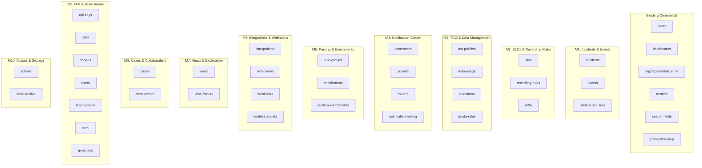

# Plan: Coralogix Full Public API Coverage

| Field | Value |
|-------|-------|
| Status | to-do |
| Created | 2026-04-27 |
| Ticket | N/A |
| Branch | feat/full-api-coverage |

## Context

The cx CLI currently covers ~9 command groups (alerts, dashboards, logs, spans, metrics, search-fields, dataprime, profiles, cleanup). The Coralogix public API exposes 46 service groups with 282 endpoints. This plan adds the remaining ~37 API groups following the existing fan-out → merge → render pattern, supporting text/json/agents output modes. Each new command group follows the established 5-step pattern: CLI definition (main.rs) → API types (src/api/) → command handlers (src/commands/) → main.rs wiring → module registration.

## API Reference

**Coralogix OpenAPI spec:** https://api.coralogix.com/mgmt/openapi/5/openapi.yaml

Before implementing any task, fetch this spec to get the exact endpoint paths, HTTP methods, request/response schemas, and field names. Use it to:
- Set correct API base paths (e.g., `const SLO_BASE: &str = "/mgmt/openapi/latest/slos/v2";`)
- Define response structs with accurate field names and types
- Set correct `#[serde(rename = "...")]` annotations where API uses camelCase or snake_case
- Determine which endpoints use POST vs GET for list operations

## Architecture Decisions

- **One API module + one command module per service group** — keeps the codebase navigable at scale
- **Follow existing patterns exactly** — Clap derive enums, `fan_out()`, `render_table()`/`render_json()`/agents TOON, profile tagging
- **CRUD subcommand naming**: `list`, `get`, `create`, `update`, `delete` — matching existing alerts/dashboards patterns
- **File-based input for create/update** — `--from-file` with `-` for stdin, matching dashboards/alerts create pattern
- **No generated client** — hand-written API structs following the `XxxApi<'a>` pattern, keeping response types minimal (only deserialize fields needed for text output)
- **Milestone ordering** — prioritized by operational value: incident management and observability config first, admin/governance last

## Diagrams



## Testing Requirements

Every new command must include tests at three layers (per CLAUDE.md):

| Layer | Location | What | Run with |
|-------|----------|------|----------|
| **Unit** | `src/api/<domain>.rs` `#[cfg(test)]` | Response deserialization, display helpers | `cargo test` |
| **Integration** | `tests/<domain>.rs` (wiremock) | fan_out → merge → render with mocked HTTP | `cargo test` |
| **E2E** | `tests/e2e/<domain>.rs` (`#[ignore]`) | Real `cx` binary against live Coralogix | `cargo test --test e2e -- --ignored --test-threads=1` |

### Patterns to follow

- **Unit tests:** See `src/api/alerts.rs:181-372` — `serde_json::json!()` → deserialize → assert fields
- **Integration tests:** See `tests/alerts.rs` — `MockServer::start()`, `Mock::given()`, `common::test_target()`, call `run_list()`
- **E2E tests:** See `tests/e2e/alerts.rs` — `harness::require_creds()`, `harness::run_ok_json()`, `assert_array_of_objects_with_keys()`
- **E2E registration:** Add `#[path = "e2e/<domain>.rs"] mod <domain>;` in `tests/e2e.rs`
- **ID discovery:** Use `OnceLock<Option<String>>` to discover IDs from list for get tests (see alerts E2E)
- **Mutating commands:** Skip E2E (shared test team) — cover via wiremock only

### E2E credentials

The harness reads `CX_API_KEY` + `CX_REGION` from env vars or `.env` file. Before running:
```bash
export CX_API_KEY=<key from profile>
export CX_REGION=<region from profile>
cargo test --test e2e -- --ignored --test-threads=1
```

## Milestones Overview

1. **Incidents & Alert Events** — Operators can triage incidents and inspect alert event history from the terminal
2. **SLOs & Recording Rules** — SREs can manage SLO definitions and Prometheus recording rules
3. **TCO Policies & Data Management** — Platform teams can manage cost optimization policies, quotas, and retention settings
4. **Notification Center** — Teams can manage notification connectors, presets, and routing rules
5. **Parsing Rules & Enrichments** — Data engineers can manage log parsing pipelines and enrichment tables
6. **Integrations & Webhooks** — Teams can manage third-party integrations, extensions, and outgoing webhooks
7. **Views & Data Exploration** — Users can manage saved views and view folders
8. **Cases & Collaboration** — Teams can manage incident cases and case comments
9. **IAM & Team Administration** — Admins can manage API keys, roles, scopes, users, groups, SAML, and IP access
10. **Actions & Storage Configuration** — Teams can manage actions and data archival storage targets

---

## Milestone 1: Incidents & Alert Events

**Why this matters:** Incident responders currently must switch to the Coralogix UI to triage incidents. With CLI support, they can list, acknowledge, resolve, and inspect incidents directly from the terminal or via AI agents — critical for on-call automation and ChatOps workflows.

**Success criteria:** An on-call engineer can `cx incidents list`, drill into a specific incident with `cx incidents get <id>`, and acknowledge/resolve it — all from the terminal with text/json/agents output.

**Key decisions:** Incidents use POST for list (filter body) unlike most services that use GET. We'll accept filter flags as CLI args and build the POST body internally, keeping the UX consistent with other list commands.

### 1.1 [ ] Add `incidents` API module
- **Files:** `src/api/incidents.rs`, `src/api/mod.rs`
- **What:** Create `IncidentsApi<'a>` with methods: `list()` (POST /incidents/incidents/v1 with filter body), `get()` (GET /incidents/incidents/v1/{id}), `acknowledge()` (POST .../all/acknowledge), `resolve()` (POST .../all/resolve), `close()` (POST .../all/closed), `assign()` (POST .../all/by-user), `unassign()` (DELETE .../all/by-user), `get_events()` (GET /incidents/events/v1), `get_aggregations()` (GET /incidents/aggregations/v1). Define response structs for list/get (Incident, IncidentEvent) with fields needed for text table rendering: id, name, severity, status, created_at, assigned_to. Register in api/mod.rs. Add `#[cfg(test)] mod tests` with unit tests covering response deserialization (follow `src/api/alerts.rs:181-372` pattern).
- **Acceptance:** `cargo test` passes, `IncidentsApi` compiles with all methods, unit tests cover deserialization of list/get responses
- **Dependencies:** None

### 1.2 [ ] Add `incidents` command module
- **Files:** `src/commands/incidents.rs`, `src/commands/mod.rs`
- **What:** Implement `run_list()`, `run_get()`, `run_acknowledge()`, `run_resolve()`, `run_close()`, `run_assign()`, `run_unassign()`, `run_events()`, `run_aggregations()`. Follow the alerts pattern: fan_out → merge → render for each. `run_list()` should accept optional `--status`, `--severity`, `--assignee` filter flags. Text output: table with columns [ID, Name, Severity, Status, Created, Assigned To]. Register in commands/mod.rs.
- **Acceptance:** Module compiles, `cargo clippy` clean
- **Dependencies:** 1.1

### 1.2a [ ] Add `incidents` integration tests (wiremock)
- **Files:** `tests/incidents.rs`
- **What:** Add wiremock-based integration tests for incidents list/get handlers. Mock POST /incidents/incidents/v1 and GET /incidents/incidents/v1/{id}. Test fan_out → merge → render for both JSON and text output. Follow `tests/alerts.rs` pattern: `MockServer::start()`, `Mock::given()`, `common::test_target()`.
- **Acceptance:** `cargo test --test incidents` passes, covers list and get handlers
- **Dependencies:** 1.2

### 1.3 [ ] Wire `incidents` into CLI and add E2E tests
- **Files:** `src/main.rs`, `tests/e2e/incidents.rs`, `tests/e2e.rs`
- **What:** Add `Incidents` variant to `Commands` enum with `IncidentsCmd` subcommand enum containing: `List` (with filter args), `Get { id }`, `Acknowledge { ids: Vec<String> }`, `Resolve { ids: Vec<String> }`, `Close { ids: Vec<String> }`, `Assign { ids: Vec<String>, user_id: String }`, `Unassign { ids: Vec<String> }`, `Events` (with optional --incident-id filter), `Aggregations`. Wire match arms to command handlers. Add help examples. Add E2E tests in `tests/e2e/incidents.rs` with `#[test] #[ignore]` covering `incidents list` (JSON output, assert array of objects with keys) and `incidents get` (with ID discovery via OnceLock). Register module in `tests/e2e.rs`. Skip mutating commands (acknowledge/resolve/close/assign) in E2E — cover via wiremock only.
- **Acceptance:** `cx incidents --help` shows all subcommands, `cx incidents list --help` shows filter flags, `cargo test` passes, `cargo test --test e2e -- --ignored --test-threads=1 incidents` passes against real Coralogix
- **Dependencies:** 1.2a

### 1.4 [ ] Add `alert-events` API methods and unit tests
- **Files:** `src/api/alerts.rs`
- **What:** Add `events()` and `event_stats()` methods to `AlertsApi`. Define response structs (AlertEvent, ListAlertEventsResponse) with fields for text table: event_id, alert_name, severity, triggered_at, status. Add unit tests for event response deserialization in existing `#[cfg(test)]` block.
- **Acceptance:** `cargo test` passes, unit tests cover event deserialization
- **Dependencies:** None

### 1.4a [ ] Add `alert-events` command handlers
- **Files:** `src/commands/alerts.rs`
- **What:** Implement `run_events()` (GET /alerts/alerts/v3/all/events with optional --alert-id, --start, --end filters) and `run_event_stats()`. Text table: [Event ID, Alert Name, Severity, Triggered At, Status].
- **Acceptance:** Module compiles, `cargo clippy` clean
- **Dependencies:** 1.4

### 1.4b [ ] Add `alert-events` integration tests and wire into CLI
- **Files:** `src/main.rs`, `tests/alerts.rs`
- **What:** Wire `Events` and `EventStats` into `AlertsCmd`. Add wiremock test for `run_events()` in `tests/alerts.rs`.
- **Acceptance:** `cx alerts events --help` works, `cargo test` passes
- **Dependencies:** 1.4a

### 1.4c [ ] Add `alert-events` E2E tests
- **Files:** `tests/e2e/alerts.rs`
- **What:** Add E2E test `alerts_events` in existing `tests/e2e/alerts.rs` with `#[test] #[ignore]`.
- **Acceptance:** `cargo test --test e2e -- --ignored --test-threads=1 alerts_events` passes against real Coralogix
- **Dependencies:** 1.4b

### 1.5 [ ] Add `alert-schedulers` API module
- **Files:** `src/api/alert_schedulers.rs`, `src/api/mod.rs`
- **What:** Create `AlertSchedulersApi<'a>` with methods: list, get, create, update, delete + bulk create/update. Define response structs with fields for text table: id, name, schedule, enabled, created. Register in api/mod.rs. Add `#[cfg(test)] mod tests` for response deserialization.
- **Acceptance:** `cargo test` passes, unit tests cover deserialization
- **Dependencies:** None

### 1.5a [ ] Add `alert-schedulers` command module
- **Files:** `src/commands/alert_schedulers.rs`, `src/commands/mod.rs`
- **What:** Implement `run_list()`, `run_get()`, `run_create()`, `run_update()`, `run_delete()`. Text table: [ID, Name, Schedule, Enabled, Created]. Follow alerts create pattern for file input. Register in commands/mod.rs.
- **Acceptance:** Module compiles, `cargo clippy` clean
- **Dependencies:** 1.5

### 1.5b [ ] Add `alert-schedulers` integration tests (wiremock)
- **Files:** `tests/alert_schedulers.rs`
- **What:** Wiremock-based integration tests for list/get handlers.
- **Acceptance:** `cargo test --test alert_schedulers` passes
- **Dependencies:** 1.5a

### 1.5c [ ] Wire `alert-schedulers` into CLI and add E2E tests
- **Files:** `src/main.rs`, `tests/e2e/alert_schedulers.rs`, `tests/e2e.rs`
- **What:** Add `AlertSchedulers` variant to `Commands` enum with CRUD subcommands. Wire match arms. Add E2E tests for list (read-only). Register in `tests/e2e.rs`. Skip create/update/delete E2E tests (shared test team).
- **Acceptance:** `cx alert-schedulers --help` shows subcommands, `cargo test` passes, `cargo test --test e2e -- --ignored --test-threads=1 alert_schedulers` passes against real Coralogix
- **Dependencies:** 1.5b

---

## Milestone 2: SLOs & Recording Rules

**Why this matters:** SREs managing service reliability need to define and monitor SLOs. Recording rules let teams pre-compute expensive PromQL queries. CLI access enables GitOps workflows — define SLOs/rules in files, apply via CI/CD.

**Success criteria:** An SRE can `cx slos list` to see all SLOs, `cx slos create --from-file slo.json` to create one, and `cx recording-rules list` to manage recording rules — all supporting the standard output modes.

**Key decisions:** SLOs and recording rules are independent services but grouped together because they serve the same SRE persona. Events2Metrics (E2M) is included here as it's closely related to recording rules.

### 2.1 [ ] Add `slos` API module
- **Files:** `src/api/slos.rs`, `src/api/mod.rs`
- **What:** Create `SlosApi<'a>` with methods: list, get, create (POST), replace (PUT), delete, batch_get, batch_execute. Define response structs (Slo, ListSlosResponse) with fields for text table: id, name, target, status, service, period. Register in api/mod.rs. Add `#[cfg(test)] mod tests` with unit tests covering response deserialization.
- **Acceptance:** `cargo test` passes, unit tests cover deserialization of list/get responses
- **Dependencies:** None

### 2.1a [ ] Add `slos` command module
- **Files:** `src/commands/slos.rs`, `src/commands/mod.rs`
- **What:** Implement `run_list()`, `run_get()`, `run_create()`, `run_update()`, `run_delete()`. Follow alerts pattern: fan_out → merge → render. Text table: [ID, Name, Target, Status, Service, Period]. Register in commands/mod.rs.
- **Acceptance:** Module compiles, `cargo clippy` clean
- **Dependencies:** 2.1

### 2.1b [ ] Add `slos` integration tests (wiremock)
- **Files:** `tests/slos.rs`
- **What:** Add wiremock-based integration tests for slos list/get handlers. Follow `tests/alerts.rs` pattern: `MockServer::start()`, `Mock::given()`, `common::test_target()`.
- **Acceptance:** `cargo test --test slos` passes, covers list and get handlers
- **Dependencies:** 2.1a

### 2.1c [ ] Wire `slos` into CLI and add E2E tests
- **Files:** `src/main.rs`, `tests/e2e/slos.rs`, `tests/e2e.rs`
- **What:** Add `Slos` variant to `Commands` enum with subcommands: `List`, `Get { id }`, `Create`, `Update`, `Delete { id }`. Wire match arms. Add E2E tests with `#[test] #[ignore]` for list and get (ID discovery via OnceLock). Register in `tests/e2e.rs`. Skip mutating E2E tests.
- **Acceptance:** `cx slos --help` shows subcommands, `cargo test` passes, `cargo test --test e2e -- --ignored --test-threads=1 slos` passes against real Coralogix
- **Dependencies:** 2.1b

### 2.2 [ ] Add `recording-rules` API module
- **Files:** `src/api/recording_rules.rs`, `src/api/mod.rs`
- **What:** Create `RecordingRulesApi<'a>` with methods: list, get, create, update, delete. Define response structs with fields for text table: id, name, rules_count, interval, created. Register in api/mod.rs. Add `#[cfg(test)] mod tests` for response deserialization.
- **Acceptance:** `cargo test` passes, unit tests cover deserialization
- **Dependencies:** None

### 2.2a [ ] Add `recording-rules` command module
- **Files:** `src/commands/recording_rules.rs`, `src/commands/mod.rs`
- **What:** Implement `run_list()`, `run_get()`, `run_create()`, `run_update()`, `run_delete()`. Text table: [ID, Name, Rules Count, Interval, Created]. Register in commands/mod.rs.
- **Acceptance:** Module compiles, `cargo clippy` clean
- **Dependencies:** 2.2

### 2.2b [ ] Add `recording-rules` integration tests (wiremock)
- **Files:** `tests/recording_rules.rs`
- **What:** Wiremock-based integration tests for list/get handlers.
- **Acceptance:** `cargo test --test recording_rules` passes
- **Dependencies:** 2.2a

### 2.2c [ ] Wire `recording-rules` into CLI and add E2E tests
- **Files:** `src/main.rs`, `tests/e2e/recording_rules.rs`, `tests/e2e.rs`
- **What:** Add `RecordingRules` variant to `Commands` enum with CRUD subcommands. Wire match arms. Add E2E tests for list. Register in `tests/e2e.rs`.
- **Acceptance:** `cx recording-rules --help` works, `cargo test` passes, `cargo test --test e2e -- --ignored --test-threads=1 recording_rules` passes against real Coralogix
- **Dependencies:** 2.2b

### 2.3 [ ] Add `e2m` (Events2Metrics) API module
- **Files:** `src/api/e2m.rs`, `src/api/mod.rs`
- **What:** Create `E2mApi<'a>` with methods: list, get, create, replace, delete, batch_execute, get_labels_cardinality, get_limits. Define response structs with fields for text table: id, name, type, metric_name, created. Register in api/mod.rs. Add `#[cfg(test)] mod tests` for response deserialization.
- **Acceptance:** `cargo test` passes, unit tests cover deserialization
- **Dependencies:** None

### 2.3a [ ] Add `e2m` command module
- **Files:** `src/commands/e2m.rs`, `src/commands/mod.rs`
- **What:** Implement `run_list()`, `run_get()`, `run_create()`, `run_update()`, `run_delete()`, `run_labels_cardinality()`, `run_limits()`. Text table: [ID, Name, Type, Metric Name, Created]. Register in commands/mod.rs.
- **Acceptance:** Module compiles, `cargo clippy` clean
- **Dependencies:** 2.3

### 2.3b [ ] Add `e2m` integration tests (wiremock)
- **Files:** `tests/e2m.rs`
- **What:** Wiremock-based integration tests for list/get handlers.
- **Acceptance:** `cargo test --test e2m` passes
- **Dependencies:** 2.3a

### 2.3c [ ] Wire `e2m` into CLI and add E2E tests
- **Files:** `src/main.rs`, `tests/e2e/e2m.rs`, `tests/e2e.rs`
- **What:** Add `E2m` variant to `Commands` enum with subcommands: `List`, `Get { id }`, `Create`, `Update`, `Delete { id }`, `LabelsCardinality`, `Limits`. Wire match arms. Add E2E tests for list. Register in `tests/e2e.rs`.
- **Acceptance:** `cx e2m --help` works, `cargo test` passes, `cargo test --test e2e -- --ignored --test-threads=1 e2m` passes against real Coralogix
- **Dependencies:** 2.3b

---

## Milestone 3: TCO Policies & Data Management

**Why this matters:** Platform teams need to control data costs. TCO policies determine which logs go to hot vs. warm storage. Retention settings, quotas, and usage metrics give visibility into data spend. CLI access enables infrastructure-as-code for cost governance.

**Success criteria:** A platform engineer can `cx tco-policies list` to see current policies, `cx data-usage` to check consumption, `cx retentions list` to see retention settings, and `cx quota-rules get` to inspect quota allocations.

**Key decisions:** These four services (policies, data-usage, retentions, quota-rules) are grouped because they're all used by the same platform/FinOps persona for cost management.

### 3.1 [ ] Add `tco-policies` API module
- **Files:** `src/api/tco_policies.rs`, `src/api/mod.rs`
- **What:** Create `TcoPoliciesApi<'a>` with methods: list (GET /dataplans/policies/v1), get, create, update, delete, reorder, test_policies, get_settings, replace_settings, overwrite_log_policies, overwrite_span_policies. Define response structs with fields for text table: id, name, priority, source_type, severity, archive_retention. Register in api/mod.rs. Add `#[cfg(test)] mod tests` for response deserialization.
- **Acceptance:** `cargo test` passes, unit tests cover deserialization
- **Dependencies:** None

### 3.1a [ ] Add `tco-policies` command module
- **Files:** `src/commands/tco_policies.rs`, `src/commands/mod.rs`
- **What:** Implement `run_list()`, `run_get()`, `run_create()`, `run_update()`, `run_delete()`, `run_reorder()`, `run_test()`, `run_settings()`, `run_settings_update()`. Text table: [ID, Name, Priority, Source Type, Severity, Archive Retention]. Register in commands/mod.rs.
- **Acceptance:** Module compiles, `cargo clippy` clean
- **Dependencies:** 3.1

### 3.1b [ ] Add `tco-policies` integration tests (wiremock)
- **Files:** `tests/tco_policies.rs`
- **What:** Wiremock-based integration tests for list/get/settings handlers.
- **Acceptance:** `cargo test --test tco_policies` passes
- **Dependencies:** 3.1a

### 3.1c [ ] Wire `tco-policies` into CLI and add E2E tests
- **Files:** `src/main.rs`, `tests/e2e/tco_policies.rs`, `tests/e2e.rs`
- **What:** Add `TcoPolicies` variant to `Commands` enum with subcommands: `List`, `Get { id }`, `Create`, `Update`, `Delete { id }`, `Reorder`, `Test`, `Settings`, `SettingsUpdate`. Wire match arms. Add E2E tests for list and settings (read-only). Register in `tests/e2e.rs`.
- **Acceptance:** `cx tco-policies --help` works, `cargo test` passes, `cargo test --test e2e -- --ignored --test-threads=1 tco_policies` passes against real Coralogix
- **Dependencies:** 3.1b

### 3.2 [ ] Add `data-usage` API module
- **Files:** `src/api/data_usage.rs`, `src/api/mod.rs`
- **What:** Create `DataUsageApi<'a>` with methods: get_usage, daily_processed_gbs, daily_units, daily_eval_tokens, logs_count, spans_count, export_status. Define response structs for summary and daily breakdown. Register in api/mod.rs. Add `#[cfg(test)] mod tests` for response deserialization.
- **Acceptance:** `cargo test` passes, unit tests cover deserialization
- **Dependencies:** None

### 3.2a [ ] Add `data-usage` command module
- **Files:** `src/commands/data_usage.rs`, `src/commands/mod.rs`
- **What:** Implement `run_summary()`, `run_daily()`, `run_logs_count()`, `run_spans_count()`, `run_export_status()`. Text output: summary table or daily breakdown. Register in commands/mod.rs.
- **Acceptance:** Module compiles, `cargo clippy` clean
- **Dependencies:** 3.2

### 3.2b [ ] Add `data-usage` integration tests (wiremock)
- **Files:** `tests/data_usage.rs`
- **What:** Wiremock-based integration tests for summary handler.
- **Acceptance:** `cargo test --test data_usage` passes
- **Dependencies:** 3.2a

### 3.2c [ ] Wire `data-usage` into CLI and add E2E tests
- **Files:** `src/main.rs`, `tests/e2e/data_usage.rs`, `tests/e2e.rs`
- **What:** Add `DataUsage` variant to `Commands` enum with subcommands: `Summary`, `Daily { data_type, start, end }`, `LogsCount`, `SpansCount`, `ExportStatus`. Wire match arms. Add E2E tests for summary (read-only). Register in `tests/e2e.rs`.
- **Acceptance:** `cx data-usage --help` works, `cargo test` passes, `cargo test --test e2e -- --ignored --test-threads=1 data_usage` passes against real Coralogix
- **Dependencies:** 3.2b

### 3.3 [ ] Add `retentions` API module
- **Files:** `src/api/retentions.rs`, `src/api/mod.rs`
- **What:** Create `RetentionsApi<'a>` with methods: get, update, activate, get_enabled. Define response structs with fields for text table: id, name, retention_days, enabled. Register in api/mod.rs. Add `#[cfg(test)] mod tests` for response deserialization.
- **Acceptance:** `cargo test` passes, unit tests cover deserialization
- **Dependencies:** None

### 3.3a [ ] Add `retentions` command module
- **Files:** `src/commands/retentions.rs`, `src/commands/mod.rs`
- **What:** Implement `run_list()`, `run_update()`, `run_activate()`, `run_status()`. Text table: [ID, Name, Retention Days, Enabled]. Register in commands/mod.rs.
- **Acceptance:** Module compiles, `cargo clippy` clean
- **Dependencies:** 3.3

### 3.3b [ ] Add `retentions` integration tests (wiremock)
- **Files:** `tests/retentions.rs`
- **What:** Wiremock-based integration tests for list and status handlers.
- **Acceptance:** `cargo test --test retentions` passes
- **Dependencies:** 3.3a

### 3.3c [ ] Wire `retentions` into CLI and add E2E tests
- **Files:** `src/main.rs`, `tests/e2e/retentions.rs`, `tests/e2e.rs`
- **What:** Add `Retentions` variant to `Commands` enum with subcommands: `List`, `Update`, `Activate`, `Status`. Wire match arms. Add E2E tests for list and status (read-only). Register in `tests/e2e.rs`.
- **Acceptance:** `cx retentions --help` works, `cargo test` passes, `cargo test --test e2e -- --ignored --test-threads=1 retentions` passes against real Coralogix
- **Dependencies:** 3.3b

### 3.4 [ ] Add `quota-rules` API module
- **Files:** `src/api/quota_rules.rs`, `src/api/mod.rs`
- **What:** Create `QuotaRulesApi<'a>` with methods: get, create, replace, delete. Define response structs for rule set details. Register in api/mod.rs. Add `#[cfg(test)] mod tests` for response deserialization.
- **Acceptance:** `cargo test` passes, unit tests cover deserialization
- **Dependencies:** None

### 3.4a [ ] Add `quota-rules` command module
- **Files:** `src/commands/quota_rules.rs`, `src/commands/mod.rs`
- **What:** Implement `run_get()`, `run_create()`, `run_update()`, `run_delete()`. Text output: render rule set details. Register in commands/mod.rs.
- **Acceptance:** Module compiles, `cargo clippy` clean
- **Dependencies:** 3.4

### 3.4b [ ] Add `quota-rules` integration tests (wiremock)
- **Files:** `tests/quota_rules.rs`
- **What:** Wiremock-based integration tests for get handler.
- **Acceptance:** `cargo test --test quota_rules` passes
- **Dependencies:** 3.4a

### 3.4c [ ] Wire `quota-rules` into CLI and add E2E tests
- **Files:** `src/main.rs`, `tests/e2e/quota_rules.rs`, `tests/e2e.rs`
- **What:** Add `QuotaRules` variant to `Commands` enum with subcommands: `Get`, `Create`, `Update`, `Delete`. Wire match arms. Add E2E tests for get (read-only). Register in `tests/e2e.rs`.
- **Acceptance:** `cx quota-rules --help` works, `cargo test` passes, `cargo test --test e2e -- --ignored --test-threads=1 quota_rules` passes against real Coralogix
- **Dependencies:** 3.4b

---

## Milestone 4: Notification Center

**Why this matters:** Alert routing is critical for incident response. Teams need to manage where notifications go (connectors), how they look (presets), and how they're routed (global routers). CLI access enables version-controlled notification infrastructure.

**Success criteria:** A team lead can `cx connectors list` to see notification destinations, `cx routers list` to see routing rules, and `cx presets list` to see message templates — creating/updating any of them from JSON files.

**Key decisions:** The notification center has 4 sub-services (connectors, presets, routers, testing). We implement each as a separate top-level command rather than nesting under `cx notifications` to keep commands discoverable and avoid deep nesting.

### 4.1 [ ] Add `connectors` API module
- **Files:** `src/api/connectors.rs`, `src/api/mod.rs`
- **What:** Create `ConnectorsApi<'a>` with methods: list, get, create, replace, delete, list_summaries, get_type_summaries. Define response structs with fields for text table: id, name, type, enabled, created. Register in api/mod.rs. Add `#[cfg(test)] mod tests` for response deserialization.
- **Acceptance:** `cargo test` passes, unit tests cover deserialization
- **Dependencies:** None

### 4.1a [ ] Add `connectors` command module
- **Files:** `src/commands/connectors.rs`, `src/commands/mod.rs`
- **What:** Implement `run_list()`, `run_get()`, `run_create()`, `run_update()`, `run_delete()`, `run_types()`. Text table: [ID, Name, Type, Enabled, Created]. Register in commands/mod.rs.
- **Acceptance:** Module compiles, `cargo clippy` clean
- **Dependencies:** 4.1

### 4.1b [ ] Add `connectors` integration tests (wiremock)
- **Files:** `tests/connectors.rs`
- **What:** Wiremock-based integration tests for list/get/types handlers.
- **Acceptance:** `cargo test --test connectors` passes
- **Dependencies:** 4.1a

### 4.1c [ ] Wire `connectors` into CLI and add E2E tests
- **Files:** `src/main.rs`, `tests/e2e/connectors.rs`, `tests/e2e.rs`
- **What:** Add `Connectors` variant to `Commands` enum with subcommands. Wire match arms. Add E2E tests for list and types (read-only). Register in `tests/e2e.rs`.
- **Acceptance:** `cx connectors --help` works, `cargo test` passes, `cargo test --test e2e -- --ignored --test-threads=1 connectors` passes against real Coralogix
- **Dependencies:** 4.1b

### 4.2 [ ] Add `routers` API module
- **Files:** `src/api/routers.rs`, `src/api/mod.rs`
- **What:** Create `RoutersApi<'a>` with methods: list, get, create, replace, delete, batch_get_summaries, validate_matcher. Define response structs with fields for text table: id, name, entity_type, destinations_count. Register in api/mod.rs. Add `#[cfg(test)] mod tests` for response deserialization.
- **Acceptance:** `cargo test` passes, unit tests cover deserialization
- **Dependencies:** None

### 4.2a [ ] Add `routers` command module
- **Files:** `src/commands/routers.rs`, `src/commands/mod.rs`
- **What:** Implement `run_list()`, `run_get()`, `run_create()`, `run_update()`, `run_delete()`, `run_validate_matcher()`. Text table: [ID, Name, Entity Type, Destinations Count]. Register in commands/mod.rs.
- **Acceptance:** Module compiles, `cargo clippy` clean
- **Dependencies:** 4.2

### 4.2b [ ] Add `routers` integration tests (wiremock)
- **Files:** `tests/routers.rs`
- **What:** Wiremock-based integration tests for list/get handlers.
- **Acceptance:** `cargo test --test routers` passes
- **Dependencies:** 4.2a

### 4.2c [ ] Wire `routers` into CLI and add E2E tests
- **Files:** `src/main.rs`, `tests/e2e/routers.rs`, `tests/e2e.rs`
- **What:** Add `Routers` variant to `Commands` enum with subcommands. Wire match arms. Add E2E tests for list (read-only). Register in `tests/e2e.rs`.
- **Acceptance:** `cx routers --help` works, `cargo test` passes, `cargo test --test e2e -- --ignored --test-threads=1 routers` passes against real Coralogix
- **Dependencies:** 4.2b

### 4.3 [ ] Add `presets` API module
- **Files:** `src/api/presets.rs`, `src/api/mod.rs`
- **What:** Create `PresetsApi<'a>` with methods: list_summaries, get, create_custom, replace_custom, delete_custom, set_default, get_default_summary. Define response structs with fields for text table: id, name, connector_type, is_default, is_custom. Register in api/mod.rs. Add `#[cfg(test)] mod tests` for response deserialization.
- **Acceptance:** `cargo test` passes, unit tests cover deserialization
- **Dependencies:** None

### 4.3a [ ] Add `presets` command module
- **Files:** `src/commands/presets.rs`, `src/commands/mod.rs`
- **What:** Implement `run_list()`, `run_get()`, `run_create()`, `run_update()`, `run_delete()`, `run_set_default()`. Text table: [ID, Name, Connector Type, Is Default, Is Custom]. Register in commands/mod.rs.
- **Acceptance:** Module compiles, `cargo clippy` clean
- **Dependencies:** 4.3

### 4.3b [ ] Add `presets` integration tests (wiremock)
- **Files:** `tests/presets.rs`
- **What:** Wiremock-based integration tests for list/get handlers.
- **Acceptance:** `cargo test --test presets` passes
- **Dependencies:** 4.3a

### 4.3c [ ] Wire `presets` into CLI and add E2E tests
- **Files:** `src/main.rs`, `tests/e2e/presets.rs`, `tests/e2e.rs`
- **What:** Add `Presets` variant to `Commands` enum with subcommands. Wire match arms. Add E2E tests for list (read-only). Register in `tests/e2e.rs`.
- **Acceptance:** `cx presets --help` works, `cargo test` passes, `cargo test --test e2e -- --ignored --test-threads=1 presets` passes against real Coralogix
- **Dependencies:** 4.3b

### 4.4 [ ] Add `notification-test` API module
- **Files:** `src/api/notification_testing.rs`, `src/api/mod.rs`
- **What:** Create `NotificationTestingApi<'a>` with methods for testing: connector, destination, preset, routing_condition, template_render. Define response structs. Register in api/mod.rs. Add `#[cfg(test)] mod tests` for response deserialization.
- **Acceptance:** `cargo test` passes, unit tests cover deserialization
- **Dependencies:** None

### 4.4a [ ] Add `notification-test` command module
- **Files:** `src/commands/notification_testing.rs`, `src/commands/mod.rs`
- **What:** Implement `run_test_connector()`, `run_test_destination()`, `run_test_preset()`, `run_test_routing_condition()`, `run_test_template_render()`. Each reads JSON from `--from-file` and sends to test endpoint. Register in commands/mod.rs.
- **Acceptance:** Module compiles, `cargo clippy` clean
- **Dependencies:** 4.4

### 4.4b [ ] Add `notification-test` integration tests and wire into CLI
- **Files:** `tests/notification_testing.rs`, `src/main.rs`
- **What:** Add `NotificationTest` variant to `Commands` enum with subcommands: `Connector`, `Destination`, `Preset`, `RoutingCondition`, `TemplateRender`. Wire match arms. Add wiremock-based integration tests for at least one test endpoint. No E2E tests (all subcommands are mutating/testing operations).
- **Acceptance:** `cx notification-test --help` works, `cargo test` passes
- **Dependencies:** 4.4a

---

## Milestone 5: Parsing Rules & Enrichments

**Why this matters:** Data engineers configure how logs are parsed and enriched before indexing. Managing parsing rules and enrichment tables via CLI enables automation — bulk updates, CI/CD pipelines, and scripting for large-scale configuration changes.

**Success criteria:** A data engineer can `cx rule-groups list` to see parsing rules, create/update them from files, and `cx enrichments list` / `cx custom-enrichments list` to manage enrichment configurations.

**Key decisions:** Enrichments and custom-enrichments are separate API services with different schemas, so they get separate commands despite similar names.

### 5.1 [ ] Add `rule-groups` API module
- **Files:** `src/api/rule_groups.rs`, `src/api/mod.rs`
- **What:** Create `RuleGroupsApi<'a>` with methods: list, get, create, update, delete, bulk_delete, get_usage_limits, get_model_mapping. Define response structs with fields for text table: id, name, rules_count, enabled, order, creator. Register in api/mod.rs. Add `#[cfg(test)] mod tests` for response deserialization.
- **Acceptance:** `cargo test` passes, unit tests cover deserialization
- **Dependencies:** None

### 5.1a [ ] Add `rule-groups` command module
- **Files:** `src/commands/rule_groups.rs`, `src/commands/mod.rs`
- **What:** Implement `run_list()`, `run_get()`, `run_create()`, `run_update()`, `run_delete()`, `run_bulk_delete()`, `run_usage_limits()`. Text table: [ID, Name, Rules Count, Enabled, Order, Creator]. Register in commands/mod.rs.
- **Acceptance:** Module compiles, `cargo clippy` clean
- **Dependencies:** 5.1

### 5.1b [ ] Add `rule-groups` integration tests (wiremock)
- **Files:** `tests/rule_groups.rs`
- **What:** Wiremock-based integration tests for list/get handlers.
- **Acceptance:** `cargo test --test rule_groups` passes
- **Dependencies:** 5.1a

### 5.1c [ ] Wire `rule-groups` into CLI and add E2E tests
- **Files:** `src/main.rs`, `tests/e2e/rule_groups.rs`, `tests/e2e.rs`
- **What:** Add `RuleGroups` variant to `Commands` enum with subcommands. Wire match arms. Add E2E tests for list and usage-limits (read-only). Register in `tests/e2e.rs`.
- **Acceptance:** `cx rule-groups --help` works, `cargo test` passes, `cargo test --test e2e -- --ignored --test-threads=1 rule_groups` passes against real Coralogix
- **Dependencies:** 5.1b

### 5.2 [ ] Add `enrichments` API module
- **Files:** `src/api/enrichments.rs`, `src/api/mod.rs`
- **What:** Create `EnrichmentsApi<'a>` with methods: get, add, remove, overwrite, overwrite_all, get_limit, get_settings. Define response structs with fields for text table: id, field_name, enrichment_type, source. Register in api/mod.rs. Add `#[cfg(test)] mod tests` for response deserialization.
- **Acceptance:** `cargo test` passes, unit tests cover deserialization
- **Dependencies:** None

### 5.2a [ ] Add `enrichments` command module
- **Files:** `src/commands/enrichments.rs`, `src/commands/mod.rs`
- **What:** Implement `run_list()`, `run_add()`, `run_remove()`, `run_overwrite()`, `run_limit()`, `run_settings()`. Text table: [ID, Field Name, Enrichment Type, Source]. Register in commands/mod.rs.
- **Acceptance:** Module compiles, `cargo clippy` clean
- **Dependencies:** 5.2

### 5.2b [ ] Add `enrichments` integration tests (wiremock)
- **Files:** `tests/enrichments.rs`
- **What:** Wiremock-based integration tests for list/limit/settings handlers.
- **Acceptance:** `cargo test --test enrichments` passes
- **Dependencies:** 5.2a

### 5.2c [ ] Wire `enrichments` into CLI and add E2E tests
- **Files:** `src/main.rs`, `tests/e2e/enrichments.rs`, `tests/e2e.rs`
- **What:** Add `Enrichments` variant to `Commands` enum with subcommands. Wire match arms. Add E2E tests for list, limit, and settings (read-only). Register in `tests/e2e.rs`.
- **Acceptance:** `cx enrichments --help` works, `cargo test` passes, `cargo test --test e2e -- --ignored --test-threads=1 enrichments` passes against real Coralogix
- **Dependencies:** 5.2b

### 5.3 [ ] Add `custom-enrichments` API module
- **Files:** `src/api/custom_enrichments.rs`, `src/api/mod.rs`
- **What:** Create `CustomEnrichmentsApi<'a>` with methods: list, get, create, update, delete, search_data. Define response structs with fields for text table: id, name, description, type, created. Register in api/mod.rs. Add `#[cfg(test)] mod tests` for response deserialization.
- **Acceptance:** `cargo test` passes, unit tests cover deserialization
- **Dependencies:** None

### 5.3a [ ] Add `custom-enrichments` command module
- **Files:** `src/commands/custom_enrichments.rs`, `src/commands/mod.rs`
- **What:** Implement `run_list()`, `run_get()`, `run_create()`, `run_update()`, `run_delete()`, `run_search()`. Text table: [ID, Name, Description, Type, Created]. Register in commands/mod.rs.
- **Acceptance:** Module compiles, `cargo clippy` clean
- **Dependencies:** 5.3

### 5.3b [ ] Add `custom-enrichments` integration tests (wiremock)
- **Files:** `tests/custom_enrichments.rs`
- **What:** Wiremock-based integration tests for list/get handlers.
- **Acceptance:** `cargo test --test custom_enrichments` passes
- **Dependencies:** 5.3a

### 5.3c [ ] Wire `custom-enrichments` into CLI and add E2E tests
- **Files:** `src/main.rs`, `tests/e2e/custom_enrichments.rs`, `tests/e2e.rs`
- **What:** Add `CustomEnrichments` variant to `Commands` enum with subcommands. Wire match arms. Add E2E tests for list (read-only). Register in `tests/e2e.rs`.
- **Acceptance:** `cx custom-enrichments --help` works, `cargo test` passes, `cargo test --test e2e -- --ignored --test-threads=1 custom_enrichments` passes against real Coralogix
- **Dependencies:** 5.3b

---

## Milestone 6: Integrations & Webhooks

**Why this matters:** Teams need to manage their third-party integrations (AWS, GCP, Slack, etc.), extensions, and outgoing webhooks from the terminal. This enables automation of integration deployment and webhook management across environments.

**Success criteria:** A DevOps engineer can `cx integrations list` to see configured integrations, `cx webhooks list` to see outgoing webhooks, and manage extensions — all with create/update/delete from JSON files.

**Key decisions:** Integrations, extensions, and webhooks are separate top-level commands. Contextual data integrations get their own command due to distinct API patterns.

### 6.1 [ ] Add `integrations` API module
- **Files:** `src/api/integrations.rs`, `src/api/mod.rs`
- **What:** Create `IntegrationsApi<'a>` with methods: list, get_details, get_definition, get_deployed, save, update, delete, test, get_template. Define response structs with fields for text table: id, name, type, status, version. Register in api/mod.rs. Add `#[cfg(test)] mod tests` for response deserialization.
- **Acceptance:** `cargo test` passes, unit tests cover deserialization
- **Dependencies:** None

### 6.1a [ ] Add `integrations` command module
- **Files:** `src/commands/integrations.rs`, `src/commands/mod.rs`
- **What:** Implement `run_list()`, `run_get()`, `run_definition()`, `run_deployed()`, `run_create()`, `run_update()`, `run_delete()`, `run_test()`, `run_template()`. Text table: [ID, Name, Type, Status, Version]. Register in commands/mod.rs.
- **Acceptance:** Module compiles, `cargo clippy` clean
- **Dependencies:** 6.1

### 6.1b [ ] Add `integrations` integration tests (wiremock)
- **Files:** `tests/integrations.rs`
- **What:** Wiremock-based integration tests for list handler.
- **Acceptance:** `cargo test --test integrations` passes
- **Dependencies:** 6.1a

### 6.1c [ ] Wire `integrations` into CLI and add E2E tests
- **Files:** `src/main.rs`, `tests/e2e/integrations.rs`, `tests/e2e.rs`
- **What:** Add `Integrations` variant to `Commands` enum with subcommands. Wire match arms. Add E2E tests for list (read-only). Register in `tests/e2e.rs`.
- **Acceptance:** `cx integrations --help` works, `cargo test` passes, `cargo test --test e2e -- --ignored --test-threads=1 integrations` passes against real Coralogix
- **Dependencies:** 6.1b

### 6.2 [ ] Add `extensions` API module
- **Files:** `src/api/extensions.rs`, `src/api/mod.rs`
- **What:** Create `ExtensionsApi<'a>` with methods: list_all, get, list_deployed, deploy, update, undeploy. Define response structs with fields for text table: id, name, version, deployed, updated. Register in api/mod.rs. Add `#[cfg(test)] mod tests` for response deserialization.
- **Acceptance:** `cargo test` passes, unit tests cover deserialization
- **Dependencies:** None

### 6.2a [ ] Add `extensions` command module
- **Files:** `src/commands/extensions.rs`, `src/commands/mod.rs`
- **What:** Implement `run_list()`, `run_get()`, `run_deployed()`, `run_deploy()`, `run_update()`, `run_undeploy()`. Text table: [ID, Name, Version, Deployed, Updated]. Register in commands/mod.rs.
- **Acceptance:** Module compiles, `cargo clippy` clean
- **Dependencies:** 6.2

### 6.2b [ ] Add `extensions` integration tests (wiremock)
- **Files:** `tests/extensions.rs`
- **What:** Wiremock-based integration tests for list/deployed handlers.
- **Acceptance:** `cargo test --test extensions` passes
- **Dependencies:** 6.2a

### 6.2c [ ] Wire `extensions` into CLI and add E2E tests
- **Files:** `src/main.rs`, `tests/e2e/extensions.rs`, `tests/e2e.rs`
- **What:** Add `Extensions` variant to `Commands` enum with subcommands. Wire match arms. Add E2E tests for list and deployed (read-only). Register in `tests/e2e.rs`.
- **Acceptance:** `cx extensions --help` works, `cargo test` passes, `cargo test --test e2e -- --ignored --test-threads=1 extensions` passes against real Coralogix
- **Dependencies:** 6.2b

### 6.3 [ ] Add `webhooks` API module
- **Files:** `src/api/webhooks.rs`, `src/api/mod.rs`
- **What:** Create `WebhooksApi<'a>` with methods: list_all, get, create, update, delete, test, list_types, get_type_details, list_summaries. Define response structs with fields for text table: id, name, type, url, created. Register in api/mod.rs. Add `#[cfg(test)] mod tests` for response deserialization.
- **Acceptance:** `cargo test` passes, unit tests cover deserialization
- **Dependencies:** None

### 6.3a [ ] Add `webhooks` command module
- **Files:** `src/commands/webhooks.rs`, `src/commands/mod.rs`
- **What:** Implement `run_list()`, `run_get()`, `run_create()`, `run_update()`, `run_delete()`, `run_test()`, `run_types()`. Text table: [ID, Name, Type, URL, Created]. Register in commands/mod.rs.
- **Acceptance:** Module compiles, `cargo clippy` clean
- **Dependencies:** 6.3

### 6.3b [ ] Add `webhooks` integration tests (wiremock)
- **Files:** `tests/webhooks.rs`
- **What:** Wiremock-based integration tests for list/types handlers.
- **Acceptance:** `cargo test --test webhooks` passes
- **Dependencies:** 6.3a

### 6.3c [ ] Wire `webhooks` into CLI and add E2E tests
- **Files:** `src/main.rs`, `tests/e2e/webhooks.rs`, `tests/e2e.rs`
- **What:** Add `Webhooks` variant to `Commands` enum with subcommands. Wire match arms. Add E2E tests for list and types (read-only). Register in `tests/e2e.rs`.
- **Acceptance:** `cx webhooks --help` works, `cargo test` passes, `cargo test --test e2e -- --ignored --test-threads=1 webhooks` passes against real Coralogix
- **Dependencies:** 6.3b

### 6.4 [ ] Add `contextual-data` API module
- **Files:** `src/api/contextual_data.rs`, `src/api/mod.rs`
- **What:** Create `ContextualDataApi<'a>` with methods: list, get, save, update, delete, get_definition, test. Define response structs with fields for text table: id, name, type, status, created. Register in api/mod.rs. Add `#[cfg(test)] mod tests` for response deserialization.
- **Acceptance:** `cargo test` passes, unit tests cover deserialization
- **Dependencies:** None

### 6.4a [ ] Add `contextual-data` command module
- **Files:** `src/commands/contextual_data.rs`, `src/commands/mod.rs`
- **What:** Implement `run_list()`, `run_get()`, `run_create()`, `run_update()`, `run_delete()`, `run_definition()`, `run_test()`. Text table: [ID, Name, Type, Status, Created]. Register in commands/mod.rs.
- **Acceptance:** Module compiles, `cargo clippy` clean
- **Dependencies:** 6.4

### 6.4b [ ] Add `contextual-data` integration tests (wiremock)
- **Files:** `tests/contextual_data.rs`
- **What:** Wiremock-based integration tests for list handler.
- **Acceptance:** `cargo test --test contextual_data` passes
- **Dependencies:** 6.4a

### 6.4c [ ] Wire `contextual-data` into CLI and add E2E tests
- **Files:** `src/main.rs`, `tests/e2e/contextual_data.rs`, `tests/e2e.rs`
- **What:** Add `ContextualData` variant to `Commands` enum with subcommands. Wire match arms. Add E2E tests for list (read-only). Register in `tests/e2e.rs`.
- **Acceptance:** `cx contextual-data --help` works, `cargo test` passes, `cargo test --test e2e -- --ignored --test-threads=1 contextual_data` passes against real Coralogix
- **Dependencies:** 6.4b

---

## Milestone 7: Views & Data Exploration

**Why this matters:** Saved views let users bookmark commonly-used query configurations. Managing views from the CLI enables sharing and automation — teams can version-control their view definitions and deploy them across environments.

**Success criteria:** A user can `cx views list`, `cx views get <id>`, and create/update/delete views and view folders from JSON files.

**Key decisions:** Views and view-folders are separate subcommands under a single `views` command (similar to how dashboards has `folders` nested).

### 7.1 [ ] Add `views` API module
- **Files:** `src/api/views.rs`, `src/api/mod.rs`
- **What:** Create `ViewsApi<'a>` with methods for views (list, get, create, replace, delete) and folders (list, get, create, replace, delete). Define response structs — views: id, name, folder, created; folders: id, name, parent. Follow dashboards API pattern for folder nesting. Register in api/mod.rs. Add `#[cfg(test)] mod tests` for response deserialization.
- **Acceptance:** `cargo test` passes, unit tests cover deserialization of views and folders
- **Dependencies:** None

### 7.1a [ ] Add `views` command module
- **Files:** `src/commands/views.rs`, `src/commands/mod.rs`
- **What:** Implement view handlers: `run_list()`, `run_get()`, `run_create()`, `run_update()`, `run_delete()`. Implement folder handlers: `run_folders_list()`, `run_folders_get()`, `run_folders_create()`, `run_folders_update()`, `run_folders_delete()`. Follow dashboards folders nesting pattern. Text table for views: [ID, Name, Folder, Created]. Text table for folders: [ID, Name, Parent]. Register in commands/mod.rs.
- **Acceptance:** Module compiles, `cargo clippy` clean
- **Dependencies:** 7.1

### 7.1b [ ] Add `views` integration tests (wiremock)
- **Files:** `tests/views.rs`
- **What:** Wiremock-based integration tests for views list and folders list handlers.
- **Acceptance:** `cargo test --test views` passes
- **Dependencies:** 7.1a

### 7.1c [ ] Wire `views` into CLI and add E2E tests
- **Files:** `src/main.rs`, `tests/e2e/views.rs`, `tests/e2e.rs`
- **What:** Add `Views` variant to `Commands` enum with nested subcommands for views and folders. Wire match arms. Add E2E tests for views list and folders list (read-only). Register in `tests/e2e.rs`.
- **Acceptance:** `cx views --help` works, `cx views folders --help` works, `cargo test` passes, `cargo test --test e2e -- --ignored --test-threads=1 views` passes against real Coralogix
- **Dependencies:** 7.1b

---

## Milestone 8: Cases & Collaboration

**Why this matters:** Cases are how teams track and collaborate on incidents in Coralogix. CLI access lets automation tools create comments, sync external threads, and manage case lifecycle — enabling ChatOps and ticketing integrations.

**Success criteria:** A user can view case details, list case events, add/update/delete comments, and manage team configs for the cases system.

**Key decisions:** Cases, case-events, and team-config are all nested under a single `cases` command since they share the same domain context.

### 8.1 [ ] Add `cases` API module
- **Files:** `src/api/cases.rs`, `src/api/mod.rs`
- **What:** Create `CasesApi<'a>` with methods: get_external_references, list_events, get_event, create_comment, update_comment, delete_comment, list_notification_deliveries. Team config methods: get_active, get, create, update, delete, get_system_defaults. Define response structs — events: event_id, type, created, author; team config: id, name, settings. Register in api/mod.rs. Add `#[cfg(test)] mod tests` for response deserialization.
- **Acceptance:** `cargo test` passes, unit tests cover deserialization
- **Dependencies:** None

### 8.1a [ ] Add `cases` command module
- **Files:** `src/commands/cases.rs`, `src/commands/mod.rs`
- **What:** Implement event handlers: `run_events()`, `run_event()`. Comment handlers: `run_comment_create()`, `run_comment_update()`, `run_comment_delete()`. Misc: `run_external_refs()`. Team config handlers: `run_team_config_list()`, `run_team_config_get()`, `run_team_config_create()`, `run_team_config_update()`, `run_team_config_delete()`. Text table for events: [Event ID, Type, Created, Author]. Register in commands/mod.rs.
- **Acceptance:** Module compiles, `cargo clippy` clean
- **Dependencies:** 8.1

### 8.1b [ ] Add `cases` integration tests (wiremock)
- **Files:** `tests/cases.rs`
- **What:** Wiremock-based integration tests for events list and team-config list handlers.
- **Acceptance:** `cargo test --test cases` passes
- **Dependencies:** 8.1a

### 8.1c [ ] Wire `cases` into CLI and add E2E tests
- **Files:** `src/main.rs`, `tests/e2e/cases.rs`, `tests/e2e.rs`
- **What:** Add `Cases` variant to `Commands` enum with nested subcommands for events, comments, external-refs, and team-config. Wire match arms. Add E2E tests for team-config list (read-only). Register in `tests/e2e.rs`. Skip comment and events E2E (need specific case IDs, mutating).
- **Acceptance:** `cx cases --help` works, `cargo test` passes, `cargo test --test e2e -- --ignored --test-threads=1 cases` passes against real Coralogix
- **Dependencies:** 8.1b

---

## Milestone 9: IAM & Team Administration

**Why this matters:** Administrators need to manage API keys, roles, scopes, users, team groups, SAML, and IP access controls. CLI access enables infrastructure-as-code for security governance — automate user provisioning, rotate API keys, manage RBAC, and configure SSO.

**Success criteria:** An admin can manage the full IAM lifecycle from the terminal: `cx api-keys list`, `cx roles list`, `cx scopes list`, `cx users search`, `cx team-groups list`, `cx saml get`, `cx ip-access get`.

**Key decisions:** Each IAM service gets its own top-level command despite being in the same "aaa" API namespace. This keeps commands discoverable and avoids deep nesting. The API Keys Admin service (team-wide operations) is merged into the `api-keys` command as admin subcommands.

### 9.1 [ ] Add `api-keys` API module
- **Files:** `src/api/api_keys.rs`, `src/api/mod.rs`
- **What:** Create `ApiKeysApi<'a>` with methods: list, get, create, update, delete, get_send_data_keys, get_team_members_keys (admin), bulk_delete (admin), update_status (admin). Define response structs with fields for text table: id, name, owner, active, created, hashed_key. Register in api/mod.rs. Add `#[cfg(test)] mod tests` for response deserialization.
- **Acceptance:** `cargo test` passes, unit tests cover deserialization
- **Dependencies:** None

### 9.1a [ ] Add `api-keys` command module
- **Files:** `src/commands/api_keys.rs`, `src/commands/mod.rs`
- **What:** Implement `run_list()`, `run_get()`, `run_create()`, `run_update()`, `run_delete()`, `run_send_data_keys()`, `run_admin_list()`, `run_admin_delete()`, `run_admin_set_status()`. Text table: [ID, Name, Owner, Active, Created, Hashed Key]. Register in commands/mod.rs.
- **Acceptance:** Module compiles, `cargo clippy` clean
- **Dependencies:** 9.1

### 9.1b [ ] Add `api-keys` integration tests (wiremock)
- **Files:** `tests/api_keys.rs`
- **What:** Wiremock-based integration tests for list and send-data-keys handlers.
- **Acceptance:** `cargo test --test api_keys` passes
- **Dependencies:** 9.1a

### 9.1c [ ] Wire `api-keys` into CLI and add E2E tests
- **Files:** `src/main.rs`, `tests/e2e/api_keys.rs`, `tests/e2e.rs`
- **What:** Add `ApiKeys` variant to `Commands` enum with subcommands including nested `Admin` group. Wire match arms. Add E2E tests for list and send-data-keys (read-only). Register in `tests/e2e.rs`.
- **Acceptance:** `cx api-keys --help` works, `cargo test` passes, `cargo test --test e2e -- --ignored --test-threads=1 api_keys` passes against real Coralogix
- **Dependencies:** 9.1b

### 9.2 [ ] Add `roles` API module
- **Files:** `src/api/roles.rs`, `src/api/mod.rs`
- **What:** Create `RolesApi<'a>` with methods: list_custom, get_custom, create, update, delete, list_system. Define response structs with fields for text table: id, name, type, description, permissions_count. Register in api/mod.rs. Add `#[cfg(test)] mod tests` for response deserialization.
- **Acceptance:** `cargo test` passes, unit tests cover deserialization
- **Dependencies:** None

### 9.2a [ ] Add `roles` command module
- **Files:** `src/commands/roles.rs`, `src/commands/mod.rs`
- **What:** Implement `run_list()`, `run_get()`, `run_create()`, `run_update()`, `run_delete()`, `run_system()`. Text table: [ID, Name, Type, Description, Permissions Count]. Register in commands/mod.rs.
- **Acceptance:** Module compiles, `cargo clippy` clean
- **Dependencies:** 9.2

### 9.2b [ ] Add `roles` integration tests (wiremock)
- **Files:** `tests/roles.rs`
- **What:** Wiremock-based integration tests for list and system handlers.
- **Acceptance:** `cargo test --test roles` passes
- **Dependencies:** 9.2a

### 9.2c [ ] Wire `roles` into CLI and add E2E tests
- **Files:** `src/main.rs`, `tests/e2e/roles.rs`, `tests/e2e.rs`
- **What:** Add `Roles` variant to `Commands` enum with subcommands. Wire match arms. Add E2E tests for list and system (read-only). Register in `tests/e2e.rs`.
- **Acceptance:** `cx roles --help` works, `cargo test` passes, `cargo test --test e2e -- --ignored --test-threads=1 roles` passes against real Coralogix
- **Dependencies:** 9.2b

### 9.3 [ ] Add `scopes` API module
- **Files:** `src/api/scopes.rs`, `src/api/mod.rs`
- **What:** Create `ScopesApi<'a>` with methods: list, get (via list+filter), create, update, delete. Define response structs with fields for text table: id, name, description, filters. Register in api/mod.rs. Add `#[cfg(test)] mod tests` for response deserialization.
- **Acceptance:** `cargo test` passes, unit tests cover deserialization
- **Dependencies:** None

### 9.3a [ ] Add `scopes` command module
- **Files:** `src/commands/scopes.rs`, `src/commands/mod.rs`
- **What:** Implement `run_list()`, `run_get()`, `run_create()`, `run_update()`, `run_delete()`. Text table: [ID, Name, Description, Filters]. Register in commands/mod.rs.
- **Acceptance:** Module compiles, `cargo clippy` clean
- **Dependencies:** 9.3

### 9.3b [ ] Add `scopes` integration tests (wiremock)
- **Files:** `tests/scopes.rs`
- **What:** Wiremock-based integration tests for list handler.
- **Acceptance:** `cargo test --test scopes` passes
- **Dependencies:** 9.3a

### 9.3c [ ] Wire `scopes` into CLI and add E2E tests
- **Files:** `src/main.rs`, `tests/e2e/scopes.rs`, `tests/e2e.rs`
- **What:** Add `Scopes` variant to `Commands` enum with subcommands. Wire match arms. Add E2E tests for list (read-only). Register in `tests/e2e.rs`.
- **Acceptance:** `cx scopes --help` works, `cargo test` passes, `cargo test --test e2e -- --ignored --test-threads=1 scopes` passes against real Coralogix
- **Dependencies:** 9.3b

### 9.4 [ ] Add `users` API module
- **Files:** `src/api/users.rs`, `src/api/mod.rs`
- **What:** Create `UsersApi<'a>` with methods: search, get, create, update, update_statuses. Define response structs with fields for text table: user_id, name, email, role, status. Register in api/mod.rs. Add `#[cfg(test)] mod tests` for response deserialization.
- **Acceptance:** `cargo test` passes, unit tests cover deserialization
- **Dependencies:** None

### 9.4a [ ] Add `users` command module
- **Files:** `src/commands/users.rs`, `src/commands/mod.rs`
- **What:** Implement `run_search()`, `run_get()`, `run_create()`, `run_update()`, `run_set_status()`. team_id resolved from config/profile. Text table: [User ID, Name, Email, Role, Status]. Register in commands/mod.rs.
- **Acceptance:** Module compiles, `cargo clippy` clean
- **Dependencies:** 9.4

### 9.4b [ ] Add `users` integration tests (wiremock)
- **Files:** `tests/users.rs`
- **What:** Wiremock-based integration tests for search handler.
- **Acceptance:** `cargo test --test users` passes
- **Dependencies:** 9.4a

### 9.4c [ ] Wire `users` into CLI and add E2E tests
- **Files:** `src/main.rs`, `tests/e2e/users.rs`, `tests/e2e.rs`
- **What:** Add `Users` variant to `Commands` enum with subcommands. Wire match arms. Add E2E tests for search (read-only). Register in `tests/e2e.rs`.
- **Acceptance:** `cx users --help` works, `cargo test` passes, `cargo test --test e2e -- --ignored --test-threads=1 users` passes against real Coralogix
- **Dependencies:** 9.4b

### 9.5 [ ] Add `team-groups` API module
- **Files:** `src/api/team_groups.rs`, `src/api/mod.rs`
- **What:** Create `TeamGroupsApi<'a>` with methods: list, get_by_id, get_by_name, get_users, create, update, delete. Define response structs with fields for text table: group_id, name, members_count, description. Register in api/mod.rs. Add `#[cfg(test)] mod tests` for response deserialization.
- **Acceptance:** `cargo test` passes, unit tests cover deserialization
- **Dependencies:** None

### 9.5a [ ] Add `team-groups` command module
- **Files:** `src/commands/team_groups.rs`, `src/commands/mod.rs`
- **What:** Implement `run_list()`, `run_get()`, `run_get_by_name()`, `run_users()`, `run_create()`, `run_update()`, `run_delete()`. Text table: [Group ID, Name, Members Count, Description]. Register in commands/mod.rs.
- **Acceptance:** Module compiles, `cargo clippy` clean
- **Dependencies:** 9.5

### 9.5b [ ] Add `team-groups` integration tests (wiremock)
- **Files:** `tests/team_groups.rs`
- **What:** Wiremock-based integration tests for list handler.
- **Acceptance:** `cargo test --test team_groups` passes
- **Dependencies:** 9.5a

### 9.5c [ ] Wire `team-groups` into CLI and add E2E tests
- **Files:** `src/main.rs`, `tests/e2e/team_groups.rs`, `tests/e2e.rs`
- **What:** Add `TeamGroups` variant to `Commands` enum with subcommands. Wire match arms. Add E2E tests for list (read-only). Register in `tests/e2e.rs`.
- **Acceptance:** `cx team-groups --help` works, `cargo test` passes, `cargo test --test e2e -- --ignored --test-threads=1 team_groups` passes against real Coralogix
- **Dependencies:** 9.5b

### 9.6 [ ] Add `saml` API module
- **Files:** `src/api/saml.rs`, `src/api/mod.rs`
- **What:** Create `SamlApi<'a>` with methods: get_config, set_idp_params, get_sp_params, set_active. Define response structs for config details. Register in api/mod.rs. Add `#[cfg(test)] mod tests` for response deserialization.
- **Acceptance:** `cargo test` passes, unit tests cover deserialization
- **Dependencies:** None

### 9.6a [ ] Add `saml` command module
- **Files:** `src/commands/saml.rs`, `src/commands/mod.rs`
- **What:** Implement `run_get()`, `run_sp_params()`, `run_set_idp()`, `run_set_active()`. Text output: formatted SAML config details. Register in commands/mod.rs.
- **Acceptance:** Module compiles, `cargo clippy` clean
- **Dependencies:** 9.6

### 9.6b [ ] Add `saml` integration tests (wiremock)
- **Files:** `tests/saml.rs`
- **What:** Wiremock-based integration tests for get and sp-params handlers.
- **Acceptance:** `cargo test --test saml` passes
- **Dependencies:** 9.6a

### 9.6c [ ] Wire `saml` into CLI and add E2E tests
- **Files:** `src/main.rs`, `tests/e2e/saml.rs`, `tests/e2e.rs`
- **What:** Add `Saml` variant to `Commands` enum with subcommands. Wire match arms. Add E2E tests for get and sp-params (read-only). Register in `tests/e2e.rs`.
- **Acceptance:** `cx saml --help` works, `cargo test` passes, `cargo test --test e2e -- --ignored --test-threads=1 saml` passes against real Coralogix
- **Dependencies:** 9.6b

### 9.7 [ ] Add `ip-access` API module
- **Files:** `src/api/ip_access.rs`, `src/api/mod.rs`
- **What:** Create `IpAccessApi<'a>` with methods: get, create, replace, delete. Define response structs for IP access rules. Register in api/mod.rs. Add `#[cfg(test)] mod tests` for response deserialization.
- **Acceptance:** `cargo test` passes, unit tests cover deserialization
- **Dependencies:** None

### 9.7a [ ] Add `ip-access` command module
- **Files:** `src/commands/ip_access.rs`, `src/commands/mod.rs`
- **What:** Implement `run_get()`, `run_create()`, `run_update()`, `run_delete()`. Text output: formatted IP access rules. Register in commands/mod.rs.
- **Acceptance:** Module compiles, `cargo clippy` clean
- **Dependencies:** 9.7

### 9.7b [ ] Add `ip-access` integration tests (wiremock)
- **Files:** `tests/ip_access.rs`
- **What:** Wiremock-based integration tests for get handler.
- **Acceptance:** `cargo test --test ip_access` passes
- **Dependencies:** 9.7a

### 9.7c [ ] Wire `ip-access` into CLI and add E2E tests
- **Files:** `src/main.rs`, `tests/e2e/ip_access.rs`, `tests/e2e.rs`
- **What:** Add `IpAccess` variant to `Commands` enum with subcommands. Wire match arms. Add E2E tests for get (read-only). Register in `tests/e2e.rs`.
- **Acceptance:** `cx ip-access --help` works, `cargo test` passes, `cargo test --test e2e -- --ignored --test-threads=1 ip_access` passes against real Coralogix
- **Dependencies:** 9.7b

---

## Milestone 10: Actions & Storage Configuration

**Why this matters:** Actions are automation hooks triggered by alerts or user interaction. Storage targets configure where archived data is sent. CLI access completes the full API surface coverage.

**Success criteria:** Users can `cx actions list` and manage actions, `cx data-archive get` to check storage configuration — completing 100% API coverage.

**Key decisions:** Actions get a dedicated top-level command. Metrics data archive and logs data archive are combined into a single `data-archive` command with `metrics` and `logs` subcommands.

### 10.1 [ ] Add `actions` API module
- **Files:** `src/api/actions.rs`, `src/api/mod.rs`
- **What:** Create `ActionsApi<'a>` with methods: list, get, create, replace, delete, batch_execute, order. Define response structs with fields for text table: id, name, type, url, is_active. Register in api/mod.rs. Add `#[cfg(test)] mod tests` for response deserialization.
- **Acceptance:** `cargo test` passes, unit tests cover deserialization
- **Dependencies:** None

### 10.1a [ ] Add `actions` command module
- **Files:** `src/commands/actions.rs`, `src/commands/mod.rs`
- **What:** Implement `run_list()`, `run_get()`, `run_create()`, `run_update()`, `run_delete()`, `run_batch()`, `run_reorder()`. Text table: [ID, Name, Type, URL, Is Active]. Register in commands/mod.rs.
- **Acceptance:** Module compiles, `cargo clippy` clean
- **Dependencies:** 10.1

### 10.1b [ ] Add `actions` integration tests (wiremock)
- **Files:** `tests/actions.rs`
- **What:** Wiremock-based integration tests for list handler.
- **Acceptance:** `cargo test --test actions` passes
- **Dependencies:** 10.1a

### 10.1c [ ] Wire `actions` into CLI and add E2E tests
- **Files:** `src/main.rs`, `tests/e2e/actions.rs`, `tests/e2e.rs`
- **What:** Add `Actions` variant to `Commands` enum with subcommands. Wire match arms. Add E2E tests for list (read-only). Register in `tests/e2e.rs`.
- **Acceptance:** `cx actions --help` works, `cargo test` passes, `cargo test --test e2e -- --ignored --test-threads=1 actions` passes against real Coralogix
- **Dependencies:** 10.1b

### 10.2 [ ] Add `data-archive` API module
- **Files:** `src/api/data_archive.rs`, `src/api/mod.rs`
- **What:** Create `DataArchiveApi<'a>` with methods for metrics (get_config, create, update, enable, disable, validate) and logs (get_target, set_target). Define response structs for storage configuration. Register in api/mod.rs. Add `#[cfg(test)] mod tests` for response deserialization.
- **Acceptance:** `cargo test` passes, unit tests cover deserialization
- **Dependencies:** None

### 10.2a [ ] Add `data-archive` command module
- **Files:** `src/commands/data_archive.rs`, `src/commands/mod.rs`
- **What:** Implement metrics handlers: `run_metrics_get()`, `run_metrics_create()`, `run_metrics_update()`, `run_metrics_enable()`, `run_metrics_disable()`, `run_metrics_validate()`. Logs handlers: `run_logs_get()`, `run_logs_set()`. Text output: formatted storage configuration details. Register in commands/mod.rs.
- **Acceptance:** Module compiles, `cargo clippy` clean
- **Dependencies:** 10.2

### 10.2b [ ] Add `data-archive` integration tests (wiremock)
- **Files:** `tests/data_archive.rs`
- **What:** Wiremock-based integration tests for metrics get and logs get handlers.
- **Acceptance:** `cargo test --test data_archive` passes
- **Dependencies:** 10.2a

### 10.2c [ ] Wire `data-archive` into CLI and add E2E tests
- **Files:** `src/main.rs`, `tests/e2e/data_archive.rs`, `tests/e2e.rs`
- **What:** Add `DataArchive` variant to `Commands` enum with nested `Metrics` and `Logs` subcommand groups. Wire match arms. Add E2E tests for metrics get and logs get (read-only). Register in `tests/e2e.rs`.
- **Acceptance:** `cx data-archive --help` works, `cargo test` passes, `cargo test --test e2e -- --ignored --test-threads=1 data_archive` passes against real Coralogix
- **Dependencies:** 10.2b

### 10.3 [ ] Add `entity-types` to connectors API
- **Files:** `src/api/connectors.rs`
- **What:** Extend `ConnectorsApi` with methods: list_entity_types, list_entity_subtypes. Add response structs for entity types. Add unit tests for entity type response deserialization in existing `#[cfg(test)]` block.
- **Acceptance:** `cargo test` passes, unit tests cover entity type deserialization
- **Dependencies:** 4.1

### 10.3a [ ] Wire `entity-types` subcommands and add tests
- **Files:** `src/commands/connectors.rs`, `src/main.rs`, `tests/connectors.rs`, `tests/e2e/connectors.rs`
- **What:** Add `run_entity_types()`, `run_entity_subtypes()` to connectors command module. Add `EntityTypes` and `EntitySubtypes` to connectors CLI subcommands. Add wiremock test for entity-types in existing `tests/connectors.rs`. Add E2E test `connectors_entity_types` in existing `tests/e2e/connectors.rs` (read-only).
- **Acceptance:** `cx connectors entity-types` works, `cargo test` passes, `cargo test --test e2e -- --ignored --test-threads=1 connectors_entity_types` passes against real Coralogix
- **Dependencies:** 10.3
