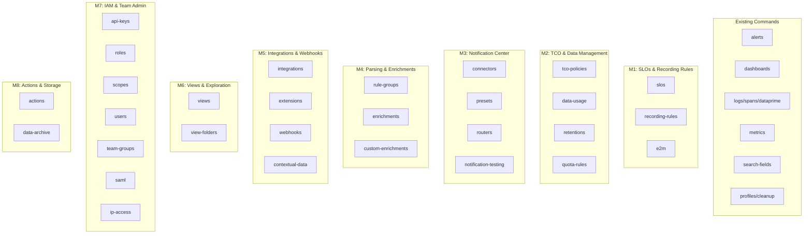

# Plan: Coralogix Full Public API Coverage

| Field | Value |
|-------|-------|
| Status | in-progress |
| Created | 2026-04-27 |
| Ticket | N/A |
| Branch | feat/full-api-coverage |

## Context

The cx CLI currently covers ~9 command groups (alerts, dashboards, logs, spans, metrics, search-fields, dataprime, profiles, cleanup). The Coralogix public API exposes 46 service groups with 282 endpoints. This plan adds the remaining ~32 API groups following the existing fan-out → merge → render pattern, supporting text/json/agents output modes. Each new command group follows the established 5-step pattern: CLI definition (main.rs) → API types (src/api/) → command handlers (src/commands/) → main.rs wiring → module registration.

## API Reference

### OpenAPI spec

The canonical Coralogix management API spec (v5) is saved locally at `plans/openapi.yaml`. Read this file to get exact endpoint paths, HTTP methods, request/response schemas, and field names before implementing any task.

Services covered by `plans/openapi.yaml`: api-keys, roles, scopes, team-groups, users, saml, ip-access, actions, alerts, SLOs.

**Services NOT in the spec:** recording-rules, e2m, TCO policies, data-usage, retentions, quota-rules, connectors, routers, presets, notification-testing, rule-groups, enrichments, custom-enrichments, integrations, extensions, webhooks, contextual-data, views, data-archive. For these, infer paths from the existing codebase pattern: `/mgmt/openapi/latest/<domain>/<resource>/<version>`, or check https://coralogix.com/docs/developer-portal/.

### Verified API paths from specs

| Service | Base path (append to `/mgmt/openapi/latest/` or `/mgmt/openapi/5/`) |
|---------|-----|
| Alerts | `/alerts/alerts-general/v3` (existing code uses `/mgmt/openapi/latest/alerts/alerts-general/v3`) |
| SLOs | `/apm/apm-slo/v1` |
| Actions | `/actions/actions/v2`, `/actions/batch/v2`, `/actions/order/v2` |
| API keys | `/aaa/api-keys/v3`, `/aaa/send-data-keys/v3` |
| Roles | `/aaa/custom-roles/v1`, `/aaa/system-roles/v1` |
| Scopes | `/aaa/team-scopes/v1` |
| Team groups | `/aaa/team-groups/v2` |
| Users | `/aaa/teams/v2/{team_id}/members` |
| SAML | `/aaa/team-saml/v1` |
| IP access | `/aaa/team-sec-ip-access/v1` |
| Dashboards | `/dashboards/dashboards/v1` (existing code uses `/mgmt/openapi/5/dashboards/dashboards/v1`) |

### How to use

Before implementing any task, read `plans/openapi.yaml` to get exact endpoint paths, HTTP methods, request/response schemas, and field names. Use it to:
- Set correct API base paths (e.g., `const SLO_BASE: &str = "/mgmt/openapi/5/apm/apm-slo/v1";`)
- Define response structs with accurate field names and types
- Set correct `#[serde(rename = "...")]` annotations where API uses camelCase or snake_case
- Determine which endpoints use POST vs GET for list operations
- For services not in the spec, follow the path convention: `/mgmt/openapi/latest/<domain>/<resource>/<version>`

## Global CLI Flags

Every command inherits these flags from the existing CLI framework (do not re-implement):

| Flag | Short | Description |
|------|-------|-------------|
| `--output <FORMAT>` | `-o` | Output format: `text` (default), `json`, `agents` |
| `--profile <NAME>` | `-p` | Use specific profile (overrides CX_PROFILE) |
| `--all-profiles` | `-a` | Fan-out across all configured profiles |

All commands must support these three output modes via the existing `render_table()`/`render_json()`/agents TOON pattern.

## Architecture Decisions

- **One API module + one command module per service group** — keeps the codebase navigable at scale
- **Follow existing patterns exactly** — Clap derive enums, `fan_out()`, `render_table()`/`render_json()`/agents TOON, profile tagging
- **CRUD subcommand naming**: `list`, `get`, `create`, `update`, `delete` — matching existing alerts/dashboards patterns
- **File-based input for create/update** — `--from-file` with `-` for stdin, matching dashboards/alerts create pattern
- **No generated client** — hand-written API structs following the `XxxApi<'a>` pattern, keeping response types minimal (only deserialize fields needed for text output)
- **Milestone ordering** — prioritized by operational value: SLO/reliability config first, admin/governance last

## Diagrams



## Testing Requirements

Every new command must include tests at three layers (per CLAUDE.md):

| Layer | Location | What | Run with |
|-------|----------|------|----------|
| **Unit** | `src/api/<domain>.rs` `#[cfg(test)]` | Response deserialization, display helpers | `cargo test` |
| **Integration** | `tests/<domain>.rs` (wiremock) | fan_out → merge → render with mocked HTTP | `cargo test` |
| **E2E** | `tests/e2e/<domain>.rs` (`#[ignore]`) | Real `cx` binary against live Coralogix | `cargo test --test e2e -- --ignored --test-threads=1` |

### Patterns to follow

- **Unit tests:** See `src/api/alerts.rs:181-372` — `serde_json::json!()` → deserialize → assert fields
- **Integration tests:** See `tests/alerts.rs` — `MockServer::start()`, `Mock::given()`, `common::test_target()`, call `run_list()`
- **E2E tests:** See `tests/e2e/alerts.rs` — `harness::require_creds()`, `harness::run_ok_json()`, `assert_array_of_objects_with_keys()`
- **E2E registration:** Add `#[path = "e2e/<domain>.rs"] mod <domain>;` in `tests/e2e.rs`
- **ID discovery:** Use `OnceLock<Option<String>>` to discover IDs from list for get tests (see alerts E2E)
- **Mutating commands:** Skip E2E (shared test team) — cover via wiremock only

### E2E credentials

The harness reads `CX_API_KEY` + `CX_REGION` from env vars or `.env` file. Before running:
```bash
export CX_API_KEY=<key from profile>
export CX_REGION=<region from profile>
cargo test --test e2e -- --ignored --test-threads=1
```

## Milestones Overview

1. **SLOs & Recording Rules** — SREs can manage SLO definitions and Prometheus recording rules
2. **TCO Policies & Data Management** — Platform teams can manage cost optimization policies, quotas, and retention settings
3. **Notification Center** — Teams can manage notification connectors, presets, and routing rules
4. **Parsing Rules & Enrichments** — Data engineers can manage log parsing pipelines and enrichment tables
5. **Integrations & Webhooks** — Teams can manage third-party integrations, extensions, and outgoing webhooks
6. **Views & Data Exploration** — Users can manage saved views and view folders
7. **IAM & Team Administration** — Admins can manage API keys, roles, scopes, users, groups, SAML, and IP access
8. **Actions & Storage Configuration** — Teams can manage actions and data archival storage targets

---

---

## Milestone 1: SLOs & Recording Rules

**Why this matters:** SREs managing service reliability need to define and monitor SLOs. Recording rules let teams pre-compute expensive PromQL queries. CLI access enables GitOps workflows — define SLOs/rules in files, apply via CI/CD.

**Success criteria:** An SRE can `cx slos list` to see all SLOs, `cx slos create --from-file slo.json` to create one, and `cx recording-rules list` to manage recording rules — all supporting the standard output modes.

**Key decisions:** SLOs and recording rules are independent services but grouped together because they serve the same SRE persona. Events2Metrics (E2M) is included here as it's closely related to recording rules.

### CLI Reference

| Command | Required args | Optional args | Description |
|---------|--------------|---------------|-------------|
| `cx slos list` | — | `--order-by <FIELD>`, `--service-names <NAMES>` | List all SLOs |
| `cx slos get <ID>` | `ID` | — | Get SLO details |
| `cx slos create --from-file <FILE>` | `--from-file` | — | Create SLO |
| `cx slos update --from-file <FILE>` | `--from-file` | — | Replace SLO definition |
| `cx slos delete <ID>` | `ID` | — | Delete SLO |
| `cx recording-rules list` | — | — | List recording rule groups |
| `cx recording-rules get <ID>` | `ID` | — | Get recording rule group |
| `cx recording-rules create --from-file <FILE>` | `--from-file` | — | Create recording rule group |
| `cx recording-rules update --from-file <FILE> <ID>` | `--from-file`, `ID` | — | Update recording rule group |
| `cx recording-rules delete <ID>` | `ID` | — | Delete recording rule group |
| `cx e2m list` | — | — | List Events2Metrics definitions |
| `cx e2m get <ID>` | `ID` | — | Get E2M definition |
| `cx e2m create --from-file <FILE>` | `--from-file` | — | Create E2M definition |
| `cx e2m update --from-file <FILE>` | `--from-file` | — | Replace E2M definition |
| `cx e2m delete <ID>` | `ID` | — | Delete E2M definition |
| `cx e2m labels-cardinality` | — | — | Get E2M labels cardinality |
| `cx e2m limits` | — | — | Get E2M limits |

**E2E skip list:** all `create`, `update`, `delete` subcommands

### 1.1 [x] Add `slos` API module *(completed 2026-04-27)*
- **Files:** `src/api/slos.rs`, `src/api/mod.rs`
- **What:** Create `SlosApi<'a>` with methods: list, get, create (POST), replace (PUT), delete, batch_get, batch_execute. Define response structs (Slo, ListSlosResponse) with fields for text table: id, name, target, status, service, period. Register in api/mod.rs. Add `#[cfg(test)] mod tests` with unit tests covering response deserialization.
- **Acceptance:** `cargo test` passes, unit tests cover deserialization of list/get responses
- **Dependencies:** None

### 1.1a [x] Add `slos` command module *(completed 2026-04-27)*
- **Files:** `src/commands/slos.rs`, `src/commands/mod.rs`
- **What:** Implement `run_list()`, `run_get()`, `run_create()`, `run_update()`, `run_delete()`. Follow alerts pattern: fan_out → merge → render. Text table: [ID, Name, Target, Status, Service, Period]. Register in commands/mod.rs.
- **Acceptance:** Module compiles, `cargo clippy` clean
- **Dependencies:** 1.1

### 1.1b [x] Add `slos` integration tests (wiremock) *(completed 2026-04-27)*
- **Files:** `tests/slos.rs`
- **What:** Add wiremock-based integration tests for slos list/get handlers. Follow `tests/alerts.rs` pattern: `MockServer::start()`, `Mock::given()`, `common::test_target()`.
- **Acceptance:** `cargo test --test slos` passes, covers list and get handlers
- **Dependencies:** 1.1a

### 1.1c [x] Wire `slos` into CLI and add E2E tests *(completed 2026-04-27)*
- **Files:** `src/main.rs`, `tests/e2e/slos.rs`, `tests/e2e.rs`
- **What:** Add `Slos` variant to `Commands` enum with subcommands: `List`, `Get { id }`, `Create`, `Update`, `Delete { id }`. Wire match arms. Add E2E tests with `#[test] #[ignore]` for list and get (ID discovery via OnceLock). Register in `tests/e2e.rs`. Skip mutating E2E tests.
- **Acceptance:** `cx slos --help` shows subcommands, `cargo test` passes, `cargo test --test e2e -- --ignored --test-threads=1 slos` passes against real Coralogix
- **Dependencies:** 1.1b

### 1.2 [x] Add `recording-rules` API module *(completed 2026-04-27)*
- **Files:** `src/api/recording_rules.rs`, `src/api/mod.rs`
- **What:** Create `RecordingRulesApi<'a>` with methods: list, get, create, update, delete. Define response structs with fields for text table: id, name, rules_count, interval, created. Register in api/mod.rs. Add `#[cfg(test)] mod tests` for response deserialization.
- **Acceptance:** `cargo test` passes, unit tests cover deserialization
- **Dependencies:** None

### 1.2a [x] Add `recording-rules` command module *(completed 2026-04-27)*
- **Files:** `src/commands/recording_rules.rs`, `src/commands/mod.rs`
- **What:** Implement `run_list()`, `run_get()`, `run_create()`, `run_update()`, `run_delete()`. Text table: [ID, Name, Rules Count, Interval, Created]. Register in commands/mod.rs.
- **Acceptance:** Module compiles, `cargo clippy` clean
- **Dependencies:** 1.2

### 1.2b [x] Add `recording-rules` integration tests (wiremock) *(completed 2026-04-27)*
- **Files:** `tests/recording_rules.rs`
- **What:** Wiremock-based integration tests for list/get handlers.
- **Acceptance:** `cargo test --test recording_rules` passes
- **Dependencies:** 1.2a

### 1.2c [x] Wire `recording-rules` into CLI and add E2E tests *(completed 2026-04-27)*
- **Files:** `src/main.rs`, `tests/e2e/recording_rules.rs`, `tests/e2e.rs`
- **What:** Add `RecordingRules` variant to `Commands` enum with CRUD subcommands. Wire match arms. Add E2E tests for list. Register in `tests/e2e.rs`.
- **Acceptance:** `cx recording-rules --help` works, `cargo test` passes, `cargo test --test e2e -- --ignored --test-threads=1 recording_rules` passes against real Coralogix
- **Dependencies:** 1.2b

### 1.3 [x] Add `e2m` (Events2Metrics) API module *(completed 2026-04-27)*
- **Files:** `src/api/e2m.rs`, `src/api/mod.rs`
- **What:** Create `E2mApi<'a>` with methods: list, get, create, replace, delete, batch_execute, get_labels_cardinality, get_limits. Define response structs with fields for text table: id, name, type, metric_name, created. Register in api/mod.rs. Add `#[cfg(test)] mod tests` for response deserialization.
- **Acceptance:** `cargo test` passes, unit tests cover deserialization
- **Dependencies:** None

### 1.3a [x] Add `e2m` command module *(completed 2026-04-27)*
- **Files:** `src/commands/e2m.rs`, `src/commands/mod.rs`
- **What:** Implement `run_list()`, `run_get()`, `run_create()`, `run_update()`, `run_delete()`, `run_labels_cardinality()`, `run_limits()`. Text table: [ID, Name, Type, Metric Name, Created]. Register in commands/mod.rs.
- **Acceptance:** Module compiles, `cargo clippy` clean
- **Dependencies:** 1.3

### 1.3b [x] Add `e2m` integration tests (wiremock) *(completed 2026-04-27)*
- **Files:** `tests/e2m.rs`
- **What:** Wiremock-based integration tests for list/get handlers.
- **Acceptance:** `cargo test --test e2m` passes
- **Dependencies:** 1.3a

### 1.3c [x] Wire `e2m` into CLI and add E2E tests *(completed 2026-04-27)*
- **Files:** `src/main.rs`, `tests/e2e/e2m.rs`, `tests/e2e.rs`
- **What:** Add `E2m` variant to `Commands` enum with subcommands: `List`, `Get { id }`, `Create`, `Update`, `Delete { id }`, `LabelsCardinality`, `Limits`. Wire match arms. Add E2E tests for list. Register in `tests/e2e.rs`.
- **Acceptance:** `cx e2m --help` works, `cargo test` passes, `cargo test --test e2e -- --ignored --test-threads=1 e2m` passes against real Coralogix
- **Dependencies:** 1.3b

---

## Milestone 2: TCO Policies & Data Management

**Why this matters:** Platform teams need to control data costs. TCO policies determine which logs go to hot vs. warm storage. Retention settings, quotas, and usage metrics give visibility into data spend. CLI access enables infrastructure-as-code for cost governance.

**Success criteria:** A platform engineer can `cx tco-policies list` to see current policies, `cx data-usage` to check consumption, `cx retentions list` to see retention settings, and `cx quota-rules get` to inspect quota allocations.

**Key decisions:** These four services (policies, data-usage, retentions, quota-rules) are grouped because they're all used by the same platform/FinOps persona for cost management.

### CLI Reference

| Command | Required args | Optional args | Description |
|---------|--------------|---------------|-------------|
| `cx tco-policies list` | — | — | List TCO policies |
| `cx tco-policies get <ID>` | `ID` | — | Get policy details |
| `cx tco-policies create --from-file <FILE>` | `--from-file` | — | Create policy |
| `cx tco-policies update --from-file <FILE>` | `--from-file` | — | Update policy |
| `cx tco-policies delete <ID>` | `ID` | — | Delete policy |
| `cx tco-policies reorder --from-file <FILE>` | `--from-file` | — | Reorder policies by priority |
| `cx tco-policies test --from-file <FILE>` | `--from-file` | — | Test policy matching |
| `cx tco-policies settings` | — | — | Show TCO settings |
| `cx tco-policies settings-update --from-file <FILE>` | `--from-file` | — | Replace TCO settings |
| `cx data-usage summary` | — | — | Show data usage overview |
| `cx data-usage daily` | — | `--type <processed-gbs\|units\|eval-tokens>`, `--start <TIME>`, `--end <TIME>` | Daily usage breakdown |
| `cx data-usage logs-count` | — | — | Show logs count |
| `cx data-usage spans-count` | — | — | Show spans count |
| `cx data-usage export-status` | — | — | Show export status |
| `cx retentions list` | — | — | List retention settings |
| `cx retentions update --from-file <FILE>` | `--from-file` | — | Update retention settings |
| `cx retentions activate` | — | — | Activate retention |
| `cx retentions status` | — | — | Check retention enabled status |
| `cx quota-rules get` | — | — | Get quota rule set |
| `cx quota-rules create --from-file <FILE>` | `--from-file` | — | Create quota rules |
| `cx quota-rules update --from-file <FILE>` | `--from-file` | — | Replace quota rules |
| `cx quota-rules delete` | — | — | Delete quota rules |

**E2E skip list:** all `create`, `update`, `delete`, `reorder`, `test`, `settings-update`, `activate` subcommands

### 2.1 [x] Add `tco-policies` API module *(completed 2026-04-27)*
- **Files:** `src/api/tco_policies.rs`, `src/api/mod.rs`
- **What:** Create `TcoPoliciesApi<'a>` with methods: list (GET /dataplans/policies/v1), get, create, update, delete, reorder, test_policies, get_settings, replace_settings, overwrite_log_policies, overwrite_span_policies. Define response structs with fields for text table: id, name, priority, source_type, severity, archive_retention. Register in api/mod.rs. Add `#[cfg(test)] mod tests` for response deserialization.
- **Acceptance:** `cargo test` passes, unit tests cover deserialization
- **Dependencies:** None

### 2.1a [x] Add `tco-policies` command module *(completed 2026-04-27)*
- **Files:** `src/commands/tco_policies.rs`, `src/commands/mod.rs`
- **What:** Implement `run_list()`, `run_get()`, `run_create()`, `run_update()`, `run_delete()`, `run_reorder()`, `run_test()`, `run_settings()`, `run_settings_update()`. Text table: [ID, Name, Priority, Source Type, Severity, Archive Retention]. Register in commands/mod.rs.
- **Acceptance:** Module compiles, `cargo clippy` clean
- **Dependencies:** 2.1

### 2.1b [x] Add `tco-policies` integration tests (wiremock) *(completed 2026-04-27)*
- **Files:** `tests/tco_policies.rs`
- **What:** Wiremock-based integration tests for list/get/settings handlers.
- **Acceptance:** `cargo test --test tco_policies` passes
- **Dependencies:** 2.1a

### 2.1c [x] Wire `tco-policies` into CLI and add E2E tests *(completed 2026-04-27)*
- **Files:** `src/main.rs`, `tests/e2e/tco_policies.rs`, `tests/e2e.rs`
- **What:** Add `TcoPolicies` variant to `Commands` enum with subcommands: `List`, `Get { id }`, `Create`, `Update`, `Delete { id }`, `Reorder`, `Test`, `Settings`, `SettingsUpdate`. Wire match arms. Add E2E tests for list and settings (read-only). Register in `tests/e2e.rs`.
- **Acceptance:** `cx tco-policies --help` works, `cargo test` passes, `cargo test --test e2e -- --ignored --test-threads=1 tco_policies` passes against real Coralogix
- **Dependencies:** 2.1b

### 2.2 [x] Add `data-usage` API module *(completed 2026-04-27)*
- **Files:** `src/api/data_usage.rs`, `src/api/mod.rs`
- **What:** Create `DataUsageApi<'a>` with methods: get_usage, daily_processed_gbs, daily_units, daily_eval_tokens, logs_count, spans_count, export_status. Define response structs for summary and daily breakdown. Register in api/mod.rs. Add `#[cfg(test)] mod tests` for response deserialization.
- **Acceptance:** `cargo test` passes, unit tests cover deserialization
- **Dependencies:** None

### 2.2a [x] Add `data-usage` command module *(completed 2026-04-27)*
- **Files:** `src/commands/data_usage.rs`, `src/commands/mod.rs`
- **What:** Implement `run_summary()`, `run_daily()`, `run_logs_count()`, `run_spans_count()`, `run_export_status()`. Text output: summary table or daily breakdown. Register in commands/mod.rs.
- **Acceptance:** Module compiles, `cargo clippy` clean
- **Dependencies:** 2.2

### 2.2b [x] Add `data-usage` integration tests (wiremock) *(completed 2026-04-27)*
- **Files:** `tests/data_usage.rs`
- **What:** Wiremock-based integration tests for summary handler.
- **Acceptance:** `cargo test --test data_usage` passes
- **Dependencies:** 2.2a

### 2.2c [x] Wire `data-usage` into CLI and add E2E tests *(completed 2026-04-27)*
- **Files:** `src/main.rs`, `tests/e2e/data_usage.rs`, `tests/e2e.rs`
- **What:** Add `DataUsage` variant to `Commands` enum with subcommands: `Summary`, `Daily { data_type, start, end }`, `LogsCount`, `SpansCount`, `ExportStatus`. Wire match arms. Add E2E tests for summary (read-only). Register in `tests/e2e.rs`.
- **Acceptance:** `cx data-usage --help` works, `cargo test` passes, `cargo test --test e2e -- --ignored --test-threads=1 data_usage` passes against real Coralogix
- **Dependencies:** 2.2b

### 2.3 [x] Add `retentions` API module *(completed 2026-04-27)*
- **Files:** `src/api/retentions.rs`, `src/api/mod.rs`
- **What:** Create `RetentionsApi<'a>` with methods: get, update, activate, get_enabled. Define response structs with fields for text table: id, name, retention_days, enabled. Register in api/mod.rs. Add `#[cfg(test)] mod tests` for response deserialization.
- **Acceptance:** `cargo test` passes, unit tests cover deserialization
- **Dependencies:** None

### 2.3a [x] Add `retentions` command module *(completed 2026-04-27)*
- **Files:** `src/commands/retentions.rs`, `src/commands/mod.rs`
- **What:** Implement `run_list()`, `run_update()`, `run_activate()`, `run_status()`. Text table: [ID, Name, Retention Days, Enabled]. Register in commands/mod.rs.
- **Acceptance:** Module compiles, `cargo clippy` clean
- **Dependencies:** 2.3

### 2.3b [x] Add `retentions` integration tests (wiremock) *(completed 2026-04-27)*
- **Files:** `tests/retentions.rs`
- **What:** Wiremock-based integration tests for list and status handlers.
- **Acceptance:** `cargo test --test retentions` passes
- **Dependencies:** 2.3a

### 2.3c [x] Wire `retentions` into CLI and add E2E tests *(completed 2026-04-27)*
- **Files:** `src/main.rs`, `tests/e2e/retentions.rs`, `tests/e2e.rs`
- **What:** Add `Retentions` variant to `Commands` enum with subcommands: `List`, `Update`, `Activate`, `Status`. Wire match arms. Add E2E tests for list and status (read-only). Register in `tests/e2e.rs`.
- **Acceptance:** `cx retentions --help` works, `cargo test` passes, `cargo test --test e2e -- --ignored --test-threads=1 retentions` passes against real Coralogix
- **Dependencies:** 2.3b

### 2.4 [x] Add `quota-rules` API module *(completed 2026-04-27)*
- **Files:** `src/api/quota_rules.rs`, `src/api/mod.rs`
- **What:** Create `QuotaRulesApi<'a>` with methods: get, create, replace, delete. Define response structs for rule set details. Register in api/mod.rs. Add `#[cfg(test)] mod tests` for response deserialization.
- **Acceptance:** `cargo test` passes, unit tests cover deserialization
- **Dependencies:** None

### 2.4a [x] Add `quota-rules` command module *(completed 2026-04-27)*
- **Files:** `src/commands/quota_rules.rs`, `src/commands/mod.rs`
- **What:** Implement `run_get()`, `run_create()`, `run_update()`, `run_delete()`. Text output: render rule set details. Register in commands/mod.rs.
- **Acceptance:** Module compiles, `cargo clippy` clean
- **Dependencies:** 2.4

### 2.4b [x] Add `quota-rules` integration tests (wiremock) *(completed 2026-04-27)*
- **Files:** `tests/quota_rules.rs`
- **What:** Wiremock-based integration tests for get handler.
- **Acceptance:** `cargo test --test quota_rules` passes
- **Dependencies:** 2.4a

### 2.4c [x] Wire `quota-rules` into CLI and add E2E tests *(completed 2026-04-27)*
- **Files:** `src/main.rs`, `tests/e2e/quota_rules.rs`, `tests/e2e.rs`
- **What:** Add `QuotaRules` variant to `Commands` enum with subcommands: `Get`, `Create`, `Update`, `Delete`. Wire match arms. Add E2E tests for get (read-only). Register in `tests/e2e.rs`.
- **Acceptance:** `cx quota-rules --help` works, `cargo test` passes, `cargo test --test e2e -- --ignored --test-threads=1 quota_rules` passes against real Coralogix
- **Dependencies:** 2.4b

---

## Milestone 3: Notification Center

**Why this matters:** Alert routing is critical for incident response. Teams need to manage where notifications go (connectors), how they look (presets), and how they're routed (global routers). CLI access enables version-controlled notification infrastructure.

**Success criteria:** A team lead can `cx connectors list` to see notification destinations, `cx routers list` to see routing rules, and `cx presets list` to see message templates — creating/updating any of them from JSON files.

**Key decisions:** The notification center has 4 sub-services (connectors, presets, routers, testing). We implement each as a separate top-level command rather than nesting under `cx notifications` to keep commands discoverable and avoid deep nesting.

### CLI Reference

| Command | Required args | Optional args | Description |
|---------|--------------|---------------|-------------|
| `cx connectors list` | — | — | List notification connectors |
| `cx connectors get <ID>` | `ID` | — | Get connector details |
| `cx connectors create --from-file <FILE>` | `--from-file` | — | Create connector |
| `cx connectors update --from-file <FILE>` | `--from-file` | — | Replace connector |
| `cx connectors delete <ID>` | `ID` | — | Delete connector |
| `cx connectors types` | — | — | List connector type summaries |
| `cx routers list` | — | — | List global notification routers |
| `cx routers get <ID>` | `ID` | — | Get router details |
| `cx routers create --from-file <FILE>` | `--from-file` | — | Create router |
| `cx routers update --from-file <FILE>` | `--from-file` | — | Replace router |
| `cx routers delete <ID>` | `ID` | — | Delete router |
| `cx routers validate-matcher --from-file <FILE>` | `--from-file` | — | Test entity label matcher |
| `cx presets list` | — | — | List notification presets |
| `cx presets get <ID>` | `ID` | — | Get preset details |
| `cx presets create --from-file <FILE>` | `--from-file` | — | Create custom preset |
| `cx presets update --from-file <FILE>` | `--from-file` | — | Replace custom preset |
| `cx presets delete <ID>` | `ID` | — | Delete custom preset |
| `cx presets set-default <ID>` | `ID` | — | Set default preset |
| `cx notification-test connector --from-file <FILE>` | `--from-file` | — | Test connector config |
| `cx notification-test destination --from-file <FILE>` | `--from-file` | — | Test destination |
| `cx notification-test preset --from-file <FILE>` | `--from-file` | — | Test preset config |
| `cx notification-test routing-condition --from-file <FILE>` | `--from-file` | — | Test routing condition |
| `cx notification-test template-render --from-file <FILE>` | `--from-file` | — | Test template rendering |

**E2E skip list:** all `create`, `update`, `delete`, `set-default`, `validate-matcher` subcommands; all `notification-test` subcommands

### 3.1 [x] Add `connectors` API module *(completed 2026-04-27)*
- **Files:** `src/api/connectors.rs`, `src/api/mod.rs`
- **What:** Create `ConnectorsApi<'a>` with methods: list, get, create, replace, delete, list_summaries, get_type_summaries. Define response structs with fields for text table: id, name, type, enabled, created. Register in api/mod.rs. Add `#[cfg(test)] mod tests` for response deserialization.
- **Acceptance:** `cargo test` passes, unit tests cover deserialization
- **Dependencies:** None

### 3.1a [x] Add `connectors` command module *(completed 2026-04-27)*
- **Files:** `src/commands/connectors.rs`, `src/commands/mod.rs`
- **What:** Implement `run_list()`, `run_get()`, `run_create()`, `run_update()`, `run_delete()`, `run_types()`. Text table: [ID, Name, Type, Enabled, Created]. Register in commands/mod.rs.
- **Acceptance:** Module compiles, `cargo clippy` clean
- **Dependencies:** 3.1

### 3.1b [x] Add `connectors` integration tests (wiremock) *(completed 2026-04-27)*
- **Files:** `tests/connectors.rs`
- **What:** Wiremock-based integration tests for list/get/types handlers.
- **Acceptance:** `cargo test --test connectors` passes
- **Dependencies:** 3.1a

### 3.1c [x] Wire `connectors` into CLI and add E2E tests *(completed 2026-04-27)*
- **Files:** `src/main.rs`, `tests/e2e/connectors.rs`, `tests/e2e.rs`
- **What:** Add `Connectors` variant to `Commands` enum with subcommands. Wire match arms. Add E2E tests for list and types (read-only). Register in `tests/e2e.rs`.
- **Acceptance:** `cx connectors --help` works, `cargo test` passes, `cargo test --test e2e -- --ignored --test-threads=1 connectors` passes against real Coralogix
- **Dependencies:** 3.1b

### 3.2 [x] Add `routers` API module *(completed 2026-04-27)*
- **Files:** `src/api/routers.rs`, `src/api/mod.rs`
- **What:** Create `RoutersApi<'a>` with methods: list, get, create, replace, delete, batch_get_summaries, validate_matcher. Define response structs with fields for text table: id, name, entity_type, destinations_count. Register in api/mod.rs. Add `#[cfg(test)] mod tests` for response deserialization.
- **Acceptance:** `cargo test` passes, unit tests cover deserialization
- **Dependencies:** None

### 3.2a [x] Add `routers` command module *(completed 2026-04-27)*
- **Files:** `src/commands/routers.rs`, `src/commands/mod.rs`
- **What:** Implement `run_list()`, `run_get()`, `run_create()`, `run_update()`, `run_delete()`, `run_validate_matcher()`. Text table: [ID, Name, Entity Type, Destinations Count]. Register in commands/mod.rs.
- **Acceptance:** Module compiles, `cargo clippy` clean
- **Dependencies:** 3.2

### 3.2b [x] Add `routers` integration tests (wiremock) *(completed 2026-04-27)*
- **Files:** `tests/routers.rs`
- **What:** Wiremock-based integration tests for list/get handlers.
- **Acceptance:** `cargo test --test routers` passes
- **Dependencies:** 3.2a

### 3.2c [x] Wire `routers` into CLI and add E2E tests *(completed 2026-04-27)*
- **Files:** `src/main.rs`, `tests/e2e/routers.rs`, `tests/e2e.rs`
- **What:** Add `Routers` variant to `Commands` enum with subcommands. Wire match arms. Add E2E tests for list (read-only). Register in `tests/e2e.rs`.
- **Acceptance:** `cx routers --help` works, `cargo test` passes, `cargo test --test e2e -- --ignored --test-threads=1 routers` passes against real Coralogix
- **Dependencies:** 3.2b

### 3.3 [x] Add `presets` API module *(completed 2026-04-27)*
- **Files:** `src/api/presets.rs`, `src/api/mod.rs`
- **What:** Create `PresetsApi<'a>` with methods: list_summaries, get, create_custom, replace_custom, delete_custom, set_default, get_default_summary. Define response structs with fields for text table: id, name, connector_type, is_default, is_custom. Register in api/mod.rs. Add `#[cfg(test)] mod tests` for response deserialization.
- **Acceptance:** `cargo test` passes, unit tests cover deserialization
- **Dependencies:** None

### 3.3a [x] Add `presets` command module *(completed 2026-04-27)*
- **Files:** `src/commands/presets.rs`, `src/commands/mod.rs`
- **What:** Implement `run_list()`, `run_get()`, `run_create()`, `run_update()`, `run_delete()`, `run_set_default()`. Text table: [ID, Name, Connector Type, Is Default, Is Custom]. Register in commands/mod.rs.
- **Acceptance:** Module compiles, `cargo clippy` clean
- **Dependencies:** 3.3

### 3.3b [x] Add `presets` integration tests (wiremock) *(completed 2026-04-27)*
- **Files:** `tests/presets.rs`
- **What:** Wiremock-based integration tests for list/get handlers.
- **Acceptance:** `cargo test --test presets` passes
- **Dependencies:** 3.3a

### 3.3c [x] Wire `presets` into CLI and add E2E tests *(completed 2026-04-27)*
- **Files:** `src/main.rs`, `tests/e2e/presets.rs`, `tests/e2e.rs`
- **What:** Add `Presets` variant to `Commands` enum with subcommands. Wire match arms. Add E2E tests for list (read-only). Register in `tests/e2e.rs`.
- **Acceptance:** `cx presets --help` works, `cargo test` passes, `cargo test --test e2e -- --ignored --test-threads=1 presets` passes against real Coralogix
- **Dependencies:** 3.3b

### 3.4 [x] Add `notification-test` API module *(completed 2026-04-27)*
- **Files:** `src/api/notification_testing.rs`, `src/api/mod.rs`
- **What:** Create `NotificationTestingApi<'a>` with methods for testing: connector, destination, preset, routing_condition, template_render. Define response structs. Register in api/mod.rs. Add `#[cfg(test)] mod tests` for response deserialization.
- **Acceptance:** `cargo test` passes, unit tests cover deserialization
- **Dependencies:** None

### 3.4a [x] Add `notification-test` command module *(completed 2026-04-27)*
- **Files:** `src/commands/notification_testing.rs`, `src/commands/mod.rs`
- **What:** Implement `run_test_connector()`, `run_test_destination()`, `run_test_preset()`, `run_test_routing_condition()`, `run_test_template_render()`. Each reads JSON from `--from-file` and sends to test endpoint. Register in commands/mod.rs.
- **Acceptance:** Module compiles, `cargo clippy` clean
- **Dependencies:** 3.4

### 3.4b [x] Add `notification-test` integration tests and wire into CLI *(completed 2026-04-27)*
- **Files:** `tests/notification_testing.rs`, `src/main.rs`
- **What:** Add `NotificationTest` variant to `Commands` enum with subcommands: `Connector`, `Destination`, `Preset`, `RoutingCondition`, `TemplateRender`. Wire match arms. Add wiremock-based integration tests for at least one test endpoint. No E2E tests (all subcommands are mutating/testing operations).
- **Acceptance:** `cx notification-test --help` works, `cargo test` passes
- **Dependencies:** 3.4a

---

## Milestone 4: Parsing Rules & Enrichments

**Why this matters:** Data engineers configure how logs are parsed and enriched before indexing. Managing parsing rules and enrichment tables via CLI enables automation — bulk updates, CI/CD pipelines, and scripting for large-scale configuration changes.

**Success criteria:** A data engineer can `cx rule-groups list` to see parsing rules, create/update them from files, and `cx enrichments list` / `cx custom-enrichments list` to manage enrichment configurations.

**Key decisions:** Enrichments and custom-enrichments are separate API services with different schemas, so they get separate commands despite similar names.

### CLI Reference

| Command | Required args | Optional args | Description |
|---------|--------------|---------------|-------------|
| `cx rule-groups list` | — | — | List parsing rule groups |
| `cx rule-groups get <ID>` | `ID` | — | Get rule group details |
| `cx rule-groups create --from-file <FILE>` | `--from-file` | — | Create rule group |
| `cx rule-groups update --from-file <FILE> <ID>` | `--from-file`, `ID` | — | Update rule group |
| `cx rule-groups delete <ID>` | `ID` | — | Delete rule group |
| `cx rule-groups bulk-delete --ids <IDS...>` | `--ids` | — | Bulk delete rule groups |
| `cx rule-groups usage-limits` | — | — | Show rule usage limits |
| `cx enrichments list` | — | — | List enrichment rules |
| `cx enrichments add --from-file <FILE>` | `--from-file` | — | Add enrichment rules |
| `cx enrichments remove --from-file <FILE>` | `--from-file` | — | Remove enrichment rules |
| `cx enrichments overwrite --from-file <FILE>` | `--from-file` | — | Overwrite enrichment rules |
| `cx enrichments limit` | — | — | Show enrichment limits |
| `cx enrichments settings` | — | — | Show enrichment settings |
| `cx custom-enrichments list` | — | — | List custom enrichment tables |
| `cx custom-enrichments get <ID>` | `ID` | — | Get enrichment table details |
| `cx custom-enrichments create --from-file <FILE>` | `--from-file` | — | Create enrichment table |
| `cx custom-enrichments update --from-file <FILE>` | `--from-file` | — | Update enrichment table |
| `cx custom-enrichments delete <ID>` | `ID` | — | Delete enrichment table |
| `cx custom-enrichments search --id <ID> --query <TEXT>` | `--id`, `--query` | — | Search enrichment data |

**E2E skip list:** all `create`, `update`, `delete`, `bulk-delete`, `add`, `remove`, `overwrite`, `search` subcommands

### 4.1 [x] Add `rule-groups` API module *(completed 2026-04-27)*
- **Files:** `src/api/rule_groups.rs`, `src/api/mod.rs`
- **What:** Create `RuleGroupsApi<'a>` with methods: list, get, create, update, delete, bulk_delete, get_usage_limits, get_model_mapping. Define response structs with fields for text table: id, name, rules_count, enabled, order, creator. Register in api/mod.rs. Add `#[cfg(test)] mod tests` for response deserialization.
- **Acceptance:** `cargo test` passes, unit tests cover deserialization
- **Dependencies:** None

### 4.1a [ ] Add `rule-groups` command module
- **Files:** `src/commands/rule_groups.rs`, `src/commands/mod.rs`
- **What:** Implement `run_list()`, `run_get()`, `run_create()`, `run_update()`, `run_delete()`, `run_bulk_delete()`, `run_usage_limits()`. Text table: [ID, Name, Rules Count, Enabled, Order, Creator]. Register in commands/mod.rs.
- **Acceptance:** Module compiles, `cargo clippy` clean
- **Dependencies:** 4.1

### 4.1b [ ] Add `rule-groups` integration tests (wiremock)
- **Files:** `tests/rule_groups.rs`
- **What:** Wiremock-based integration tests for list/get handlers.
- **Acceptance:** `cargo test --test rule_groups` passes
- **Dependencies:** 4.1a

### 4.1c [ ] Wire `rule-groups` into CLI and add E2E tests
- **Files:** `src/main.rs`, `tests/e2e/rule_groups.rs`, `tests/e2e.rs`
- **What:** Add `RuleGroups` variant to `Commands` enum with subcommands. Wire match arms. Add E2E tests for list and usage-limits (read-only). Register in `tests/e2e.rs`.
- **Acceptance:** `cx rule-groups --help` works, `cargo test` passes, `cargo test --test e2e -- --ignored --test-threads=1 rule_groups` passes against real Coralogix
- **Dependencies:** 4.1b

### 4.2 [x] Add `enrichments` API module *(completed 2026-04-27)*
- **Files:** `src/api/enrichments.rs`, `src/api/mod.rs`
- **What:** Create `EnrichmentsApi<'a>` with methods: get, add, remove, overwrite, overwrite_all, get_limit, get_settings. Define response structs with fields for text table: id, field_name, enrichment_type, source. Register in api/mod.rs. Add `#[cfg(test)] mod tests` for response deserialization.
- **Acceptance:** `cargo test` passes, unit tests cover deserialization
- **Dependencies:** None

### 4.2a [ ] Add `enrichments` command module
- **Files:** `src/commands/enrichments.rs`, `src/commands/mod.rs`
- **What:** Implement `run_list()`, `run_add()`, `run_remove()`, `run_overwrite()`, `run_limit()`, `run_settings()`. Text table: [ID, Field Name, Enrichment Type, Source]. Register in commands/mod.rs.
- **Acceptance:** Module compiles, `cargo clippy` clean
- **Dependencies:** 4.2

### 4.2b [ ] Add `enrichments` integration tests (wiremock)
- **Files:** `tests/enrichments.rs`
- **What:** Wiremock-based integration tests for list/limit/settings handlers.
- **Acceptance:** `cargo test --test enrichments` passes
- **Dependencies:** 4.2a

### 4.2c [ ] Wire `enrichments` into CLI and add E2E tests
- **Files:** `src/main.rs`, `tests/e2e/enrichments.rs`, `tests/e2e.rs`
- **What:** Add `Enrichments` variant to `Commands` enum with subcommands. Wire match arms. Add E2E tests for list, limit, and settings (read-only). Register in `tests/e2e.rs`.
- **Acceptance:** `cx enrichments --help` works, `cargo test` passes, `cargo test --test e2e -- --ignored --test-threads=1 enrichments` passes against real Coralogix
- **Dependencies:** 4.2b

### 4.3 [x] Add `custom-enrichments` API module *(completed 2026-04-27)*
- **Files:** `src/api/custom_enrichments.rs`, `src/api/mod.rs`
- **What:** Create `CustomEnrichmentsApi<'a>` with methods: list, get, create, update, delete, search_data. Define response structs with fields for text table: id, name, description, type, created. Register in api/mod.rs. Add `#[cfg(test)] mod tests` for response deserialization.
- **Acceptance:** `cargo test` passes, unit tests cover deserialization
- **Dependencies:** None

### 4.3a [ ] Add `custom-enrichments` command module
- **Files:** `src/commands/custom_enrichments.rs`, `src/commands/mod.rs`
- **What:** Implement `run_list()`, `run_get()`, `run_create()`, `run_update()`, `run_delete()`, `run_search()`. Text table: [ID, Name, Description, Type, Created]. Register in commands/mod.rs.
- **Acceptance:** Module compiles, `cargo clippy` clean
- **Dependencies:** 4.3

### 4.3b [ ] Add `custom-enrichments` integration tests (wiremock)
- **Files:** `tests/custom_enrichments.rs`
- **What:** Wiremock-based integration tests for list/get handlers.
- **Acceptance:** `cargo test --test custom_enrichments` passes
- **Dependencies:** 4.3a

### 4.3c [ ] Wire `custom-enrichments` into CLI and add E2E tests
- **Files:** `src/main.rs`, `tests/e2e/custom_enrichments.rs`, `tests/e2e.rs`
- **What:** Add `CustomEnrichments` variant to `Commands` enum with subcommands. Wire match arms. Add E2E tests for list (read-only). Register in `tests/e2e.rs`.
- **Acceptance:** `cx custom-enrichments --help` works, `cargo test` passes, `cargo test --test e2e -- --ignored --test-threads=1 custom_enrichments` passes against real Coralogix
- **Dependencies:** 4.3b

---

## Milestone 5: Integrations & Webhooks

**Why this matters:** Teams need to manage their third-party integrations (AWS, GCP, Slack, etc.), extensions, and outgoing webhooks from the terminal. This enables automation of integration deployment and webhook management across environments.

**Success criteria:** A DevOps engineer can `cx integrations list` to see configured integrations, `cx webhooks list` to see outgoing webhooks, and manage extensions — all with create/update/delete from JSON files.

**Key decisions:** Integrations, extensions, and webhooks are separate top-level commands. Contextual data integrations get their own command due to distinct API patterns.

### CLI Reference

| Command | Required args | Optional args | Description |
|---------|--------------|---------------|-------------|
| `cx integrations list` | — | — | List configured integrations |
| `cx integrations get <ID>` | `ID` | — | Get integration details |
| `cx integrations definition <ID>` | `ID` | — | Get integration definition |
| `cx integrations deployed <ID>` | `ID` | — | Get deployed integration |
| `cx integrations create --from-file <FILE>` | `--from-file` | — | Save integration |
| `cx integrations update --from-file <FILE>` | `--from-file` | — | Update integration |
| `cx integrations delete <ID>` | `ID` | — | Delete integration |
| `cx integrations test --from-file <FILE>` | `--from-file` | — | Test integration |
| `cx integrations template` | — | — | Get integration template |
| `cx extensions list` | — | — | List all available extensions |
| `cx extensions get <ID>` | `ID` | — | Get extension details |
| `cx extensions deployed` | — | — | List deployed extensions |
| `cx extensions deploy --from-file <FILE>` | `--from-file` | — | Deploy extension |
| `cx extensions update --from-file <FILE>` | `--from-file` | — | Update deployed extension |
| `cx extensions undeploy --from-file <FILE>` | `--from-file` | — | Undeploy extension |
| `cx webhooks list` | — | — | List outgoing webhooks |
| `cx webhooks get <ID>` | `ID` | — | Get webhook details |
| `cx webhooks create --from-file <FILE>` | `--from-file` | — | Create webhook |
| `cx webhooks update --from-file <FILE>` | `--from-file` | — | Update webhook |
| `cx webhooks delete <ID>` | `ID` | — | Delete webhook |
| `cx webhooks test <ID>` | `ID` | — | Test webhook |
| `cx webhooks types` | — | — | List webhook types |
| `cx contextual-data list` | — | — | List contextual data integrations |
| `cx contextual-data get <ID>` | `ID` | — | Get integration details |
| `cx contextual-data create --from-file <FILE>` | `--from-file` | — | Create integration |
| `cx contextual-data update --from-file <FILE>` | `--from-file` | — | Update integration |
| `cx contextual-data delete <ID>` | `ID` | — | Delete integration |
| `cx contextual-data definition <ID>` | `ID` | — | Get integration definition |
| `cx contextual-data test <ID>` | `ID` | — | Test integration |

**E2E skip list:** all `create`, `update`, `delete`, `deploy`, `undeploy`, `test` subcommands

### 5.1 [ ] Add `integrations` API module
- **Files:** `src/api/integrations.rs`, `src/api/mod.rs`
- **What:** Create `IntegrationsApi<'a>` with methods: list, get_details, get_definition, get_deployed, save, update, delete, test, get_template. Define response structs with fields for text table: id, name, type, status, version. Register in api/mod.rs. Add `#[cfg(test)] mod tests` for response deserialization.
- **Acceptance:** `cargo test` passes, unit tests cover deserialization
- **Dependencies:** None

### 5.1a [ ] Add `integrations` command module
- **Files:** `src/commands/integrations.rs`, `src/commands/mod.rs`
- **What:** Implement `run_list()`, `run_get()`, `run_definition()`, `run_deployed()`, `run_create()`, `run_update()`, `run_delete()`, `run_test()`, `run_template()`. Text table: [ID, Name, Type, Status, Version]. Register in commands/mod.rs.
- **Acceptance:** Module compiles, `cargo clippy` clean
- **Dependencies:** 5.1

### 5.1b [ ] Add `integrations` integration tests (wiremock)
- **Files:** `tests/integrations.rs`
- **What:** Wiremock-based integration tests for list handler.
- **Acceptance:** `cargo test --test integrations` passes
- **Dependencies:** 5.1a

### 5.1c [ ] Wire `integrations` into CLI and add E2E tests
- **Files:** `src/main.rs`, `tests/e2e/integrations.rs`, `tests/e2e.rs`
- **What:** Add `Integrations` variant to `Commands` enum with subcommands. Wire match arms. Add E2E tests for list (read-only). Register in `tests/e2e.rs`.
- **Acceptance:** `cx integrations --help` works, `cargo test` passes, `cargo test --test e2e -- --ignored --test-threads=1 integrations` passes against real Coralogix
- **Dependencies:** 5.1b

### 5.2 [ ] Add `extensions` API module
- **Files:** `src/api/extensions.rs`, `src/api/mod.rs`
- **What:** Create `ExtensionsApi<'a>` with methods: list_all, get, list_deployed, deploy, update, undeploy. Define response structs with fields for text table: id, name, version, deployed, updated. Register in api/mod.rs. Add `#[cfg(test)] mod tests` for response deserialization.
- **Acceptance:** `cargo test` passes, unit tests cover deserialization
- **Dependencies:** None

### 5.2a [ ] Add `extensions` command module
- **Files:** `src/commands/extensions.rs`, `src/commands/mod.rs`
- **What:** Implement `run_list()`, `run_get()`, `run_deployed()`, `run_deploy()`, `run_update()`, `run_undeploy()`. Text table: [ID, Name, Version, Deployed, Updated]. Register in commands/mod.rs.
- **Acceptance:** Module compiles, `cargo clippy` clean
- **Dependencies:** 5.2

### 5.2b [ ] Add `extensions` integration tests (wiremock)
- **Files:** `tests/extensions.rs`
- **What:** Wiremock-based integration tests for list/deployed handlers.
- **Acceptance:** `cargo test --test extensions` passes
- **Dependencies:** 5.2a

### 5.2c [ ] Wire `extensions` into CLI and add E2E tests
- **Files:** `src/main.rs`, `tests/e2e/extensions.rs`, `tests/e2e.rs`
- **What:** Add `Extensions` variant to `Commands` enum with subcommands. Wire match arms. Add E2E tests for list and deployed (read-only). Register in `tests/e2e.rs`.
- **Acceptance:** `cx extensions --help` works, `cargo test` passes, `cargo test --test e2e -- --ignored --test-threads=1 extensions` passes against real Coralogix
- **Dependencies:** 5.2b

### 5.3 [ ] Add `webhooks` API module
- **Files:** `src/api/webhooks.rs`, `src/api/mod.rs`
- **What:** Create `WebhooksApi<'a>` with methods: list_all, get, create, update, delete, test, list_types, get_type_details, list_summaries. Define response structs with fields for text table: id, name, type, url, created. Register in api/mod.rs. Add `#[cfg(test)] mod tests` for response deserialization.
- **Acceptance:** `cargo test` passes, unit tests cover deserialization
- **Dependencies:** None

### 5.3a [ ] Add `webhooks` command module
- **Files:** `src/commands/webhooks.rs`, `src/commands/mod.rs`
- **What:** Implement `run_list()`, `run_get()`, `run_create()`, `run_update()`, `run_delete()`, `run_test()`, `run_types()`. Text table: [ID, Name, Type, URL, Created]. Register in commands/mod.rs.
- **Acceptance:** Module compiles, `cargo clippy` clean
- **Dependencies:** 5.3

### 5.3b [ ] Add `webhooks` integration tests (wiremock)
- **Files:** `tests/webhooks.rs`
- **What:** Wiremock-based integration tests for list/types handlers.
- **Acceptance:** `cargo test --test webhooks` passes
- **Dependencies:** 5.3a

### 5.3c [ ] Wire `webhooks` into CLI and add E2E tests
- **Files:** `src/main.rs`, `tests/e2e/webhooks.rs`, `tests/e2e.rs`
- **What:** Add `Webhooks` variant to `Commands` enum with subcommands. Wire match arms. Add E2E tests for list and types (read-only). Register in `tests/e2e.rs`.
- **Acceptance:** `cx webhooks --help` works, `cargo test` passes, `cargo test --test e2e -- --ignored --test-threads=1 webhooks` passes against real Coralogix
- **Dependencies:** 5.3b

### 5.4 [ ] Add `contextual-data` API module
- **Files:** `src/api/contextual_data.rs`, `src/api/mod.rs`
- **What:** Create `ContextualDataApi<'a>` with methods: list, get, save, update, delete, get_definition, test. Define response structs with fields for text table: id, name, type, status, created. Register in api/mod.rs. Add `#[cfg(test)] mod tests` for response deserialization.
- **Acceptance:** `cargo test` passes, unit tests cover deserialization
- **Dependencies:** None

### 5.4a [ ] Add `contextual-data` command module
- **Files:** `src/commands/contextual_data.rs`, `src/commands/mod.rs`
- **What:** Implement `run_list()`, `run_get()`, `run_create()`, `run_update()`, `run_delete()`, `run_definition()`, `run_test()`. Text table: [ID, Name, Type, Status, Created]. Register in commands/mod.rs.
- **Acceptance:** Module compiles, `cargo clippy` clean
- **Dependencies:** 5.4

### 5.4b [ ] Add `contextual-data` integration tests (wiremock)
- **Files:** `tests/contextual_data.rs`
- **What:** Wiremock-based integration tests for list handler.
- **Acceptance:** `cargo test --test contextual_data` passes
- **Dependencies:** 5.4a

### 5.4c [ ] Wire `contextual-data` into CLI and add E2E tests
- **Files:** `src/main.rs`, `tests/e2e/contextual_data.rs`, `tests/e2e.rs`
- **What:** Add `ContextualData` variant to `Commands` enum with subcommands. Wire match arms. Add E2E tests for list (read-only). Register in `tests/e2e.rs`.
- **Acceptance:** `cx contextual-data --help` works, `cargo test` passes, `cargo test --test e2e -- --ignored --test-threads=1 contextual_data` passes against real Coralogix
- **Dependencies:** 5.4b

---

## Milestone 6: Views & Data Exploration

**Why this matters:** Saved views let users bookmark commonly-used query configurations. Managing views from the CLI enables sharing and automation — teams can version-control their view definitions and deploy them across environments.

**Success criteria:** A user can `cx views list`, `cx views get <id>`, and create/update/delete views and view folders from JSON files.

**Key decisions:** Views and view-folders are separate subcommands under a single `views` command (similar to how dashboards has `folders` nested).

### CLI Reference

| Command | Required args | Optional args | Description |
|---------|--------------|---------------|-------------|
| `cx views list` | — | — | List saved views |
| `cx views get <ID>` | `ID` | — | Get view details |
| `cx views create --from-file <FILE>` | `--from-file` | — | Create view |
| `cx views update --from-file <FILE> <ID>` | `--from-file`, `ID` | — | Replace view |
| `cx views delete <ID>` | `ID` | — | Delete view |
| `cx views folders list` | — | — | List view folders |
| `cx views folders get <ID>` | `ID` | — | Get folder details |
| `cx views folders create --from-file <FILE>` | `--from-file` | — | Create folder |
| `cx views folders update --from-file <FILE>` | `--from-file` | — | Replace folder |
| `cx views folders delete <ID>` | `ID` | — | Delete folder |

**E2E skip list:** all `create`, `update`, `delete` subcommands (views and folders)

### 6.1 [ ] Add `views` API module
- **Files:** `src/api/views.rs`, `src/api/mod.rs`
- **What:** Create `ViewsApi<'a>` with methods for views (list, get, create, replace, delete) and folders (list, get, create, replace, delete). Define response structs — views: id, name, folder, created; folders: id, name, parent. Follow dashboards API pattern for folder nesting. Register in api/mod.rs. Add `#[cfg(test)] mod tests` for response deserialization.
- **Acceptance:** `cargo test` passes, unit tests cover deserialization of views and folders
- **Dependencies:** None

### 6.1a [ ] Add `views` command module
- **Files:** `src/commands/views.rs`, `src/commands/mod.rs`
- **What:** Implement view handlers: `run_list()`, `run_get()`, `run_create()`, `run_update()`, `run_delete()`. Implement folder handlers: `run_folders_list()`, `run_folders_get()`, `run_folders_create()`, `run_folders_update()`, `run_folders_delete()`. Follow dashboards folders nesting pattern. Text table for views: [ID, Name, Folder, Created]. Text table for folders: [ID, Name, Parent]. Register in commands/mod.rs.
- **Acceptance:** Module compiles, `cargo clippy` clean
- **Dependencies:** 6.1

### 6.1b [ ] Add `views` integration tests (wiremock)
- **Files:** `tests/views.rs`
- **What:** Wiremock-based integration tests for views list and folders list handlers.
- **Acceptance:** `cargo test --test views` passes
- **Dependencies:** 6.1a

### 6.1c [ ] Wire `views` into CLI and add E2E tests
- **Files:** `src/main.rs`, `tests/e2e/views.rs`, `tests/e2e.rs`
- **What:** Add `Views` variant to `Commands` enum with nested subcommands for views and folders. Wire match arms. Add E2E tests for views list and folders list (read-only). Register in `tests/e2e.rs`.
- **Acceptance:** `cx views --help` works, `cx views folders --help` works, `cargo test` passes, `cargo test --test e2e -- --ignored --test-threads=1 views` passes against real Coralogix
- **Dependencies:** 6.1b

---

---

## Milestone 7: IAM & Team Administration

**Why this matters:** Administrators need to manage API keys, roles, scopes, users, team groups, SAML, and IP access controls. CLI access enables infrastructure-as-code for security governance — automate user provisioning, rotate API keys, manage RBAC, and configure SSO.

**Success criteria:** An admin can manage the full IAM lifecycle from the terminal: `cx api-keys list`, `cx roles list`, `cx scopes list`, `cx users search`, `cx team-groups list`, `cx saml get`, `cx ip-access get`.

**Key decisions:** Each IAM service gets its own top-level command despite being in the same "aaa" API namespace. This keeps commands discoverable and avoids deep nesting. The API Keys Admin service (team-wide operations) is merged into the `api-keys` command as admin subcommands.

### CLI Reference

**API paths (verified):** `/aaa/api-keys/v3`, `/aaa/send-data-keys/v3`, `/aaa/custom-roles/v1`, `/aaa/system-roles/v1`, `/aaa/team-scopes/v1`, `/aaa/teams/v2/{team_id}/members`, `/aaa/team-groups/v2`, `/aaa/team-saml/v1`, `/aaa/team-sec-ip-access/v1`

| Command | Required args | Optional args | Description |
|---------|--------------|---------------|-------------|
| `cx api-keys list` | — | — | List user's API keys |
| `cx api-keys get <ID>` | `ID` | — | Get API key details |
| `cx api-keys create --from-file <FILE>` | `--from-file` | — | Generate new API key |
| `cx api-keys update --from-file <FILE> <ID>` | `--from-file`, `ID` | — | Modify API key |
| `cx api-keys delete <ID>` | `ID` | — | Remove API key |
| `cx api-keys send-data-keys` | — | — | List send-data keys |
| `cx api-keys admin list` | — | — | List all team members' keys |
| `cx api-keys admin delete --ids <IDS...>` | `--ids` | — | Bulk remove keys |
| `cx api-keys admin set-status --ids <IDS...> --active <BOOL>` | `--ids`, `--active` | — | Toggle key activation |
| `cx roles list` | — | — | List custom + system roles |
| `cx roles get <ID>` | `ID` | — | Get role details |
| `cx roles create --from-file <FILE>` | `--from-file` | — | Create custom role |
| `cx roles update --from-file <FILE> <ID>` | `--from-file`, `ID` | — | Update role |
| `cx roles delete <ID>` | `ID` | — | Delete role |
| `cx roles system` | — | — | List system (built-in) roles |
| `cx scopes list` | — | — | List all team scopes |
| `cx scopes get <ID>` | `ID` | — | Get scope details |
| `cx scopes create --from-file <FILE>` | `--from-file` | — | Create scope |
| `cx scopes update --from-file <FILE>` | `--from-file` | — | Update scope |
| `cx scopes delete <ID>` | `ID` | — | Delete scope |
| `cx users search` | — | `--query <TEXT>`, `--status <STATUS>`, `--page-size <N>`, `--page-token <TOKEN>` | Search team users |
| `cx users get <USER_ID>` | `USER_ID` | — | Get user details |
| `cx users create --from-file <FILE>` | `--from-file` | — | Create user |
| `cx users update --from-file <FILE>` | `--from-file` | — | Update user profile |
| `cx users set-status --user-ids <IDS...> --status <active\|suspended>` | `--user-ids`, `--status` | — | Activate or suspend users |
| `cx team-groups list` | — | `--page-size <N>`, `--page-token <TOKEN>` | List team groups |
| `cx team-groups get <ID>` | `ID` | — | Get group by ID |
| `cx team-groups get-by-name <NAME>` | `NAME` | — | Get group by name |
| `cx team-groups users <GROUP_ID>` | `GROUP_ID` | `--page-size <N>`, `--page-token <TOKEN>` | List group members |
| `cx team-groups create --from-file <FILE>` | `--from-file` | — | Create group |
| `cx team-groups update --from-file <FILE> <ID>` | `--from-file`, `ID` | — | Update group |
| `cx team-groups delete <ID>` | `ID` | — | Delete group |
| `cx saml get` | — | — | Show SAML configuration |
| `cx saml sp-params` | — | — | Show service provider parameters |
| `cx saml set-idp --from-file <FILE>` | `--from-file` | — | Set identity provider params |
| `cx saml set-active --active <BOOL>` | `--active` | — | Enable/disable SAML |
| `cx ip-access get` | — | — | Show IP access rules |
| `cx ip-access create --from-file <FILE>` | `--from-file` | — | Create IP restrictions |
| `cx ip-access update --from-file <FILE>` | `--from-file` | — | Replace IP settings |
| `cx ip-access delete` | — | — | Remove IP configuration |

**E2E skip list:** all `create`, `update`, `delete`, `set-status`, `set-idp`, `set-active`, `admin delete`, `admin set-status` subcommands

### 7.1 [ ] Add `api-keys` API module
- **Files:** `src/api/api_keys.rs`, `src/api/mod.rs`
- **What:** Create `ApiKeysApi<'a>` with methods: list, get, create, update, delete, get_send_data_keys, get_team_members_keys (admin), bulk_delete (admin), update_status (admin). Define response structs with fields for text table: id, name, owner, active, created, hashed_key. Register in api/mod.rs. Add `#[cfg(test)] mod tests` for response deserialization.
- **Acceptance:** `cargo test` passes, unit tests cover deserialization
- **Dependencies:** None

### 7.1a [ ] Add `api-keys` command module
- **Files:** `src/commands/api_keys.rs`, `src/commands/mod.rs`
- **What:** Implement `run_list()`, `run_get()`, `run_create()`, `run_update()`, `run_delete()`, `run_send_data_keys()`, `run_admin_list()`, `run_admin_delete()`, `run_admin_set_status()`. Text table: [ID, Name, Owner, Active, Created, Hashed Key]. Register in commands/mod.rs.
- **Acceptance:** Module compiles, `cargo clippy` clean
- **Dependencies:** 7.1

### 7.1b [ ] Add `api-keys` integration tests (wiremock)
- **Files:** `tests/api_keys.rs`
- **What:** Wiremock-based integration tests for list and send-data-keys handlers.
- **Acceptance:** `cargo test --test api_keys` passes
- **Dependencies:** 7.1a

### 7.1c [ ] Wire `api-keys` into CLI and add E2E tests
- **Files:** `src/main.rs`, `tests/e2e/api_keys.rs`, `tests/e2e.rs`
- **What:** Add `ApiKeys` variant to `Commands` enum with subcommands including nested `Admin` group. Wire match arms. Add E2E tests for list and send-data-keys (read-only). Register in `tests/e2e.rs`.
- **Acceptance:** `cx api-keys --help` works, `cargo test` passes, `cargo test --test e2e -- --ignored --test-threads=1 api_keys` passes against real Coralogix
- **Dependencies:** 7.1b

### 7.2 [ ] Add `roles` API module
- **Files:** `src/api/roles.rs`, `src/api/mod.rs`
- **What:** Create `RolesApi<'a>` with methods: list_custom, get_custom, create, update, delete, list_system. Define response structs with fields for text table: id, name, type, description, permissions_count. Register in api/mod.rs. Add `#[cfg(test)] mod tests` for response deserialization.
- **Acceptance:** `cargo test` passes, unit tests cover deserialization
- **Dependencies:** None

### 7.2a [ ] Add `roles` command module
- **Files:** `src/commands/roles.rs`, `src/commands/mod.rs`
- **What:** Implement `run_list()`, `run_get()`, `run_create()`, `run_update()`, `run_delete()`, `run_system()`. Text table: [ID, Name, Type, Description, Permissions Count]. Register in commands/mod.rs.
- **Acceptance:** Module compiles, `cargo clippy` clean
- **Dependencies:** 7.2

### 7.2b [ ] Add `roles` integration tests (wiremock)
- **Files:** `tests/roles.rs`
- **What:** Wiremock-based integration tests for list and system handlers.
- **Acceptance:** `cargo test --test roles` passes
- **Dependencies:** 7.2a

### 7.2c [ ] Wire `roles` into CLI and add E2E tests
- **Files:** `src/main.rs`, `tests/e2e/roles.rs`, `tests/e2e.rs`
- **What:** Add `Roles` variant to `Commands` enum with subcommands. Wire match arms. Add E2E tests for list and system (read-only). Register in `tests/e2e.rs`.
- **Acceptance:** `cx roles --help` works, `cargo test` passes, `cargo test --test e2e -- --ignored --test-threads=1 roles` passes against real Coralogix
- **Dependencies:** 7.2b

### 7.3 [ ] Add `scopes` API module
- **Files:** `src/api/scopes.rs`, `src/api/mod.rs`
- **What:** Create `ScopesApi<'a>` with methods: list, get (via list+filter), create, update, delete. Define response structs with fields for text table: id, name, description, filters. Register in api/mod.rs. Add `#[cfg(test)] mod tests` for response deserialization.
- **Acceptance:** `cargo test` passes, unit tests cover deserialization
- **Dependencies:** None

### 7.3a [ ] Add `scopes` command module
- **Files:** `src/commands/scopes.rs`, `src/commands/mod.rs`
- **What:** Implement `run_list()`, `run_get()`, `run_create()`, `run_update()`, `run_delete()`. Text table: [ID, Name, Description, Filters]. Register in commands/mod.rs.
- **Acceptance:** Module compiles, `cargo clippy` clean
- **Dependencies:** 7.3

### 7.3b [ ] Add `scopes` integration tests (wiremock)
- **Files:** `tests/scopes.rs`
- **What:** Wiremock-based integration tests for list handler.
- **Acceptance:** `cargo test --test scopes` passes
- **Dependencies:** 7.3a

### 7.3c [ ] Wire `scopes` into CLI and add E2E tests
- **Files:** `src/main.rs`, `tests/e2e/scopes.rs`, `tests/e2e.rs`
- **What:** Add `Scopes` variant to `Commands` enum with subcommands. Wire match arms. Add E2E tests for list (read-only). Register in `tests/e2e.rs`.
- **Acceptance:** `cx scopes --help` works, `cargo test` passes, `cargo test --test e2e -- --ignored --test-threads=1 scopes` passes against real Coralogix
- **Dependencies:** 7.3b

### 7.4 [ ] Add `users` API module
- **Files:** `src/api/users.rs`, `src/api/mod.rs`
- **What:** Create `UsersApi<'a>` with methods: search, get, create, update, update_statuses. Define response structs with fields for text table: user_id, name, email, role, status. Register in api/mod.rs. Add `#[cfg(test)] mod tests` for response deserialization.
- **Acceptance:** `cargo test` passes, unit tests cover deserialization
- **Dependencies:** None

### 7.4a [ ] Add `users` command module
- **Files:** `src/commands/users.rs`, `src/commands/mod.rs`
- **What:** Implement `run_search()`, `run_get()`, `run_create()`, `run_update()`, `run_set_status()`. team_id resolved from config/profile. Text table: [User ID, Name, Email, Role, Status]. Register in commands/mod.rs.
- **Acceptance:** Module compiles, `cargo clippy` clean
- **Dependencies:** 7.4

### 7.4b [ ] Add `users` integration tests (wiremock)
- **Files:** `tests/users.rs`
- **What:** Wiremock-based integration tests for search handler.
- **Acceptance:** `cargo test --test users` passes
- **Dependencies:** 7.4a

### 7.4c [ ] Wire `users` into CLI and add E2E tests
- **Files:** `src/main.rs`, `tests/e2e/users.rs`, `tests/e2e.rs`
- **What:** Add `Users` variant to `Commands` enum with subcommands. Wire match arms. Add E2E tests for search (read-only). Register in `tests/e2e.rs`.
- **Acceptance:** `cx users --help` works, `cargo test` passes, `cargo test --test e2e -- --ignored --test-threads=1 users` passes against real Coralogix
- **Dependencies:** 7.4b

### 7.5 [ ] Add `team-groups` API module
- **Files:** `src/api/team_groups.rs`, `src/api/mod.rs`
- **What:** Create `TeamGroupsApi<'a>` with methods: list, get_by_id, get_by_name, get_users, create, update, delete. Define response structs with fields for text table: group_id, name, members_count, description. Register in api/mod.rs. Add `#[cfg(test)] mod tests` for response deserialization.
- **Acceptance:** `cargo test` passes, unit tests cover deserialization
- **Dependencies:** None

### 7.5a [ ] Add `team-groups` command module
- **Files:** `src/commands/team_groups.rs`, `src/commands/mod.rs`
- **What:** Implement `run_list()`, `run_get()`, `run_get_by_name()`, `run_users()`, `run_create()`, `run_update()`, `run_delete()`. Text table: [Group ID, Name, Members Count, Description]. Register in commands/mod.rs.
- **Acceptance:** Module compiles, `cargo clippy` clean
- **Dependencies:** 7.5

### 7.5b [ ] Add `team-groups` integration tests (wiremock)
- **Files:** `tests/team_groups.rs`
- **What:** Wiremock-based integration tests for list handler.
- **Acceptance:** `cargo test --test team_groups` passes
- **Dependencies:** 7.5a

### 7.5c [ ] Wire `team-groups` into CLI and add E2E tests
- **Files:** `src/main.rs`, `tests/e2e/team_groups.rs`, `tests/e2e.rs`
- **What:** Add `TeamGroups` variant to `Commands` enum with subcommands. Wire match arms. Add E2E tests for list (read-only). Register in `tests/e2e.rs`.
- **Acceptance:** `cx team-groups --help` works, `cargo test` passes, `cargo test --test e2e -- --ignored --test-threads=1 team_groups` passes against real Coralogix
- **Dependencies:** 7.5b

### 7.6 [ ] Add `saml` API module
- **Files:** `src/api/saml.rs`, `src/api/mod.rs`
- **What:** Create `SamlApi<'a>` with methods: get_config, set_idp_params, get_sp_params, set_active. Define response structs for config details. Register in api/mod.rs. Add `#[cfg(test)] mod tests` for response deserialization.
- **Acceptance:** `cargo test` passes, unit tests cover deserialization
- **Dependencies:** None

### 7.6a [ ] Add `saml` command module
- **Files:** `src/commands/saml.rs`, `src/commands/mod.rs`
- **What:** Implement `run_get()`, `run_sp_params()`, `run_set_idp()`, `run_set_active()`. Text output: formatted SAML config details. Register in commands/mod.rs.
- **Acceptance:** Module compiles, `cargo clippy` clean
- **Dependencies:** 7.6

### 7.6b [ ] Add `saml` integration tests (wiremock)
- **Files:** `tests/saml.rs`
- **What:** Wiremock-based integration tests for get and sp-params handlers.
- **Acceptance:** `cargo test --test saml` passes
- **Dependencies:** 7.6a

### 7.6c [ ] Wire `saml` into CLI and add E2E tests
- **Files:** `src/main.rs`, `tests/e2e/saml.rs`, `tests/e2e.rs`
- **What:** Add `Saml` variant to `Commands` enum with subcommands. Wire match arms. Add E2E tests for get and sp-params (read-only). Register in `tests/e2e.rs`.
- **Acceptance:** `cx saml --help` works, `cargo test` passes, `cargo test --test e2e -- --ignored --test-threads=1 saml` passes against real Coralogix
- **Dependencies:** 7.6b

### 7.7 [ ] Add `ip-access` API module
- **Files:** `src/api/ip_access.rs`, `src/api/mod.rs`
- **What:** Create `IpAccessApi<'a>` with methods: get, create, replace, delete. Define response structs for IP access rules. Register in api/mod.rs. Add `#[cfg(test)] mod tests` for response deserialization.
- **Acceptance:** `cargo test` passes, unit tests cover deserialization
- **Dependencies:** None

### 7.7a [ ] Add `ip-access` command module
- **Files:** `src/commands/ip_access.rs`, `src/commands/mod.rs`
- **What:** Implement `run_get()`, `run_create()`, `run_update()`, `run_delete()`. Text output: formatted IP access rules. Register in commands/mod.rs.
- **Acceptance:** Module compiles, `cargo clippy` clean
- **Dependencies:** 7.7

### 7.7b [ ] Add `ip-access` integration tests (wiremock)
- **Files:** `tests/ip_access.rs`
- **What:** Wiremock-based integration tests for get handler.
- **Acceptance:** `cargo test --test ip_access` passes
- **Dependencies:** 7.7a

### 7.7c [ ] Wire `ip-access` into CLI and add E2E tests
- **Files:** `src/main.rs`, `tests/e2e/ip_access.rs`, `tests/e2e.rs`
- **What:** Add `IpAccess` variant to `Commands` enum with subcommands. Wire match arms. Add E2E tests for get (read-only). Register in `tests/e2e.rs`.
- **Acceptance:** `cx ip-access --help` works, `cargo test` passes, `cargo test --test e2e -- --ignored --test-threads=1 ip_access` passes against real Coralogix
- **Dependencies:** 7.7b

---

## Milestone 8: Actions & Storage Configuration

**Why this matters:** Actions are automation hooks triggered by alerts or user interaction. Storage targets configure where archived data is sent. CLI access completes the full API surface coverage.

**Success criteria:** Users can `cx actions list` and manage actions, `cx data-archive get` to check storage configuration — completing 100% API coverage.

**Key decisions:** Actions get a dedicated top-level command. Metrics data archive and logs data archive are combined into a single `data-archive` command with `metrics` and `logs` subcommands.

### CLI Reference

**API paths (verified):** `/actions/actions/v2`, `/actions/batch/v2`, `/actions/order/v2`

| Command | Required args | Optional args | Description |
|---------|--------------|---------------|-------------|
| `cx actions list` | — | — | List all actions |
| `cx actions get <ID>` | `ID` | — | Get action details |
| `cx actions create --from-file <FILE>` | `--from-file` | — | Create action |
| `cx actions update --from-file <FILE>` | `--from-file` | — | Replace action |
| `cx actions delete <ID>` | `ID` | — | Delete action |
| `cx actions batch --from-file <FILE>` | `--from-file` | — | Batch execute actions |
| `cx actions reorder --from-file <FILE>` | `--from-file` | — | Reorder actions |
| `cx data-archive metrics get` | — | — | Get metrics archive config |
| `cx data-archive metrics create --from-file <FILE>` | `--from-file` | — | Create metrics archive |
| `cx data-archive metrics update --from-file <FILE>` | `--from-file` | — | Update metrics archive |
| `cx data-archive metrics enable` | — | — | Enable metrics archiving |
| `cx data-archive metrics disable` | — | — | Disable metrics archiving |
| `cx data-archive metrics validate --from-file <FILE>` | `--from-file` | — | Validate archive config |
| `cx data-archive logs get` | — | — | Get logs archive target |
| `cx data-archive logs set --from-file <FILE>` | `--from-file` | — | Set logs archive target |
| `cx connectors entity-types` | — | — | List entity types |
| `cx connectors entity-subtypes --type <TYPE>` | `--type` | — | List entity subtypes |

**E2E skip list:** all `create`, `update`, `delete`, `batch`, `reorder`, `enable`, `disable`, `validate`, `set` subcommands

### 8.1 [ ] Add `actions` API module
- **Files:** `src/api/actions.rs`, `src/api/mod.rs`
- **What:** Create `ActionsApi<'a>` with methods: list, get, create, replace, delete, batch_execute, order. Define response structs with fields for text table: id, name, type, url, is_active. Register in api/mod.rs. Add `#[cfg(test)] mod tests` for response deserialization.
- **Acceptance:** `cargo test` passes, unit tests cover deserialization
- **Dependencies:** None

### 8.1a [ ] Add `actions` command module
- **Files:** `src/commands/actions.rs`, `src/commands/mod.rs`
- **What:** Implement `run_list()`, `run_get()`, `run_create()`, `run_update()`, `run_delete()`, `run_batch()`, `run_reorder()`. Text table: [ID, Name, Type, URL, Is Active]. Register in commands/mod.rs.
- **Acceptance:** Module compiles, `cargo clippy` clean
- **Dependencies:** 8.1

### 8.1b [ ] Add `actions` integration tests (wiremock)
- **Files:** `tests/actions.rs`
- **What:** Wiremock-based integration tests for list handler.
- **Acceptance:** `cargo test --test actions` passes
- **Dependencies:** 8.1a

### 8.1c [ ] Wire `actions` into CLI and add E2E tests
- **Files:** `src/main.rs`, `tests/e2e/actions.rs`, `tests/e2e.rs`
- **What:** Add `Actions` variant to `Commands` enum with subcommands. Wire match arms. Add E2E tests for list (read-only). Register in `tests/e2e.rs`.
- **Acceptance:** `cx actions --help` works, `cargo test` passes, `cargo test --test e2e -- --ignored --test-threads=1 actions` passes against real Coralogix
- **Dependencies:** 8.1b

### 8.2 [ ] Add `data-archive` API module
- **Files:** `src/api/data_archive.rs`, `src/api/mod.rs`
- **What:** Create `DataArchiveApi<'a>` with methods for metrics (get_config, create, update, enable, disable, validate) and logs (get_target, set_target). Define response structs for storage configuration. Register in api/mod.rs. Add `#[cfg(test)] mod tests` for response deserialization.
- **Acceptance:** `cargo test` passes, unit tests cover deserialization
- **Dependencies:** None

### 8.2a [ ] Add `data-archive` command module
- **Files:** `src/commands/data_archive.rs`, `src/commands/mod.rs`
- **What:** Implement metrics handlers: `run_metrics_get()`, `run_metrics_create()`, `run_metrics_update()`, `run_metrics_enable()`, `run_metrics_disable()`, `run_metrics_validate()`. Logs handlers: `run_logs_get()`, `run_logs_set()`. Text output: formatted storage configuration details. Register in commands/mod.rs.
- **Acceptance:** Module compiles, `cargo clippy` clean
- **Dependencies:** 8.2

### 8.2b [ ] Add `data-archive` integration tests (wiremock)
- **Files:** `tests/data_archive.rs`
- **What:** Wiremock-based integration tests for metrics get and logs get handlers.
- **Acceptance:** `cargo test --test data_archive` passes
- **Dependencies:** 8.2a

### 8.2c [ ] Wire `data-archive` into CLI and add E2E tests
- **Files:** `src/main.rs`, `tests/e2e/data_archive.rs`, `tests/e2e.rs`
- **What:** Add `DataArchive` variant to `Commands` enum with nested `Metrics` and `Logs` subcommand groups. Wire match arms. Add E2E tests for metrics get and logs get (read-only). Register in `tests/e2e.rs`.
- **Acceptance:** `cx data-archive --help` works, `cargo test` passes, `cargo test --test e2e -- --ignored --test-threads=1 data_archive` passes against real Coralogix
- **Dependencies:** 8.2b

### 8.3 [ ] Add `entity-types` to connectors API
- **Files:** `src/api/connectors.rs`
- **What:** Extend `ConnectorsApi` with methods: list_entity_types, list_entity_subtypes. Add response structs for entity types. Add unit tests for entity type response deserialization in existing `#[cfg(test)]` block.
- **Acceptance:** `cargo test` passes, unit tests cover entity type deserialization
- **Dependencies:** 3.1

### 8.3a [ ] Wire `entity-types` subcommands and add tests
- **Files:** `src/commands/connectors.rs`, `src/main.rs`, `tests/connectors.rs`, `tests/e2e/connectors.rs`
- **What:** Add `run_entity_types()`, `run_entity_subtypes()` to connectors command module. Add `EntityTypes` and `EntitySubtypes` to connectors CLI subcommands. Add wiremock test for entity-types in existing `tests/connectors.rs`. Add E2E test `connectors_entity_types` in existing `tests/e2e/connectors.rs` (read-only).
- **Acceptance:** `cx connectors entity-types` works, `cargo test` passes, `cargo test --test e2e -- --ignored --test-threads=1 connectors_entity_types` passes against real Coralogix
- **Dependencies:** 8.3
