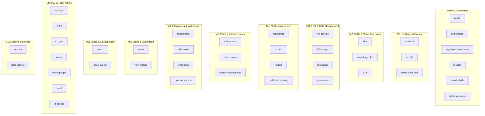

# Plan: Coralogix Full Public API Coverage

| Field | Value |
|-------|-------|
| Status | in-progress |
| Created | 2026-04-27 |
| Ticket | N/A |
| Branch | feat/full-api-coverage |

## Context

The cx CLI currently covers ~9 command groups (alerts, dashboards, logs, spans, metrics, search-fields, dataprime, profiles, cleanup). The Coralogix public API exposes 46 service groups with 282 endpoints. This plan adds the remaining ~37 API groups following the existing fan-out → merge → render pattern, supporting text/json/agents output modes. Each new command group follows the established 5-step pattern: CLI definition (main.rs) → API types (src/api/) → command handlers (src/commands/) → main.rs wiring → module registration.

## Architecture Decisions

- **One API module + one command module per service group** — keeps the codebase navigable at scale
- **Follow existing patterns exactly** — Clap derive enums, `fan_out()`, `render_table()`/`render_json()`/agents TOON, profile tagging
- **CRUD subcommand naming**: `list`, `get`, `create`, `update`, `delete` — matching existing alerts/dashboards patterns
- **File-based input for create/update** — `--from-file` with `-` for stdin, matching dashboards/alerts create pattern
- **No generated client** — hand-written API structs following the `XxxApi<'a>` pattern, keeping response types minimal (only deserialize fields needed for text output)
- **Milestone ordering** — prioritized by operational value: incident management and observability config first, admin/governance last

## Diagrams

## Milestones Overview

1. **Incidents & Alert Events** — Operators can triage incidents and inspect alert event history from the terminal
2. **SLOs & Recording Rules** — SREs can manage SLO definitions and Prometheus recording rules
3. **TCO Policies & Data Management** — Platform teams can manage cost optimization policies, quotas, and retention settings
4. **Notification Center** — Teams can manage notification connectors, presets, and routing rules
5. **Parsing Rules & Enrichments** — Data engineers can manage log parsing pipelines and enrichment tables
6. **Integrations & Webhooks** — Teams can manage third-party integrations, extensions, and outgoing webhooks
7. **Views & Data Exploration** — Users can manage saved views and view folders
8. **Cases & Collaboration** — Teams can manage incident cases and case comments
9. **IAM & Team Administration** — Admins can manage API keys, roles, scopes, users, groups, SAML, and IP access
10. **Actions & Storage Configuration** — Teams can manage actions and data archival storage targets

---

## Milestone 1: Incidents & Alert Events

**Why this matters:** Incident responders currently must switch to the Coralogix UI to triage incidents. With CLI support, they can list, acknowledge, resolve, and inspect incidents directly from the terminal or via AI agents — critical for on-call automation and ChatOps workflows.

**Success criteria:** An on-call engineer can `cx incidents list`, drill into a specific incident with `cx incidents get <id>`, and acknowledge/resolve it — all from the terminal with text/json/agents output.

**Key decisions:** Incidents use POST for list (filter body) unlike most services that use GET. We'll accept filter flags as CLI args and build the POST body internally, keeping the UX consistent with other list commands.

### 1.1 [x] Add `incidents` API module *(completed 2026-04-27)*
- **Files:** `src/api/incidents.rs`, `src/api/mod.rs`
- **What:** Create `IncidentsApi<'a>` with methods: `list()` (POST /incidents/incidents/v1 with filter body), `get()` (GET /incidents/incidents/v1/{id}), `acknowledge()` (POST .../all/acknowledge), `resolve()` (POST .../all/resolve), `close()` (POST .../all/closed), `assign()` (POST .../all/by-user), `unassign()` (DELETE .../all/by-user), `get_events()` (GET /incidents/events/v1), `get_aggregations()` (GET /incidents/aggregations/v1). Define response structs for list/get (Incident, IncidentEvent) with fields needed for text table rendering: id, name, severity, status, created_at, assigned_to. Register in api/mod.rs.
- **Acceptance:** `cargo test` passes, `IncidentsApi` compiles with all methods
- **Dependencies:** None

### 1.2 [x] Add `incidents` command module *(completed 2026-04-27)*
- **Files:** `src/commands/incidents.rs`, `src/commands/mod.rs`
- **What:** Implement `run_list()`, `run_get()`, `run_acknowledge()`, `run_resolve()`, `run_close()`, `run_assign()`, `run_unassign()`, `run_events()`, `run_aggregations()`. Follow the alerts pattern: fan_out → merge → render for each. `run_list()` should accept optional `--status`, `--severity`, `--assignee` filter flags. Text output: table with columns [ID, Name, Severity, Status, Created, Assigned To]. Register in commands/mod.rs.
- **Acceptance:** Module compiles, `cargo clippy` clean
- **Dependencies:** 1.1

### 1.3 [x] Wire `incidents` into CLI *(completed 2026-04-27)*
- **Files:** `src/main.rs`
- **What:** Add `Incidents` variant to `Commands` enum with `IncidentsCmd` subcommand enum containing: `List` (with filter args), `Get { id }`, `Acknowledge { ids: Vec<String> }`, `Resolve { ids: Vec<String> }`, `Close { ids: Vec<String> }`, `Assign { ids: Vec<String>, user_id: String }`, `Unassign { ids: Vec<String> }`, `Events` (with optional --incident-id filter), `Aggregations`. Wire match arms to command handlers. Add help examples.
- **Acceptance:** `cx incidents --help` shows all subcommands, `cx incidents list --help` shows filter flags, `cargo test` passes
- **Dependencies:** 1.2

### 1.4 [x] Add `alert-events` subcommand to existing `alerts` *(completed 2026-04-27)*
- **Files:** `src/api/alerts.rs`, `src/commands/alerts.rs`, `src/main.rs`
- **What:** Extend the existing alerts command with `events` subcommand. Add `events()` and `event_stats()` methods to `AlertsApi`. Implement `run_events()` (GET /alerts/alerts/v3/all/events with optional --alert-id, --start, --end filters) and `run_event_stats()`. Text table: [Event ID, Alert Name, Severity, Triggered At, Status]. Wire `Events` and `EventStats` into `AlertsCmd`.
- **Acceptance:** `cx alerts events --help` works, `cargo test` passes
- **Dependencies:** None

### 1.5 [x] Add `alert-schedulers` command *(completed 2026-04-27)*
- **Files:** `src/api/alert_schedulers.rs`, `src/api/mod.rs`, `src/commands/alert_schedulers.rs`, `src/commands/mod.rs`, `src/main.rs`
- **What:** Full CRUD for alert scheduler (suppression) rules. API: list, get, create, update, delete + bulk create/update. CLI subcommands: `list`, `get <id>`, `create --from-file`, `update --from-file`, `delete <id>`. Text table for list: [ID, Name, Schedule, Enabled, Created]. Follow alerts create pattern for file input.
- **Acceptance:** `cx alert-schedulers --help` shows subcommands, `cargo test` passes
- **Dependencies:** None

---

## Milestone 2: SLOs & Recording Rules

**Why this matters:** SREs managing service reliability need to define and monitor SLOs. Recording rules let teams pre-compute expensive PromQL queries. CLI access enables GitOps workflows — define SLOs/rules in files, apply via CI/CD.

**Success criteria:** An SRE can `cx slos list` to see all SLOs, `cx slos create --from-file slo.json` to create one, and `cx recording-rules list` to manage recording rules — all supporting the standard output modes.

**Key decisions:** SLOs and recording rules are independent services but grouped together because they serve the same SRE persona. Events2Metrics (E2M) is included here as it's closely related to recording rules.

### 2.1 [ ] Add `slos` API module and command
- **Files:** `src/api/slos.rs`, `src/api/mod.rs`, `src/commands/slos.rs`, `src/commands/mod.rs`, `src/main.rs`
- **What:** Full CRUD for SLOs. API methods: list, get, create (POST), replace (PUT), delete, batch_get, batch_execute. CLI subcommands: `list`, `get <id>`, `create --from-file`, `update --from-file`, `delete <id>`. Text table for list: [ID, Name, Target, Status, Service, Period]. Wire into main.rs with help examples.
- **Acceptance:** `cx slos --help` shows subcommands, `cargo test` passes
- **Dependencies:** None

### 2.2 [ ] Add `recording-rules` API module and command
- **Files:** `src/api/recording_rules.rs`, `src/api/mod.rs`, `src/commands/recording_rules.rs`, `src/commands/mod.rs`, `src/main.rs`
- **What:** CRUD for recording rule groups. API methods: list, get, create, update, delete. CLI subcommands: `list`, `get <id>`, `create --from-file`, `update --from-file <id>`, `delete <id>`. Text table for list: [ID, Name, Rules Count, Interval, Created]. Wire into main.rs.
- **Acceptance:** `cx recording-rules --help` works, `cargo test` passes
- **Dependencies:** None

### 2.3 [ ] Add `e2m` (Events2Metrics) API module and command
- **Files:** `src/api/e2m.rs`, `src/api/mod.rs`, `src/commands/e2m.rs`, `src/commands/mod.rs`, `src/main.rs`
- **What:** CRUD for Events2Metrics definitions. API methods: list, get, create, replace, delete, batch_execute, get_labels_cardinality, get_limits. CLI subcommands: `list`, `get <id>`, `create --from-file`, `update --from-file`, `delete <id>`, `labels-cardinality`, `limits`. Text table for list: [ID, Name, Type, Metric Name, Created]. Wire into main.rs.
- **Acceptance:** `cx e2m --help` works, `cargo test` passes
- **Dependencies:** None

---

## Milestone 3: TCO Policies & Data Management

**Why this matters:** Platform teams need to control data costs. TCO policies determine which logs go to hot vs. warm storage. Retention settings, quotas, and usage metrics give visibility into data spend. CLI access enables infrastructure-as-code for cost governance.

**Success criteria:** A platform engineer can `cx tco-policies list` to see current policies, `cx data-usage` to check consumption, `cx retentions list` to see retention settings, and `cx quota-rules get` to inspect quota allocations.

**Key decisions:** These four services (policies, data-usage, retentions, quota-rules) are grouped because they're all used by the same platform/FinOps persona for cost management.

### 3.1 [ ] Add `tco-policies` API module and command
- **Files:** `src/api/tco_policies.rs`, `src/api/mod.rs`, `src/commands/tco_policies.rs`, `src/commands/mod.rs`, `src/main.rs`
- **What:** CRUD for TCO policies. API methods: list (GET /dataplans/policies/v1), get, create, update, delete, reorder, test_policies, get_settings, replace_settings, overwrite_log_policies, overwrite_span_policies. CLI subcommands: `list`, `get <id>`, `create --from-file`, `update --from-file`, `delete <id>`, `reorder --from-file`, `test --from-file`, `settings` (show), `settings update --from-file`. Text table for list: [ID, Name, Priority, Source Type, Severity, Archive Retention]. Wire into main.rs.
- **Acceptance:** `cx tco-policies --help` works, `cargo test` passes
- **Dependencies:** None

### 3.2 [ ] Add `data-usage` API module and command
- **Files:** `src/api/data_usage.rs`, `src/api/mod.rs`, `src/commands/data_usage.rs`, `src/commands/mod.rs`, `src/main.rs`
- **What:** Read-only data usage queries. API methods: get_usage, daily_processed_gbs, daily_units, daily_eval_tokens, logs_count, spans_count, export_status. CLI subcommands: `summary` (GET overview), `daily --type processed-gbs|units|eval-tokens --start --end`, `logs-count`, `spans-count`, `export-status`. Text output: summary table or daily breakdown table. Wire into main.rs.
- **Acceptance:** `cx data-usage --help` works, `cargo test` passes
- **Dependencies:** None

### 3.3 [ ] Add `retentions` API module and command
- **Files:** `src/api/retentions.rs`, `src/api/mod.rs`, `src/commands/retentions.rs`, `src/commands/mod.rs`, `src/main.rs`
- **What:** Retention management. API methods: get, update, activate, get_enabled. CLI subcommands: `list` (shows retention tags), `update --from-file`, `activate`, `status` (enabled check). Text table: [ID, Name, Retention Days, Enabled]. Wire into main.rs.
- **Acceptance:** `cx retentions --help` works, `cargo test` passes
- **Dependencies:** None

### 3.4 [ ] Add `quota-rules` API module and command
- **Files:** `src/api/quota_rules.rs`, `src/api/mod.rs`, `src/commands/quota_rules.rs`, `src/commands/mod.rs`, `src/main.rs`
- **What:** Quota allocation rule sets. API methods: get, create, replace, delete. CLI subcommands: `get`, `create --from-file`, `update --from-file`, `delete`. Text output: render rule set details. Wire into main.rs.
- **Acceptance:** `cx quota-rules --help` works, `cargo test` passes
- **Dependencies:** None

---

## Milestone 4: Notification Center

**Why this matters:** Alert routing is critical for incident response. Teams need to manage where notifications go (connectors), how they look (presets), and how they're routed (global routers). CLI access enables version-controlled notification infrastructure.

**Success criteria:** A team lead can `cx connectors list` to see notification destinations, `cx routers list` to see routing rules, and `cx presets list` to see message templates — creating/updating any of them from JSON files.

**Key decisions:** The notification center has 4 sub-services (connectors, presets, routers, testing). We implement each as a separate top-level command rather than nesting under `cx notifications` to keep commands discoverable and avoid deep nesting.

### 4.1 [ ] Add `connectors` API module and command
- **Files:** `src/api/connectors.rs`, `src/api/mod.rs`, `src/commands/connectors.rs`, `src/commands/mod.rs`, `src/main.rs`
- **What:** CRUD for notification connectors. API methods: list, get, create, replace, delete, list_summaries, get_type_summaries. CLI subcommands: `list`, `get <id>`, `create --from-file`, `update --from-file`, `delete <id>`, `types` (list connector type summaries). Text table for list: [ID, Name, Type, Enabled, Created].
- **Acceptance:** `cx connectors --help` works, `cargo test` passes
- **Dependencies:** None

### 4.2 [ ] Add `routers` (global routers) API module and command
- **Files:** `src/api/routers.rs`, `src/api/mod.rs`, `src/commands/routers.rs`, `src/commands/mod.rs`, `src/main.rs`
- **What:** CRUD for global notification routers. API methods: list, get, create, replace, delete, batch_get_summaries, validate_matcher. CLI subcommands: `list`, `get <id>`, `create --from-file`, `update --from-file`, `delete <id>`, `validate-matcher --from-file` (test entity label matcher). Text table: [ID, Name, Entity Type, Destinations Count].
- **Acceptance:** `cx routers --help` works, `cargo test` passes
- **Dependencies:** None

### 4.3 [ ] Add `presets` API module and command
- **Files:** `src/api/presets.rs`, `src/api/mod.rs`, `src/commands/presets.rs`, `src/commands/mod.rs`, `src/main.rs`
- **What:** CRUD for notification presets. API methods: list_summaries, get, create_custom, replace_custom, delete_custom, set_default, get_default_summary. CLI subcommands: `list`, `get <id>`, `create --from-file`, `update --from-file`, `delete <id>`, `set-default <id>`. Text table: [ID, Name, Connector Type, Is Default, Is Custom].
- **Acceptance:** `cx presets --help` works, `cargo test` passes
- **Dependencies:** None

### 4.4 [ ] Add `notification-test` command
- **Files:** `src/api/notification_testing.rs`, `src/api/mod.rs`, `src/commands/notification_testing.rs`, `src/commands/mod.rs`, `src/main.rs`
- **What:** Testing endpoints for notification center. CLI subcommands: `connector --from-file` (test connector config), `destination --from-file` (test destination), `preset --from-file` (test preset config), `routing-condition --from-file` (test routing condition), `template-render --from-file` (test template rendering). Each reads a JSON definition and sends it to the test endpoint, printing the result.
- **Acceptance:** `cx notification-test --help` works, `cargo test` passes
- **Dependencies:** None

---

## Milestone 5: Parsing Rules & Enrichments

**Why this matters:** Data engineers configure how logs are parsed and enriched before indexing. Managing parsing rules and enrichment tables via CLI enables automation — bulk updates, CI/CD pipelines, and scripting for large-scale configuration changes.

**Success criteria:** A data engineer can `cx rule-groups list` to see parsing rules, create/update them from files, and `cx enrichments list` / `cx custom-enrichments list` to manage enrichment configurations.

**Key decisions:** Enrichments and custom-enrichments are separate API services with different schemas, so they get separate commands despite similar names.

### 5.1 [ ] Add `rule-groups` (parsing rules) API module and command
- **Files:** `src/api/rule_groups.rs`, `src/api/mod.rs`, `src/commands/rule_groups.rs`, `src/commands/mod.rs`, `src/main.rs`
- **What:** CRUD for parsing rule groups. API methods: list, get, create, update, delete, bulk_delete, get_usage_limits, get_model_mapping. CLI subcommands: `list`, `get <id>`, `create --from-file`, `update --from-file <id>`, `delete <id>`, `bulk-delete --ids`, `usage-limits`. Text table: [ID, Name, Rules Count, Enabled, Order, Creator].
- **Acceptance:** `cx rule-groups --help` works, `cargo test` passes
- **Dependencies:** None

### 5.2 [ ] Add `enrichments` API module and command
- **Files:** `src/api/enrichments.rs`, `src/api/mod.rs`, `src/commands/enrichments.rs`, `src/commands/mod.rs`, `src/main.rs`
- **What:** Enrichment rules management. API methods: get, add, remove, overwrite, overwrite_all, get_limit, get_settings. CLI subcommands: `list`, `add --from-file`, `remove --from-file`, `overwrite --from-file`, `limit`, `settings`. Text table: [ID, Field Name, Enrichment Type, Source].
- **Acceptance:** `cx enrichments --help` works, `cargo test` passes
- **Dependencies:** None

### 5.3 [ ] Add `custom-enrichments` API module and command
- **Files:** `src/api/custom_enrichments.rs`, `src/api/mod.rs`, `src/commands/custom_enrichments.rs`, `src/commands/mod.rs`, `src/main.rs`
- **What:** Custom enrichment tables. API methods: list, get, create, update, delete, search_data. CLI subcommands: `list`, `get <id>`, `create --from-file`, `update --from-file`, `delete <id>`, `search --id <id> --query <text>` (search enrichment data). Text table: [ID, Name, Description, Type, Created].
- **Acceptance:** `cx custom-enrichments --help` works, `cargo test` passes
- **Dependencies:** None

---

## Milestone 6: Integrations & Webhooks

**Why this matters:** Teams need to manage their third-party integrations (AWS, GCP, Slack, etc.), extensions, and outgoing webhooks from the terminal. This enables automation of integration deployment and webhook management across environments.

**Success criteria:** A DevOps engineer can `cx integrations list` to see configured integrations, `cx webhooks list` to see outgoing webhooks, and manage extensions — all with create/update/delete from JSON files.

**Key decisions:** Integrations, extensions, and webhooks are separate top-level commands. Contextual data integrations get their own command due to distinct API patterns.

### 6.1 [ ] Add `integrations` API module and command
- **Files:** `src/api/integrations.rs`, `src/api/mod.rs`, `src/commands/integrations.rs`, `src/commands/mod.rs`, `src/main.rs`
- **What:** Integration management. API methods: list, get_details, get_definition, get_deployed, save, update, delete, test, get_template. CLI subcommands: `list`, `get <id>`, `definition <id>`, `deployed <id>`, `create --from-file`, `update --from-file`, `delete <id>`, `test --from-file`, `template`. Text table for list: [ID, Name, Type, Status, Version].
- **Acceptance:** `cx integrations --help` works, `cargo test` passes
- **Dependencies:** None

### 6.2 [ ] Add `extensions` API module and command
- **Files:** `src/api/extensions.rs`, `src/api/mod.rs`, `src/commands/extensions.rs`, `src/commands/mod.rs`, `src/main.rs`
- **What:** Extension deployment management. API methods: list_all, get, list_deployed, deploy, update, undeploy. CLI subcommands: `list` (all available), `get <id>`, `deployed` (list deployed), `deploy --from-file`, `update --from-file`, `undeploy --from-file`. Text table: [ID, Name, Version, Deployed, Updated].
- **Acceptance:** `cx extensions --help` works, `cargo test` passes
- **Dependencies:** None

### 6.3 [ ] Add `webhooks` (outgoing) API module and command
- **Files:** `src/api/webhooks.rs`, `src/api/mod.rs`, `src/commands/webhooks.rs`, `src/commands/mod.rs`, `src/main.rs`
- **What:** Outgoing webhook management. API methods: list_all, get, create, update, delete, test, list_types, get_type_details, list_summaries. CLI subcommands: `list`, `get <id>`, `create --from-file`, `update --from-file`, `delete <id>`, `test <id>`, `types` (list webhook types). Text table for list: [ID, Name, Type, URL, Created].
- **Acceptance:** `cx webhooks --help` works, `cargo test` passes
- **Dependencies:** None

### 6.4 [ ] Add `contextual-data` API module and command
- **Files:** `src/api/contextual_data.rs`, `src/api/mod.rs`, `src/commands/contextual_data.rs`, `src/commands/mod.rs`, `src/main.rs`
- **What:** Contextual data integration management. API methods: list, get, save, update, delete, get_definition, test. CLI subcommands: `list`, `get <id>`, `create --from-file`, `update --from-file`, `delete <id>`, `definition <id>`, `test <id>`. Text table: [ID, Name, Type, Status, Created].
- **Acceptance:** `cx contextual-data --help` works, `cargo test` passes
- **Dependencies:** None

---

## Milestone 7: Views & Data Exploration

**Why this matters:** Saved views let users bookmark commonly-used query configurations. Managing views from the CLI enables sharing and automation — teams can version-control their view definitions and deploy them across environments.

**Success criteria:** A user can `cx views list`, `cx views get <id>`, and create/update/delete views and view folders from JSON files.

**Key decisions:** Views and view-folders are separate subcommands under a single `views` command (similar to how dashboards has `folders` nested).

### 7.1 [ ] Add `views` API module and command
- **Files:** `src/api/views.rs`, `src/api/mod.rs`, `src/commands/views.rs`, `src/commands/mod.rs`, `src/main.rs`
- **What:** CRUD for views and view folders. API methods for views: list, get, create, replace, delete. API methods for folders: list, get, create, replace, delete. CLI structure: `cx views list`, `cx views get <id>`, `cx views create --from-file`, `cx views update --from-file <id>`, `cx views delete <id>`, `cx views folders list`, `cx views folders get <id>`, `cx views folders create --from-file`, `cx views folders update --from-file`, `cx views folders delete <id>`. Follow the dashboards folders nesting pattern. Text table for views: [ID, Name, Folder, Created]. Text table for folders: [ID, Name, Parent].
- **Acceptance:** `cx views --help` works, `cx views folders --help` works, `cargo test` passes
- **Dependencies:** None

---

## Milestone 8: Cases & Collaboration

**Why this matters:** Cases are how teams track and collaborate on incidents in Coralogix. CLI access lets automation tools create comments, sync external threads, and manage case lifecycle — enabling ChatOps and ticketing integrations.

**Success criteria:** A user can view case details, list case events, add/update/delete comments, and manage team configs for the cases system.

**Key decisions:** Cases, case-events, and team-config are all nested under a single `cases` command since they share the same domain context.

### 8.1 [ ] Add `cases` API module and command
- **Files:** `src/api/cases.rs`, `src/api/mod.rs`, `src/commands/cases.rs`, `src/commands/mod.rs`, `src/main.rs`
- **What:** Case management with nested subcommands. API methods: get_external_references, list_events, get_event, create_comment, update_comment, delete_comment, list_notification_deliveries. Team config API: get_active, get, create, update, delete, get_system_defaults. CLI structure: `cx cases events --case-id <id>` (list events), `cx cases event <event_id>` (get single event), `cx cases comment --case-id <id> --message <text>` (create comment), `cx cases comment update <event_id> --message <text>`, `cx cases comment delete <event_id>`, `cx cases external-refs <case_id>`, `cx cases team-config list`, `cx cases team-config get <id>`, `cx cases team-config create --from-file`, `cx cases team-config update --from-file <id>`, `cx cases team-config delete <id>`. Text table for events: [Event ID, Type, Created, Author].
- **Acceptance:** `cx cases --help` works, `cargo test` passes
- **Dependencies:** None

---

## Milestone 9: IAM & Team Administration

**Why this matters:** Administrators need to manage API keys, roles, scopes, users, team groups, SAML, and IP access controls. CLI access enables infrastructure-as-code for security governance — automate user provisioning, rotate API keys, manage RBAC, and configure SSO.

**Success criteria:** An admin can manage the full IAM lifecycle from the terminal: `cx api-keys list`, `cx roles list`, `cx scopes list`, `cx users search`, `cx team-groups list`, `cx saml get`, `cx ip-access get`.

**Key decisions:** Each IAM service gets its own top-level command despite being in the same "aaa" API namespace. This keeps commands discoverable and avoids deep nesting. The API Keys Admin service (team-wide operations) is merged into the `api-keys` command as admin subcommands.

### 9.1 [ ] Add `api-keys` API module and command
- **Files:** `src/api/api_keys.rs`, `src/api/mod.rs`, `src/commands/api_keys.rs`, `src/commands/mod.rs`, `src/main.rs`
- **What:** API key management (both user and admin operations). API methods: list, get, create, update, delete, get_send_data_keys, get_team_members_keys (admin), bulk_delete (admin), update_status (admin). CLI subcommands: `list`, `get <id>`, `create --from-file`, `update --from-file <id>`, `delete <id>`, `send-data-keys`, `admin list` (team-wide), `admin delete --ids`, `admin set-status --ids --active`. Text table: [ID, Name, Owner, Active, Created, Hashed Key].
- **Acceptance:** `cx api-keys --help` works, `cargo test` passes
- **Dependencies:** None

### 9.2 [ ] Add `roles` API module and command
- **Files:** `src/api/roles.rs`, `src/api/mod.rs`, `src/commands/roles.rs`, `src/commands/mod.rs`, `src/main.rs`
- **What:** Role management (custom + system). API methods: list_custom, get_custom, create, update, delete, list_system. CLI subcommands: `list` (shows both custom and system), `get <id>`, `create --from-file`, `update --from-file <id>`, `delete <id>`, `system` (list system roles). Text table: [ID, Name, Type, Description, Permissions Count].
- **Acceptance:** `cx roles --help` works, `cargo test` passes
- **Dependencies:** None

### 9.3 [ ] Add `scopes` API module and command
- **Files:** `src/api/scopes.rs`, `src/api/mod.rs`, `src/commands/scopes.rs`, `src/commands/mod.rs`, `src/main.rs`
- **What:** Scope management. API methods: list, get (via list+filter), create, update, delete. CLI subcommands: `list`, `get <id>`, `create --from-file`, `update --from-file`, `delete <id>`. Text table: [ID, Name, Description, Filters].
- **Acceptance:** `cx scopes --help` works, `cargo test` passes
- **Dependencies:** None

### 9.4 [ ] Add `users` API module and command
- **Files:** `src/api/users.rs`, `src/api/mod.rs`, `src/commands/users.rs`, `src/commands/mod.rs`, `src/main.rs`
- **What:** User management. API methods: search, get, create, update, update_statuses. CLI subcommands: `search --query <text>` (search users), `get <user_id>`, `create --from-file`, `update --from-file`, `set-status --user-ids --status active|suspended`. Note: team_id is resolved from the config/profile. Text table: [User ID, Name, Email, Role, Status].
- **Acceptance:** `cx users --help` works, `cargo test` passes
- **Dependencies:** None

### 9.5 [ ] Add `team-groups` API module and command
- **Files:** `src/api/team_groups.rs`, `src/api/mod.rs`, `src/commands/team_groups.rs`, `src/commands/mod.rs`, `src/main.rs`
- **What:** Team group management. API methods: list, get_by_id, get_by_name, get_users, create, update, delete. CLI subcommands: `list`, `get <id>`, `get-by-name <name>`, `users <group_id>`, `create --from-file`, `update --from-file <id>`, `delete <id>`. Text table: [Group ID, Name, Members Count, Description].
- **Acceptance:** `cx team-groups --help` works, `cargo test` passes
- **Dependencies:** None

### 9.6 [ ] Add `saml` API module and command
- **Files:** `src/api/saml.rs`, `src/api/mod.rs`, `src/commands/saml.rs`, `src/commands/mod.rs`, `src/main.rs`
- **What:** SAML configuration management. API methods: get_config, set_idp_params, get_sp_params, set_active. CLI subcommands: `get` (show current config), `sp-params` (show SP parameters), `set-idp --from-file` (set IDP parameters), `set-active --active true|false`. Text output: formatted SAML config details.
- **Acceptance:** `cx saml --help` works, `cargo test` passes
- **Dependencies:** None

### 9.7 [ ] Add `ip-access` API module and command
- **Files:** `src/api/ip_access.rs`, `src/api/mod.rs`, `src/commands/ip_access.rs`, `src/commands/mod.rs`, `src/main.rs`
- **What:** IP access control management. API methods: get, create, replace, delete. CLI subcommands: `get`, `create --from-file`, `update --from-file`, `delete`. Text output: formatted IP access rules.
- **Acceptance:** `cx ip-access --help` works, `cargo test` passes
- **Dependencies:** None

---

## Milestone 10: Actions & Storage Configuration

**Why this matters:** Actions are automation hooks triggered by alerts or user interaction. Storage targets configure where archived data is sent. CLI access completes the full API surface coverage.

**Success criteria:** Users can `cx actions list` and manage actions, `cx data-archive get` to check storage configuration — completing 100% API coverage.

**Key decisions:** Actions get a dedicated top-level command. Metrics data archive and logs data archive are combined into a single `data-archive` command with `metrics` and `logs` subcommands.

### 10.1 [ ] Add `actions` API module and command
- **Files:** `src/api/actions.rs`, `src/api/mod.rs`, `src/commands/actions.rs`, `src/commands/mod.rs`, `src/main.rs`
- **What:** Actions management. API methods: list, get, create, replace, delete, batch_execute, order. CLI subcommands: `list`, `get <id>`, `create --from-file`, `update --from-file`, `delete <id>`, `batch --from-file` (batch execute), `reorder --from-file`. Text table: [ID, Name, Type, URL, Is Active].
- **Acceptance:** `cx actions --help` works, `cargo test` passes
- **Dependencies:** None

### 10.2 [ ] Add `data-archive` API module and command
- **Files:** `src/api/data_archive.rs`, `src/api/mod.rs`, `src/commands/data_archive.rs`, `src/commands/mod.rs`, `src/main.rs`
- **What:** Storage target configuration for metrics and logs. API methods for metrics: get_config, create, update, enable, disable, validate. API methods for logs: get_target, set_target. CLI subcommands: `metrics get`, `metrics create --from-file`, `metrics update --from-file`, `metrics enable`, `metrics disable`, `metrics validate --from-file`, `logs get`, `logs set --from-file`. Text output: formatted storage configuration details.
- **Acceptance:** `cx data-archive --help` works, `cargo test` passes
- **Dependencies:** None

### 10.3 [ ] Add `entity-types` subcommand to connectors
- **Files:** `src/api/connectors.rs`, `src/commands/connectors.rs`, `src/main.rs`
- **What:** Extend connectors with entity type queries. Add API methods: list_entity_types, list_entity_subtypes. Add CLI subcommands: `entity-types` (list all), `entity-subtypes --type <entity_type>`. Text table for entity types: [Type, Description]. These are part of the notification center entities service but logically belong with connectors.
- **Acceptance:** `cx connectors entity-types` works, `cargo test` passes
- **Dependencies:** 4.1
