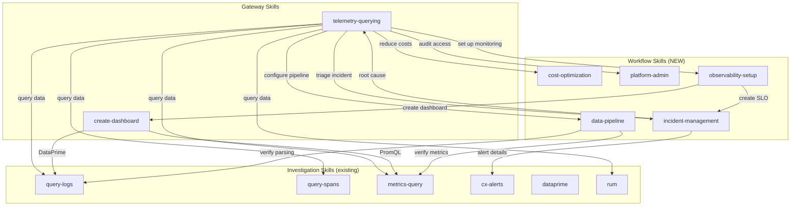

# Plan: Skills Overhaul — Workflow Skills for Full CLI Coverage

| Field | Value |
|-------|-------|
| Status | in-progress |
| Created | 2026-04-28 |
| Ticket | N/A |
| Branch | liranhason/implement-all |

## Context

The cx CLI grew from 8 commands (logs, spans, metrics, alerts, dashboards) to 26 commands covering all Coralogix API endpoints. The existing 8 skills cover investigation/query commands well, but 18 new operational commands (IAM, notifications, cost management, data pipeline, etc.) have zero skill coverage. Agents like Claude and Cursor can't discover or use these commands because no skill triggers on the user intents they serve ("reduce our Coralogix spend", "investigate this incident", "who has access?").

The goal is NOT 1:1 command-to-skill mapping. Instead, we're building **workflow-oriented skills** organized by user intent (inspired by Datadog pup's approach). Each skill teaches agents when to reach for `cx` and exactly what commands to run — minimizing failed attempts and maximizing insight delivery.

## Architecture Decisions

- **Workflow skills over command stubs** — Skills are organized by what users are trying to accomplish, not by CLI command structure. A user never says "manage TCO policies"; they say "we're spending too much." The skill must match the intent.
- **Gateway pattern proven** — `telemetry-querying` and `create-dashboard` already prove this pattern works. New skills extend it to operational domains.
- **No reference files for new skills** — The new commands are REST CRUD operations without complex schemas (unlike alerts with 12 types). All guidance fits in SKILL.md inline.
- **`cx schema` as fallback** — For edge-case commands not deeply covered by a workflow skill, agents can run `cx schema` to discover exact syntax. The `telemetry-querying` skill already references this.
- **Existing skills get updates, not rewrites** — `telemetry-querying` gets `search-fields` added; `create-dashboard` gets dashboard CRUD operations added. No structural changes to working skills.
- **Shared commands across skills** — Some commands (e.g., `cx notifications`) appear in multiple skills with different intents: setup in `observability-setup`, debugging in `incident-management`. This is intentional — skills are organized by user goal, not by command ownership.

## Diagrams

## Milestones Overview

1. **Cost Optimization Skill** — Agents can help users analyze and reduce Coralogix spend
2. **Incident Management Skill** — Agents can triage incidents end-to-end using alerts, SLOs, and notifications
3. **Data Pipeline Skill** — Agents can help users configure log parsing, enrichment, and metric generation
4. **Platform Admin Skill** — Agents can audit access, manage API keys, and configure SSO
5. **Observability Setup Skill** — Agents can help users set up views, webhooks, and integrations for a new service
6. **Update Existing Skills** — Existing gateway and query skills cover the full command set
7. **Skill Testing & README** — All skills are verified for trigger accuracy, command correctness, and cross-links

---

## Milestone 1: Cost Optimization Skill

**Why this matters:** Engineering teams using Coralogix often ask "why is our bill so high?" or "how can we reduce data costs?" — these are high-value questions that currently have no skill coverage. After this milestone, an agent hearing "optimize our Coralogix spend" will know to reach for `cx usage`, `cx tco`, `cx quotas`, `cx retentions`, and `cx archive` in a structured investigation workflow, guiding the user from diagnosis to action.

**Success criteria:** An agent given "we're spending too much on Coralogix logging" activates the skill, runs the cost investigation workflow, and produces actionable recommendations using real CLI output — without any failed commands or flag guessing.

**Key decisions:**
- Skill covers 5 commands (usage, tco, quotas, retentions, archive) unified by the "cost" intent
- Workflow follows a diagnosis pattern: measure current spend → identify waste → recommend policy changes → verify impact
- Includes jq examples for every command since cost analysis requires filtering/aggregation
- Archive is included because it's the primary cost-saving mechanism for cold data

### Deliverable Spec

| cx command | Subcommands covered in skill | Workflow role |
|---|---|---|
| `cx usage` | `summary`, `daily`, `logs-count`, `spans-count`, `export-status` | Step 1: Measure current spend |
| `cx tco` | `list`, `get`, `create`, `update`, `delete`, `settings` | Step 2: Review/modify TCO policies |
| `cx retentions` | `list`, `update`, `activate`, `status` | Step 3: Check/adjust retention periods |
| `cx quotas` | `get`, `create`, `update`, `delete` | Step 4: Set ingestion guardrails |
| `cx archive` | `logs get/set`, `metrics get/create/update/enable/disable/validate` | Step 5: Configure cold storage |

### 1.1 [x] Create cost-optimization skill directory and SKILL.md *(completed 2026-04-29)*

- **Files:** `skills/cost-optimization/SKILL.md`
- **What:** Create the skill directory and SKILL.md. The frontmatter description must include 15+ trigger phrases covering: explicit command names ("check data usage", "list TCO policies", "view quotas"), user intents ("reduce Coralogix costs", "optimize observability spend", "lower our logging bill", "data budget exceeded"), and domain jargon ("TCO policy", "retention tier", "archive storage", "ingestion costs", "frequent search vs archive"). The body must include:
  1. **Intro paragraph** — what this skill covers and when to use it
  2. **CLI Commands table** — all subcommands across `cx usage`, `cx tco`, `cx quotas`, `cx retentions`, `cx archive` with key flags
  3. **Cost Investigation Workflow** — numbered steps: (1) Check current usage with `cx usage summary -o json`, (2) Review TCO policies with `cx tco list -o json`, (3) Check retention settings with `cx retentions list -o json`, (4) Review quota rules with `cx quotas get -o json`, (5) Check archive config with `cx archive logs get -o json` and `cx archive metrics get -o json`, (6) Recommend optimizations based on findings
  4. **Common Optimization Patterns** — table of patterns: "High-volume low-value logs → move to archive tier via TCO policy", "Unused indices → reduce retention period", "Burst ingestion → add quota rules", "Cold data → enable archive storage"
  5. **jq Examples** — practical jq filters for each command (e.g., `cx usage summary -o json | jq '.[] | {name, dailyGb: .avgDailyGb}' | sort_by(.dailyGb) | reverse`)
  6. **Key Principles** — always measure before changing, use `-o json` with jq, verify changes with follow-up queries, multi-profile awareness
  7. **Related Skills** — link to `telemetry-querying` for investigation context
- **Acceptance:** File exists, frontmatter has 15+ trigger phrases, body has all 7 sections, all CLI commands referenced match actual `cx` commands (verify against `src/main.rs` command definitions), under 300 lines
- **Dependencies:** None

---

## Milestone 2: Incident Management Skill

**Why this matters:** Incident investigation is the #1 reason engineers reach for observability tools. Currently, `telemetry-querying` routes agents to query skills (logs, spans, metrics), but there's no coverage for the operational side: checking which alerts are firing, reviewing SLO breaches, seeing who was notified, and triaging incidents. After this milestone, an agent hearing "we have an incident" or "SLO is breaching" can orchestrate the full triage workflow — from detection through notification verification.

**Success criteria:** An agent given "our checkout service SLO is breaching, help me investigate" activates this skill, checks active incidents, reviews the SLO status, finds related alerts, verifies notification delivery, and cross-references with the telemetry-querying skill for root cause — all without failed commands.

**Key decisions:**
- Covers 4 commands: `cx incidents`, `cx slos`, `cx alerts` (already has its own skill but referenced here for workflow), `cx notifications`
- This skill is a workflow orchestrator — it doesn't replace `cx-alerts` for deep alert management, but references it for detailed alert inspection
- Notification commands (connectors, routers, presets, test) are included for "verify the right people were notified" workflow
- SLO creation is included here (not just inspection) because SLOs are tightly coupled to incident detection

### Deliverable Spec

| cx command | Subcommands covered in skill | Workflow role |
|---|---|---|
| `cx incidents` | `list`, `get` | Step 1-2: Check active incidents |
| `cx slos` | `list`, `get`, `create`, `update`, `delete` | Step 4: Review SLO status / create SLOs |
| `cx alerts` | `list` (reference to `cx-alerts` skill for full coverage) | Step 3: Find related firing alerts |
| `cx notifications` | `connectors list/get`, `routers list/get`, `presets list/get`, `test connector/destination/preset` | Step 5: Verify notification delivery |

### 2.1 [x] Create incident-management skill directory and SKILL.md *(completed 2026-04-29)*

- **Files:** `skills/incident-management/SKILL.md`
- **What:** Create the skill directory and SKILL.md. The frontmatter description must include 15+ trigger phrases covering: incident intents ("investigate incident", "triage this alert", "what's firing", "who got paged", "incident response", "check incident status"), SLO intents ("SLO breaching", "error budget burned", "check service level", "SLI status"), notification intents ("who was notified", "check notification delivery", "verify alert routing"), and domain jargon ("MTTR", "incident severity", "error budget", "burn rate"). The body must include:
  1. **Intro paragraph** — gateway for incident-related operations, references `cx-alerts` and `telemetry-querying` for deeper investigation
  2. **CLI Commands table** — subcommands across `cx incidents`, `cx slos`, `cx notifications` (connectors list/get, routers list/get, presets list/get, test), with key flags
  3. **Incident Triage Workflow** — numbered steps: (1) Check active incidents with `cx incidents list -o json`, (2) Get incident details with `cx incidents get <id> -o json`, (3) Check related alerts using `cx alerts list -o json | jq 'select(.status == "ALERTING")'`, (4) Review SLO status with `cx slos list -o json`, (5) Verify notifications with `cx notifications connectors list -o json` and `cx notifications routers list -o json`, (6) Pivot to `telemetry-querying` skill for root cause
  4. **SLO Management** — creating and monitoring SLOs: `cx slos create --from-file`, checking error budget, interpreting SLO status
  5. **Notification Debugging** — when notifications aren't reaching the right people: check connectors, check routers, test with `cx notifications test`
  6. **Key Principles** — triage before deep-dive, check SLO burn rate not just status, verify notification chain end-to-end, always cross-reference with telemetry
  7. **Related Skills** — `cx-alerts` for deep alert management, `telemetry-querying` for root cause, `query-logs`/`query-spans`/`metrics-query` for signal investigation
- **Acceptance:** File exists, frontmatter has 15+ trigger phrases, body has all 7 sections, CLI commands match actual `cx` commands, under 300 lines, cross-references to existing skills are correct
- **Dependencies:** None

---

## Milestone 3: Data Pipeline Skill

**Why this matters:** Teams configuring their Coralogix data pipeline need to set up parsing rules, enrichments, events-to-metrics conversions, and recording rules. These are complex operations where agents frequently fail — wrong JSON formats, missing required fields, incorrect API calls. After this milestone, an agent hearing "set up log parsing for our new service" or "create a metric from log events" can walk the user through the full configuration workflow with correct payloads.

**Success criteria:** An agent given "I need to extract structured fields from our nginx access logs" activates the skill, uses `cx rules list` to check existing rules, guides the user through creating a parsing rule group with the correct JSON structure, and verifies the rule was applied correctly — without any payload format errors.

**Key decisions:**
- Covers 4 commands: `cx rules`, `cx enrichments` (including custom enrichment tables), `cx e2m`, `cx recording-rules`
- Each command's create workflow includes a "get an existing one first as a template" pattern (like cx-alerts does) because these JSON payloads are complex
- Enrichments includes both enrichment rules AND custom enrichment tables (the `custom` sub-domain)
- Recording rules and E2M are both "derive new data from existing data" — grouped together in the workflow

### Deliverable Spec

| cx command | Subcommands covered in skill | Workflow role |
|---|---|---|
| `cx rules` | `list`, `get`, `create`, `update`, `delete`, `bulk-delete`, `usage-limits` | Parsing rules: extract fields from raw logs |
| `cx enrichments` | `list`, `add`, `remove`, `overwrite`, `limit`, `settings`, `custom list/get/create/update/delete/search` | Enrichment: add context to log data |
| `cx e2m` | `list`, `get`, `create`, `update`, `delete`, `labels-cardinality`, `limits` | Events2Metrics: derive metrics from logs |
| `cx recording-rules` | `list`, `get`, `create`, `update`, `delete` | Recording rules: precompute PromQL expressions |

### 3.1 [x] Create data-pipeline skill directory and SKILL.md *(completed 2026-04-29)*

- **Files:** `skills/data-pipeline/SKILL.md`
- **What:** Create the skill directory and SKILL.md. The frontmatter description must include 15+ trigger phrases covering: rules intents ("set up parsing", "create parsing rule", "extract fields from logs", "regex extraction", "log parsing"), enrichment intents ("enrich logs", "add context to logs", "custom enrichment table", "lookup table", "geo enrichment"), E2M intents ("create metric from logs", "events to metrics", "convert logs to metrics", "generate metrics from events"), recording rules intents ("recording rule", "precomputed metrics", "PromQL recording"), and general ("configure data pipeline", "transform log data", "data processing rules"). The body must include:
  1. **Intro paragraph** — configuring how Coralogix processes, enriches, and transforms data
  2. **CLI Commands table** — all subcommands across `cx rules`, `cx enrichments` (including `custom` sub-domain), `cx e2m`, `cx recording-rules` with key flags. Note that most create/update operations use `--from-file`
  3. **Working with JSON Payloads** — the "template" pattern: always `cx <command> get <existing-id> -o json > template.json`, modify, then `cx <command> create --from-file template.json`. This is critical for reducing failed attempts
  4. **Parsing Rules Workflow** — list existing rules → get one as template → modify for new service → create → verify with `cx logs` query
  5. **Enrichment Workflow** — list enrichment rules → create custom enrichment table if needed → add enrichment rule → verify enriched fields appear in logs
  6. **Events2Metrics Workflow** — design the metric (name, labels, aggregation) → create E2M definition → verify metric appears with `cx metrics search`
  7. **Recording Rules Workflow** — write PromQL expression → create recording rule group → verify with `cx metrics query`
  8. **Key Principles** — always template from existing, verify after create, use `-o json` for payloads, check usage limits with `cx rules usage-limits` and `cx e2m limits`
  9. **Related Skills** — `query-logs` for verifying parsing results, `metrics-query` for verifying E2M/recording rules, `dataprime` for DataPrime syntax in rules
- **Acceptance:** File exists, frontmatter has 15+ trigger phrases, body has all 9 sections, CLI commands match actual `cx` commands, includes the template pattern for every create operation, under 350 lines
- **Dependencies:** None

---

## Milestone 4: Platform Admin Skill

**Why this matters:** Security teams and platform engineers need to audit access, manage API keys, configure SSO, and set IP restrictions. These are high-stakes operations where incorrect actions can lock out users or expose credentials. After this milestone, an agent hearing "who has access to our Coralogix account?" or "rotate our API keys" can execute a structured access audit or key management workflow safely.

**Success criteria:** An agent given "audit who has access to production Coralogix and what permissions they have" activates the skill, runs the access audit workflow across users, roles, groups, and API keys, and produces a structured report — without accidentally modifying any access controls.

**Key decisions:**
- Covers 1 wrapper command with 7 sub-domains: `cx iam` (api-keys, roles, scopes, users, groups, saml, ip-access)
- Skill emphasizes READ operations and audit workflows — write operations (create/delete keys, modify roles) require extra caution callouts
- The "access audit" workflow is the primary use case — listing all users, their roles, group memberships, active API keys, and IP restrictions
- SAML and IP access are configuration queries, not investigation workflows — simpler treatment

### Deliverable Spec

| cx command | Subcommands covered in skill | Workflow role |
|---|---|---|
| `cx iam api-keys` | `list`, `get`, `create`, `update`, `delete`, `send-data-keys`, `admin` | API key inventory and rotation |
| `cx iam roles` | `list`, `get`, `create`, `update`, `delete`, `system` | Role definitions and permissions |
| `cx iam scopes` | `list`, `get`, `create`, `update`, `delete` | Team scope boundaries |
| `cx iam users` | `search`, `get`, `create`, `update`, `set-status` | User management and audit |
| `cx iam groups` | `list`, `get`, `get-by-name`, `users`, `create`, `update`, `delete` | Group membership and access |
| `cx iam saml` | `get`, `sp-params`, `set-idp`, `set-active` | SSO configuration |
| `cx iam ip-access` | `get`, `create`, `update`, `delete` | IP restriction management |

### 4.1 [x] Create platform-admin skill directory and SKILL.md *(completed 2026-04-29)*

- **Files:** `skills/platform-admin/SKILL.md`
- **What:** Create the skill directory and SKILL.md. The frontmatter description must include 15+ trigger phrases covering: access intents ("who has access", "audit permissions", "check user roles", "list API keys", "review access controls"), key management ("rotate API keys", "create API key", "delete expired keys", "send data keys"), SSO/security ("configure SAML", "set up SSO", "IP allowlist", "IP access restrictions", "check IP whitelist"), and user management ("add user", "deactivate user", "manage team groups", "user permissions", "role-based access"). The body must include:
  1. **Intro paragraph** — managing access, authentication, and authorization for Coralogix accounts
  2. **CLI Commands table** — all subcommands across all 7 IAM sub-domains: `cx iam api-keys` (list/get/create/update/delete/send-data-keys/admin), `cx iam roles` (list/get/create/update/delete/system), `cx iam scopes` (list/get/create/update/delete), `cx iam users` (search/get/create/update/set-status), `cx iam groups` (list/get/get-by-name/users/create/update/delete), `cx iam saml` (get/sp-params/set-idp/set-active), `cx iam ip-access` (get/create/update/delete)
  3. **Access Audit Workflow** — numbered steps: (1) List all users with `cx iam users search -o json`, (2) List roles with `cx iam roles list -o json` and system roles with `cx iam roles system -o json`, (3) List groups and memberships with `cx iam groups list -o json`, (4) List active API keys with `cx iam api-keys list -o json`, (5) Check IP restrictions with `cx iam ip-access get -o json`, (6) Check SAML config with `cx iam saml get -o json`, (7) Cross-reference: which users have admin roles? which keys are old?
  4. **API Key Management** — safe key rotation workflow: list keys → identify old keys → create new key → distribute → delete old key. Include caution: "never delete a key before its replacement is deployed"
  5. **Safety Callouts** — bold warnings for destructive operations: deleting API keys can break integrations, deactivating users is immediate, SAML changes can lock out the team
  6. **Key Principles** — audit before modifying, never delete keys without replacement, use `-o json` for structured reports, multi-profile for cross-environment audits
  7. **Related Skills** — `cost-optimization` for reviewing what API keys are used for
- **Acceptance:** File exists, frontmatter has 15+ trigger phrases, all 7 IAM sub-domains have their subcommands listed in the CLI table, safety callouts present for destructive operations, under 350 lines
- **Dependencies:** None

---

## Milestone 5: Observability Setup Skill

**Why this matters:** When teams onboard a new service or reconfigure their observability stack, they need to set up saved views, configure webhook integrations, and connect notification channels. After this milestone, an agent hearing "set up monitoring for our new payment service" or "configure Slack notifications for alerts" can walk through the full setup workflow — from creating views to wiring up webhooks and testing notification delivery.

**Success criteria:** An agent given "configure Slack notifications for our critical alerts" activates the skill, lists existing connectors, guides the user through creating a Slack connector if needed, sets up a router for critical alerts, and tests the notification end-to-end — without format errors or missing steps.

**Key decisions:**
- Covers 4 commands: `cx views` (including folders), `cx webhooks` (including actions), `cx notifications` (connectors/routers/presets/test for setup — triage is in incident-management), `cx integrations` (including extensions, contextual-data)
- Notifications appear in BOTH this skill (setup/configuration) and incident-management (triage/debugging) — this is intentional. Different intents, same commands
- Dashboard CRUD (list, get, delete) is mentioned here with a reference to `create-dashboard` for the full creation workflow
- SLO creation is mentioned here with a reference to `incident-management` for the monitoring workflow

### Deliverable Spec

| cx command | Subcommands covered in skill | Workflow role |
|---|---|---|
| `cx views` | `list`, `get`, `create`, `update`, `delete`, `folders list/get/create/update/delete` | Saved views for service log queries |
| `cx webhooks` | `list`, `get`, `create`, `update`, `delete`, `test`, `types`, `actions list/get/create/update/delete/batch/reorder` | Outgoing webhook integrations |
| `cx notifications` | `connectors list/get/create/update/delete/types/entity-types/entity-subtypes`, `routers list/get/create/update/delete/validate-matcher`, `presets list/get/create/update/delete/set-default`, `test connector/destination/preset/routing-condition/template-render` | Notification channel configuration |
| `cx integrations` | `list`, `get`, `create`, `update`, `delete`, `test`, `template`, `definition`, `deployed`, `extensions list/get/deployed`, `contextual-data list/get/create/update/delete/definition/test` | External integration management |

### 5.1 [ ] Create observability-setup skill directory and SKILL.md

- **Files:** `skills/observability-setup/SKILL.md`
- **What:** Create the skill directory and SKILL.md. The frontmatter description must include 15+ trigger phrases covering: setup intents ("set up monitoring", "configure observability", "onboard new service", "create saved view", "set up notifications"), webhooks ("configure webhook", "set up Slack integration", "outgoing webhook", "automation action", "webhook for alerts"), views ("create view", "saved view", "view folder", "organize dashboards"), integrations ("install integration", "configure extension", "contextual data", "connect external service"), and notifications setup ("create notification connector", "set up email alerts", "configure PagerDuty", "notification routing"). The body must include:
  1. **Intro paragraph** — setting up and configuring the observability stack for a service or team
  2. **CLI Commands table** — subcommands across `cx views` (list/get/create/update/delete, folders: list/get/create/update/delete), `cx webhooks` (list/get/create/update/delete/test/types, actions: list/get/create/update/delete/batch/reorder), `cx notifications` (connectors: list/get/create/update/delete/types, routers: list/get/create/update/delete, presets: list/get/create/update/delete/set-default), `cx integrations` (list/get/create/update/delete/test/template, extensions: list/get/deployed, contextual-data: list/get/create/update/delete/test)
  3. **New Service Setup Workflow** — ordered checklist: (1) Create saved views for the service's key log queries with `cx views create`, (2) Set up notification connectors if needed (Slack, PagerDuty, email) with `cx notifications connectors create`, (3) Configure notification routing with `cx notifications routers create`, (4) Set up webhooks for external integrations with `cx webhooks create`, (5) Install relevant integrations with `cx integrations create`, (6) Create a dashboard (reference `create-dashboard` skill), (7) Create SLOs (reference `incident-management` skill)
  4. **Notification Setup Workflow** — detailed: list connector types → create connector → create router → create/assign preset → test with `cx notifications test connector`
  5. **Webhook Setup** — list webhook types → create webhook → test with `cx webhooks test` → optionally create actions for automation
  6. **Key Principles** — always test after setup (`cx notifications test`, `cx webhooks test`), use `--from-file` for complex JSON payloads, template from existing with `get -o json`, reference `create-dashboard` and `incident-management` skills for related setup
  7. **Related Skills** — `create-dashboard` for dashboard creation, `incident-management` for SLO and alert setup, `cx-alerts` for alert definitions, `telemetry-querying` for verifying data flows
- **Acceptance:** File exists, frontmatter has 15+ trigger phrases, body has all 7 sections, CLI commands match actual `cx` commands, cross-references to other skills are correct, under 350 lines
- **Dependencies:** None

---

## Milestone 6: Update Existing Skills

**Why this matters:** The existing skills were written when the CLI had fewer commands. `telemetry-querying` doesn't mention `cx search-fields` prominently enough. `create-dashboard` only covers dashboard creation but not listing/managing dashboards. After this milestone, the existing skills are fully up-to-date with the expanded CLI, and cross-references between old and new skills create a complete navigation graph — agents can always find the right tool regardless of which skill they enter through.

**Success criteria:** An agent that enters through `telemetry-querying` can discover and navigate to any of the 5 new skills via cross-references. An agent using `create-dashboard` knows about `cx dashboards list/get/delete` for dashboard management. The Related Skills sections across all 13 skills form a complete, bidirectional graph.

**Key decisions:**
- Minimal changes to existing skills — add cross-references and missing commands, don't restructure
- `telemetry-querying` is the most important update — it's the primary gateway and needs links to all new workflow skills
- Dashboard management (list/get/delete) is added to `create-dashboard` as a new section, not a separate skill

### Before/After

Currently, `telemetry-querying` only routes to investigation skills (logs, spans, metrics, RUM, alerts). After this milestone, it also routes to all 5 operational workflow skills, and `create-dashboard` includes dashboard CRUD operations alongside the creation workflow.

### 6.1 [ ] Update telemetry-querying with new skill cross-references

- **Files:** `skills/telemetry-querying/SKILL.md`
- **What:** Update the Related Skills section to include all 5 new workflow skills. Add a new section "Beyond Investigation" after the existing content that routes operational intents to the right skill: "Reducing costs? → `cost-optimization`", "Incident triage? → `incident-management`", "Setting up monitoring? → `observability-setup`", "Configuring data pipeline? → `data-pipeline`", "Access audit? → `platform-admin`". Also ensure the CLI Commands Reference table includes `cx search-fields` with both `--dataset logs` and `--dataset spans` examples (it's already there but verify completeness). Add `cx schema` reference if not already present.
- **Acceptance:** Related Skills section lists all 13 skills (8 existing + 5 new), "Beyond Investigation" section routes to all 5 new skills, file still under 250 lines
- **Dependencies:** 1.1, 2.1, 3.1, 4.1, 5.1

### 6.2 [ ] Update create-dashboard with dashboard management commands

- **Files:** `skills/create-dashboard/SKILL.md`
- **What:** Add a "Dashboard Management" section before the existing workflow content covering `cx dashboards list`, `cx dashboards get <id>`, `cx dashboards delete <id>`, and `cx dashboards folders list/get/create/delete`. Include these in the CLI Commands table. Add cross-references to new skills in the Related Skills / references section: `observability-setup` for the full monitoring setup workflow, `incident-management` for alert-connected dashboards.
- **Acceptance:** CLI Commands table includes list/get/delete/folders subcommands, Dashboard Management section exists, cross-references to new skills present
- **Dependencies:** 5.1

### 6.3 [ ] Update cx-alerts with cross-references to incident-management

- **Files:** `skills/cx-alerts/SKILL.md`
- **What:** Add to the Related Skills / Additional Resources section: reference `incident-management` skill for incident triage workflows that involve alerts. Add reference to `observability-setup` for setting up notification routing for alerts. Keep changes minimal — cx-alerts is already a comprehensive skill.
- **Acceptance:** Related Skills mentions incident-management and observability-setup, no structural changes to existing content
- **Dependencies:** 2.1, 5.1

---

## Milestone 7: Skill Testing & README

**Why this matters:** Skills that reference wrong commands, missing flags, or broken cross-links will cause agents to fail when they try to follow the instructions. After this milestone, every skill has been mechanically verified against the actual CLI, trigger phrases have been reviewed for coverage gaps, and the public README accurately catalogs all 13 skills — making the skills installable and trustworthy for external users.

**Success criteria:** Running the verification script produces zero errors: all CLI commands in all skills resolve to real `cx` commands, all cross-referenced skills exist, all trigger descriptions have 10+ phrases, and `skills/README.md` lists all 13 skills with accurate descriptions.

**Key decisions:**
- Verification is a bash script that can be run in CI, not a manual checklist
- Trigger phrase testing is manual review, not automated — we check for intent coverage gaps by reading each skill's triggers against a list of common user questions
- README update is a single task at the end to avoid merge conflicts from incremental updates

### Before/After

Currently there is no automated way to verify skill correctness, and `skills/README.md` lists 8 skills. After this milestone, a verification script catches broken command references and cross-links, trigger phrases are reviewed against 15 common user questions, and the README lists all 13 skills.

### 7.1 [ ] Create skill verification script and run it

- **Files:** `scripts/verify-skills.sh` (new)
- **What:** Write a bash script that verifies all skills in `skills/`:
  1. **Frontmatter check:** Every `skills/*/SKILL.md` has `name`, `description`, and `version` fields
  2. **Trigger phrase count:** Description field contains at least 10 quoted trigger phrases (count occurrences of `"..."` in description)
  3. **Command validation:** Extract all `cx <command>` invocations from each SKILL.md, run `cx schema` once to get the command tree, and verify each referenced command exists in the schema
  4. **Cross-reference validation:** Extract all skill references (e.g., "`cost-optimization`", "`cx-alerts`") from each SKILL.md and verify the referenced skill directory exists in `skills/`
  5. **Line count check:** No SKILL.md exceeds 400 lines
  6. Output a pass/fail summary per skill with specific errors
  Run the script and fix any issues found across all skills.
- **Acceptance:** Script runs cleanly, all 13 skills pass all checks, any issues found are fixed in the skill files
- **Dependencies:** 6.1, 6.2, 6.3

### 7.2 [ ] Review trigger phrases for intent coverage gaps

- **Files:** All `skills/*/SKILL.md` files (trigger descriptions only)
- **What:** Review each of the 5 new skills' trigger descriptions against these common user questions and verify at least one skill would activate for each:
  - "Our Coralogix bill is too high" → cost-optimization
  - "Optimize our log ingestion costs" → cost-optimization
  - "We have a production incident" → incident-management
  - "Our SLO is breaching" → incident-management
  - "Set up parsing rules for nginx logs" → data-pipeline
  - "Create a metric from log events" → data-pipeline
  - "Who has admin access to Coralogix?" → platform-admin
  - "Rotate our API keys" → platform-admin
  - "Set up Slack notifications for alerts" → observability-setup
  - "Configure monitoring for a new service" → observability-setup
  - "What recording rules do we have?" → data-pipeline
  - "Check our data retention settings" → cost-optimization
  - "Add an enrichment table" → data-pipeline
  - "Test our notification routing" → observability-setup or incident-management
  - "Create a webhook for PagerDuty" → observability-setup
  If any question wouldn't clearly match a skill, add trigger phrases to the relevant skill's description.
- **Acceptance:** Every question in the list maps to at least one skill's trigger phrases, any gaps have been addressed
- **Dependencies:** 7.1

### 7.3 [ ] Update skills/README.md with all new skills

- **Files:** `skills/README.md`
- **What:** Add all 5 new skills to the Available Skills table in alphabetical order. Update the Usage section's example list to include examples from the new domains: "How can we reduce our Coralogix costs?", "Help me triage this incident", "Set up parsing rules for our new service", "Who has access to production?", "Configure Slack notifications for critical alerts". Ensure the installation instructions are unchanged.
- **Acceptance:** Available Skills table has 13 rows (8 existing + 5 new), Usage section has representative examples for all skill domains, descriptions are accurate and concise
- **Dependencies:** 7.2

### 7.4 [ ] Update CLAUDE.md skill coverage table

- **Files:** `CLAUDE.md`
- **What:** Update the "Skill Coverage" table in the Contributing section to reflect the new skill structure. Replace the 1:1 command-to-skill mapping with the workflow skill mapping. Each new command should show which workflow skill covers it. Mark all commands as "Covered" with the skill name. Remove the "Not covered" entries.
- **Acceptance:** Every CLI command in the table maps to a skill, no "Not covered" entries remain, table accurately reflects the workflow skill names
- **Dependencies:** 7.3
